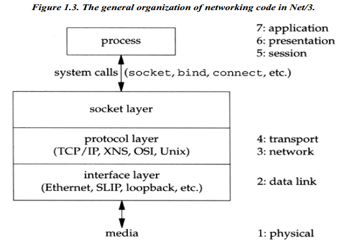
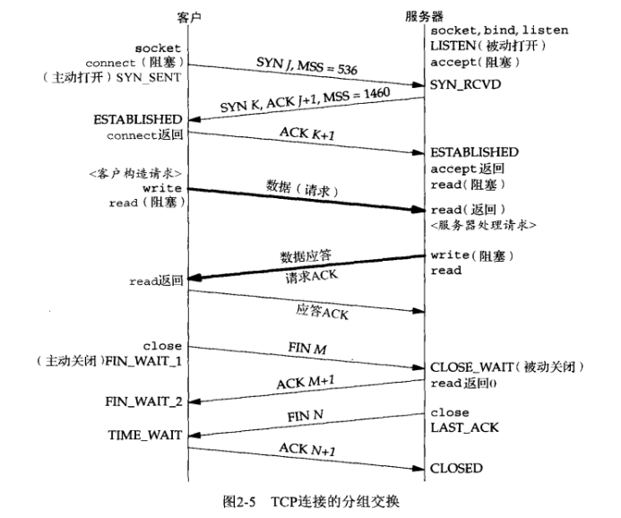

# 探索TCP/IP 协议栈中各层之间的关系

进入公司后，我做的第一个项目是C1主机服务程序开发。C1主机需要与手机APP、显示器程序进行网络通信。在开发期间，曾经出现过不少网络通信问题，比如：

- APP上传文件时，C1主机提前返回错误并随后关闭连接，APP无法及时识别而报“broken pipe”。
- APP上传文件时突然断开与C1主机的wifi连接，C1主机需要等待较长时间才能和APP断开。
- C1主机发送安装包给显示器后，迟迟等不到显示器的回复。

在解决这些网络问题的过程中，我发现自己对于应用层与其他层的关系理解得有点模糊，影响了问题定位效率。为什么说影响问题定位效率呢？我们知道，定位问题的主要思路便是逐步缩小排查范围，对于服务端网络问题而言，便是要确认是应用层的问题（如代码有bug）还是底层的问题（如wifi异常断开）。只有理清应用层与其他层的关系，才可能快速找出问题根源。因此，下面将展开讨论TCP/IP 协议栈中各层之间的关系。

## TCP/IP 协议栈各层的实现

在“计算机网络”课程中，我们学过TCP/IP五层协议，从上到下依次是：

- 应用层
- 传输层
- 网络层
- 数据链路层
- 物理层

倘若要讨论清楚TCP/IP 协议栈各层的具体实现细节，远非本人目前知识水平所能及。因此，这里只讨论一些简单、具体的问题，以对TCP/IP 协议栈有个基本的概念。（注意：为了简化问题，以下的讨论限制在**同一局域网内的两台设备之间直接通信**的场景，不涉及路由器、交换机等中间节点。）

1. TCP/IP 协议栈各层分别由谁实现？对应的实体是什么？
2. TCP/IP 协议栈各层之间是如何通信的？数据是如何在各层之间传输的？

### 问题1：TCP/IP 协议栈各层分别由谁实现？对应的实体是什么？

这个问题的后半部分听起来可能有点奇怪，这里澄清一下：TCP/IP 协议栈的实现，既需要硬件（网卡、网线、wifi芯片、交换机、路由器等），也需要软件（网卡驱动、操作系统、应用程序）。因此，我想搞清楚：TCP/IP 协议栈各层需要哪些硬件和软件？它们分别是由谁提供的？存在在哪里？下面结合C1项目和我的笔记本来进行讨论。

#### 物理层

不难想象，物理层是由网卡实现的（比如C1主机与手机的wifi连接使用无线网卡，与显示器的连接使用USB虚拟网卡），而网卡是由硬件厂商提供的。

在ubuntu系统下输入命令`lspci | grep -i net`，可以获取网卡基本信息，如我的笔记本会输出以下结果：
```
00:1f.6 Ethernet controller: Intel Corporation Ethernet Connection (4) I219-LM (rev 21)
02:00.0 Network controller: Intel Corporation Wireless 8265 / 8275 (rev 78)
```

从输出结果中可以看到，我的笔记本分别有一个有线网卡（The Intel Ethernet Connection I219）和一个无线网卡（The Intel Dual Band Wireless-AC 8265）。为简化问题，接下来只讨论有线网卡的情况。从Intel官网上可以下载到[Intel Ethernet Connection I219-LM 的数据手册][i219]。数据手册第1章开头介绍了I219的基本信息：

> The Intel® Ethernet Connect I219 (I219) is a single-port Gigabit Ethernet Physical Layer Transceiver (PHY). It connects to an integrated Media Access Controller (MAC) through a dedicated interconnect. The I219 supports operation at 10/100/1000 Mb/s data rates. The PHY circuitry provides a standard IEEE 802.3 Ethernet interface for 10BASE-T, 100BASE-TX, and 1000BASE-T applications (802.3, 802.3u, and 802.3ab).

可见，I219是一款PHY芯片，它实现了物理层的协议标准，并与MAC芯片互连，为实现物理层与数据链路层的数据通信提供了硬件上的支持。

> The I219 main interfaces are PCIe and SMBus on the host side and the MDI interface on the link side.  Transmit traffic is received from the MAC device through either PCIe or SMBus on the host interconnect and then transmitted on the MDI link. Receive traffic arrives on the MDI link and transferred to the integrated LAN controller through either the PCIe or SMBus interconnects.

由以上关于I219物理接口的描述可知，I219的主要任务是从物理线路（如网线）收到报文并传给MAC芯片，以及将MAC芯片发来的报文传到物理线路中。那么，I219完成这两个任务，是单纯靠物理电路来实现的呢？还是需要运行驱动软件来支持？据我的调查，物理层主要是靠PHY芯片内部的数字逻辑电路来运作的，但PHY芯片要想正常工作，需要配置好内部寄存器（比如I219芯片在上电启动后需要由MAC初始化其MDIO寄存器），这个工作是由驱动程序来完成的。

[i219]: https://ark.intel.com/content/www/us/en/ark/products/82185/intel-ethernet-connection-i219-lm.html

#### 数据链路层

根据维基百科对于[网卡（Network interface controller）][nic] 的描述："The NIC is both a **physical layer and data link layer** device, as it provides physical access to a networking medium and, for IEEE 802 and similar networks, provides a low-level addressing system through the use of MAC addresses that are uniquely assigned to network interfaces."，可见，网卡不仅实现了物理层，还完成了数据链路层的工作。

根据网上资料[What is the use of Phy and MAC chip?][Q1]和[what is the difference between PHY and MAC chip][Q2]，数据链路层的硬件主要是MAC芯片，而MAC芯片的存在形式有两种：一是MAC和PHY一起被封装在同一个芯片上面构成一个SoC（System on Chip, 系统级芯片），二是MAC被封装在处理器内部。我在Intel官网上始终无法找到跟I219芯片对接的MAC芯片名字，后来查看我笔记本CPU [Intel Core i7-8650U的数据手册][i7-8650U]，发现里面第20章"Gigabit Ethernet Controller"说的基本是MAC的内容，因此可以推断这个"Gigabit Ethernet Controller"便是我笔记本里面的MAC芯片。

> The Gigabit Ethernet controller(D31:F6) in conjuction with the Intel Ethernet Connection I219 provides a complete LAN solution.
> The integrated GbE controller provides a complete CSMA/CD function supporting IEEE 802.3(10 Mbps), 802.3u(100 Mbps) implementations. It also supports the IEEE 802.3z and 802.3ab(1000 Mbps) implementations.

我们知道，网卡包括硬件和软件，硬件即上述的PHY芯片和MAC芯片，而软件便是网卡驱动。网卡驱动有的是系统自带，有的需要从官方芯片厂商网站下载安装。在Ubuntu系统下输入`lspci -v`命令，其中"Ethernet controller"对应的内容中包含网卡驱动信息，如我的笔记本会输出以下结果：
```
00:1f.6 Ethernet controller: Intel Corporation Ethernet Connection (4) I219-LM (rev 21)
	Subsystem: Lenovo Ethernet Connection (4) I219-LM
	Flags: bus master, fast devsel, latency 0, IRQ 160
	Memory at ee300000 (32-bit, non-prefetchable) [size=128K]
	Capabilities: <access denied>
	Kernel driver in use: e1000e
	Kernel modules: e1000e
```

可见我的笔记本上的有线网卡驱动程序是e1000e，从Intel官网上也可以下载到[e1000e的源码][e1000e_src]。

[nic]: https://en.wikipedia.org/wiki/Network_interface_controller
[Q1]: https://networkengineering.stackexchange.com/questions/57746/what-is-the-use-of-phy-and-mac-chip
[Q2]: https://electronics.stackexchange.com/questions/75596/what-is-the-difference-between-phy-and-mac-chip
[i7-8650U]: https://www.intel.com/content/www/us/en/products/docs/processors/core/7th-and-8th-gen-core-family-mobile-u-y-processor-lines-i-o-datasheet-vol-1.html
[e1000e_src]: http://oenhan.com/linux-e1000-networking-driver

#### 网络层、传输层

我们知道，网络层的主要协议是IP，传输层的主要协议是TCP和UDP，在《TCP/IP 详解 卷2：实现》的第1.7节“网络实现概述”中提到，内核中的联网代码组织成三层（如下图所示）：

- 插口层（socket layer）是一个到下面协议相关层的协议无关接口。所有系统调用从协议无关的插口层开始。
- 协议层（protocol layer）包括TCP/IP等协议族的实现。
- 接口层（interface layer）包括同网络设备通信的设备驱动程序。



可见，网络层和传输层是由操作系统内核实现的。

#### 应用层

应用层比较容易理解：应用层是由应用软件开发者提供的，比如C1项目的应用层便是由我们软件组写的C1主机服务程序实现的。

#### 总结

基于以上分析，我们可以得出结论：TCP/IP 协议栈从下到上，分别由网卡、网卡驱动、操作系统内核和应用程序来实现。

### 问题2：TCP/IP 协议栈各层之间是如何通信的？数据是如何在各层之间传输的？

根据谢希仁所著《计算机网络》第1.7.2节的描述，分层的一个好处是：各层之间是独立的。某一层并不需要知道它的下一层是如何实现的，而仅仅需要知道该层通过层间的接口所提供的服务。接下来，我们同样不关心每一层是如何实现的，而关心各层之间是如何通信的。具体而言，我想知道：各层之间如何通知对方要接收/发送数据的？各层之间如何完成数据的传输的？（注意下文不会讨论TCP/IP协议栈各层对数据进行封装（填充协议头、增加校验码）的细节，因为这并非本文关注的重点。）

#### 物理层 vs 数据链路层

> 网卡设备启动时首先调用函数e1000_open()，在该函数中调用e1000_request_irq()申请中断号及其相应的中断处理程序e1000_intr()，其实际是调用request_irq()函数来实现的。在函数e1000_open()中调用e1000_setup_all_tx_resources()根据发送队列数建立发送缓冲区，每个缓冲区的建立由函数e1000_setup_tx_resources()实现，在e1000_setup_tx_resources()中，主要是对描述发送缓冲区的结构体e1000_tx_ring的初始化，其将DMA缓冲区与网卡所映射的虚拟地址空间联系起来，使用函数pci_alloc_consistent()实现一致性映射。而虚拟地址空间与网卡的物理地址相对应，故而这三种空间就对应了起来，DMA也就可以在此基础上实现了，当数据包内容被映射到DMA缓冲区后，其将完全由设备操控。DMA的缓冲区的初始化在驱动程序的e1000_probe()函数中实现。e1000_open()函数会调用e1000_up()对网卡的一些相关的软硬件参数与空间进行配置，如硬件寄存器的读写，数据包接收与发送空间的处理函数的初始化等。发送缓冲空间的初始化结构及相互间的关系如图4-1所示。

> 根据发送队列数num_tx_queues建立相应的发送缓冲区结构e1000_tx_ring，在该结构中有描述该区域的指向e1000_tx_desc结构的desc，该缓冲区指向的dma总线地址，用于接收硬件传送来的用e1000_buffer结构描述的缓冲块数组buffer_info[]，另外的几个参数则主要用于描述这些缓冲块，其中count表示缓冲块的个数，next_to_use和next_to_clean主要描述缓冲块的使用状态，如已经接收接收了数据的位置及准备接收的位置，当有新的数据包要发送时，首先由上层协议调用e1000_xmit_frame()，在该函数中接着调用e1000_tx_queue()根据相应的参数找到缓冲块存放，缓冲块的初始化则由函数e1000_tx_map()实现。buffer_info指向的环形缓冲块区域主要用来接收总线地址映射来的数据包，所有的缓冲块用next_to_match连接成一个环，每个缓冲块用结构体e1000_buffer表示，在该结构中，skb存放数据包的内容，dma表示该数据包所在的总线地址。此处使用函数pci_map_single()进行流式映射，的映射方向为PCI_DMA_TODEVICE，控制总线会把虚拟地址空间所指内容映射到总线地址，然后将该内容由网卡传送出去。

> 当有新的数据包到达时，首先触动中断处理函数e1000_intr()，在函数中会为新来的数据包在缓冲块数组buffer_info中找到一个新的缓冲块位置，并完成e1000_buffer结构的赋值。数据包的接收其实就是将总线地址指向的内容拷贝到skb中，然后根据skb中的协议将其传给相应的上层协议的接收函数。

[nic_driver]: https://blog.csdn.net/fengying765/article/details/6776394
[e1000e_analysis]: http://oenhan.com/linux-e1000-networking-driver

#### 数据链路层 vs 网络层

网络层是在操作系统内核实现的，而数据链路层是在网卡驱动实现的，那么它们之间是如何通信的呢？如何实现数据的收发？

#### 网络层 vs 传输层

由于传输层与网络层均在操作系统内核中实现，可以想象两者也是通过函数调用的方式完成交互。要想了解两者具体的交互细节，需要啃内核代码。这里暂不讨论。

#### 传输层 vs 应用层

《Unix 网络编程 卷1：套接字联网API》第2章的图2.5（如下图所示）展示了一个完整的TCP连接所发生的实际分组交换情况，图中也展示了相关的套接字API。据此我们可以知道，作为传输层的实现者，操作系统内核是通过API的方式向应用层提供传输层的服务的。比如，为从传输层收发数据，应用层的客户端只需调用socket/connect/read/write等函数，应用层的服务端只需调用socket/bind/listen/accept/read/write等函数。



### 问题3：收发数据只能由应用层发起吗？底层会自行收发数据吗？

## TCP/IP 协议栈各层的常见问题

- 服务器IP不可达
- 服务器端口不可达
- 客户端网络短暂断开
- 客户端网络长期断开
- 服务器网络短暂断开
- 服务器网络长期断开
- 客户端堵塞
- 服务端堵塞

## 关于网络通信的一些疑惑

1. 操作系统是如何向应用层的程序提供TCP/IP服务的？系统后台是否运行着一个TCP/IP协议栈进程？还是以系统调用的方式提供服务？

2. TCP/IP传输层、网络层、数据链路层又是如何实现的？各层是以进程的方式存在，还是接口的方式？

3. 应用层与tcp/ip协议栈的数据通信是怎样的？应用层如何从tcp/ip协议栈获取数据的？如何通知tcp/ip协议栈结束连接的？

4. 网卡与tcp层的交互是怎样的？tcp/ip协议栈如何从网络中获取数据包？中间设备驱动程序又做了什么工作？

5. 出现网络问题时，如何区分是TCP/IP协议族的问题，还是应用程序的问题？

### TCP/IP stack

1. TCP/IP stack 下接网卡驱动、软中断；上承 inode 转发来的系统调用操作；中间还要与平级的进程文件描述符管理子系统打交道。
