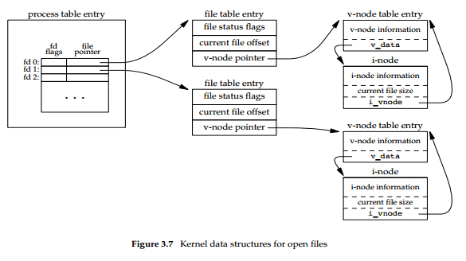
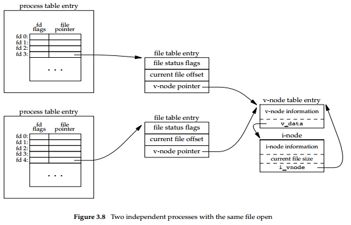

# Advanced Programming in the Unix Environment

## 3 File I/O

### 3.1 Introduction

1. Most file I/O on a UNIX system can be performed using only five functions: `open, read, write, lseek, and close`.

2. The term **unbuffered** means that each read or write invokes a **system call** in the kernel. **These unbuffered I/O functions are not part of ISO C, but are part of POSIX.1 and the Single UNIX Specification**. (Wu: `man -a open`, we can find that it is a system call -- functions provided by the kernel -- rather than library call -- functions within program libraries)

### 3.2 File Descriptors

1. To the kernel, all open files are referred to by **file descriptors**. A file descriptor is a **non-negative integer**. When we open an existing file or create a new file, the kernel returns a file descriptor to the process. When we want to read or write a file, we identify the file with the file descriptor that was returned by open or creat as an argument to either read or write.

2. By convention, UNIX System **shells** associate file descriptor 0 with the **standard input** of a process, file descriptor 1 with the **standard output**, and file descriptor 2 with the **standard error**. This convention is used by the shells and many applications; it is not a feature of the UNIX kernel. Nevertheless, many applications would break if these associations weren’t followed.

3. Although their values are standardized by POSIX.1, the magic numbers 0, 1, and 2 should be replaced in POSIX-compliant applications with the symbolic constants `STDIN_FILENO, STDOUT_FILENO, and STDERR_FILENO` to improve readability.  These constants are defined in the `<unistd.h>` header.

4. File descriptors range from 0 through `OPEN_MAX−1`. Note: call the function `sysconf` to get the value of `OPEN_MAX`.
```
#include <unistd.h>

int max_open_num = sysconf(_SC_OPEN_MAX);
```

5. 根据我写的测试程序`alloc_fd.c`的运行结果来看，fd的分配规则是：每次分配当前未被占用的最小正整数。这与pid的分配规则不同，pid是这一轮未被分配过的最小正整数。

### 3.3 open and openat Functions

1. A file is opened or created by calling either the `open` function or the `openat` function.
```
#include <fcntl.h>

int open(const char *path, int oflag, ... /* mode_t mode */ );
int openat(int fd, const char *path, int oflag, ... /* mode_t mode */ );

// Both return: file descriptor if OK, −1 on error
```

2. The `oflag` argument is formed by **ORing** together one or more of the following constants from the `<fcntl.h>` header:
    - `O_RDONLY`: Open for reading only.
    - `O_WRONLY`: Open for writing only.
    - `O_RDWR`: Open for reading and writing.
    - `O_APPEND`: Append to the end of file on each write.
    - `O_CREAT`: Create the file if it doesn’t exist. This option requires a third argument to the open function (a fourth argument to the openat function) — the mode, which specifies the access permission bits of the new file.
    - `O_SYNC`: Have each write wait for physical I/O to complete, including I/O necessary to update file attributes modified as a result of the write.
    - `O_TRUNC`: If the file exists and if it is successfully opened for either write-only or read–write, truncate its length to 0.
    - `O_EXCL` Generate an error if `O_CREAT` is also specified and the file already exists. This test for whether the file already exists and the creation of the file if it doesn’t exist is an atomic operation. **This is guaranteed to never clobber an existing file.** （伍注：`O_EXCL`要与`O_CREAT`一起使用。如果只设置了`O_EXCL`，而文件不存在，则行为是undefined的。在我的系统上会返回错误码-1）

3. The file descriptor returned by open and openat is guaranteed to be the **lowest-numbered unused descriptor**. This fact is used by some applications to open a new file on standard input, standard output, or standard error.

4. The openat function is one of a class of functions added to the latest version of POSIX.1 to address two problems.
    - First, it gives threads a way to use **relative pathnames** to open files in directories other than the current working directory. As we’ll see in Chapter 11, all threads in the same process share the same current working directory, so this makes it difficult for multiple threads in the same process to work in different directories at the same time.
    - Second, it provides a way to avoid **time-of-checkto-time-of-use (TOCTTOU)** errors.

5. The basic idea behind TOCTTOU errors is that a program is vulnerable if it makes two file-based function calls where the second call depends on the results of the first call. Because the two calls are not atomic, the file can change between the two calls, thereby invalidating the results of the first call, leading to a program error.

6. TOCTTOU errors in the file system namespace generally deal with attempts to subvert file system permissions by tricking a privileged program into either reducing permissions on a privileged file or modifying a privileged file to open up a security hole.

7. With POSIX.1, the constant `_POSIX_NO_TRUNC` determines whether long filenames and long components of pathnames are truncated or an error is returned.

8. If `_POSIX_NO_TRUNC` is in effect, errno is set to `ENAMETOOLONG`, and an error status is returned if any filename component of the pathname exceeds `NAME_MAX`.

### 3.4 creat Function

1. A new file can also be created by calling the `creat` function.
```
#include <fcntl.h>

int creat(const char *path, mode_t mode);

// Returns: file descriptor opened for write-only if OK, −1 on error
```

2. Note that this function is equivalent to `open(path, O_WRONLY | O_CREAT | O_TRUNC, mode)`.

### 3.5 close Function

1. An open file is closed by calling the `close` function.
```
#include <unistd.h>

int close(int fd);

// Returns: 0 if OK, −1 on error
```

2. When a process terminates, all of its open files are closed automatically by the kernel. Many programs take advantage of this fact and don’t explicitly close open files.

### 3.6 lseek Function

1. Every open file has an associated "**current file offset**", normally a non-negative integer that measures the number of bytes from the beginning of the file.

2. Read and write operations normally start at the current file offset and cause the offset to be incremented by the number of bytes read or written. By default, this offset is initialized to 0 when a file is opened, unless the `O_APPEND` option is specified.

3. An open file’s offset can be set explicitly by calling lseek. (Note: The character l in the name lseek means "long integer.")
```
#include <unistd.h>

off_t lseek(int fd, off_t offset, int whence);

// Returns: new file offset if OK, −1 on error
```

4. The interpretation of the offset depends on the value of the whence argument.
    - If whence is `SEEK_SET`, the file’s offset is set to offset bytes from the beginning of the file.
    - If whence is `SEEK_CUR`, the file’s offset is set to its current value plus the offset. The offset can be positive or negative.
    - If whence is `SEEK_END`, the file’s offset is set to the size of the file plus the offset. The offset can be positive or negative.

5. Because a successful call to lseek returns the new file offset, we can seek zero bytes from the current position to determine the current offset:
```
off_t currpos = lseek(fd, 0, SEEK_CUR);
```

6. This technique can also be used to determine if a file is capable of seeking. If the file descriptor refers to a pipe, FIFO, or socket, lseek sets errno to **ESPIPE** and returns −1.

7. The file’s offset can be greater than the file’s current size, in which case the next write to the file will extend the file. This is referred to as creating a hole in a file and is allowed. Any bytes in a file that have not been written are read back as 0.

8. **A hole in a file isn’t required to have storage backing it on disk.** Depending on the file system implementation, when you write after seeking past the end of a file, new disk blocks might be allocated to store the data, but there is no need to allocate disk blocks for the data between the old end of file and the location where you start writing.

### 3.7 read Function

1. Data is read from an open file with the read function.
```
#include <unistd.h>

ssize_t read(int fd, void *buf, size_t nbytes);

// Returns: number of bytes read, 0 if end of file, −1 on error
```

2. There are several cases in which the number of bytes actually read is less than the amount requested:
    - When reading from a regular file, if the end of file is reached before the requested number of bytes has been read. For example, if 30 bytes remain until the end of file and we try to read 100 bytes, read returns 30. **The next time we call read, it will return 0 (end of file).**
    - When reading from a terminal device. Normally, up to one line is read at a time.
    - When reading from a network. Buffering within the network may cause less than the requested amount to be returned.
    - When reading from a pipe or FIFO. If the pipe contains fewer bytes than requested, read will return only what is available.
    - When reading from a record-oriented device. Some record-oriented devices, such as magnetic tape, can return up to a single record at a time.
    - When interrupted by a signal and a partial amount of data has already been read.

### 3.8 write Function

1. Data is written to an open file with the write function.
```
#include <unistd.h>

ssize_t write(int fd, const void *buf, size_t nbytes);

// Returns: number of bytes written if OK, −1 on error
```

2. A common cause for a write error is either filling up a disk or exceeding the file size limit for a given process.

3. For a regular file, the write operation starts at the file’s current offset. If the `O_APPEND` option was specified when the file was opened, the file’s offset is set to the current end of file **before each write operation**.

### 3.9 I/O Efficiency

1. Most file systems support some kind of read-ahead to improve performance. When sequential reads are detected, the system tries to read in more data than an application requests, assuming that the application will read it shortly.

### 3.10 File Sharing

1. The kernel uses three data structures to represent an open file, and the relationships among them determine the effect one process has on another with regard to file sharing.
    - The file descriptor flags: such as close-on-exec
    - The file status flags: such as read, write, append, sync, and nonblocking

    

2. `v-node` vs `i-node`
    - Each open file (or device) has a v-node structure that contains information about the type of file and pointers to functions that operate on the file. For most files, the v-node also contains the i-node for the file.
    - The i-node contains the owner of the file, the size of the file, pointers to where the actual data blocks for the file are located on disk, and so on.
    - The v-node was invented to provide support for multiple file system types on a single computer system. This work was done independently by Peter Weinberger (Bell Laboratories) and Bill Joy (Sun Microsystems). Sun called this the Virtual File System and called the file system–independent portion of the i-node the v-node.
    - Instead of splitting the data structures into a v-node and an i-node, Linux uses a file system–independent i-node and a file system–dependent i-node.

3. If two independent processes have the same file open, we could have the arrangement shown in the following figure:

    

4. It is possible for more than one file descriptor entry to point to the same file table entry, as we’ll see when we discuss the `dup` function. This also happens after a `fork` when the parent and the child share the same file table entry for each open descriptor.

5. Note the difference in scope between the file descriptor flags and the file status flags. The former apply only to a single descriptor in a single process, whereas the latter apply to all descriptors in any process that point to the given file table entry.

### 3.11 Atomic Operations

1. Any operation that requires more than one function call cannot be atomic, as there is always the possibility that the kernel might temporarily suspend the process between the two function calls.

2. The UNIX System provides an atomic way to do this operation (namely appending to a file) if we set the `O_APPEND` flag when a file is opened. As we described in the previous section, this causes the kernel to position the file to its current end of file before each write. We no longer have to call lseek before each write.

3. The Single UNIX Specification includes two functions that allow applications to seek and perform I/O atomically: `pread` and `pwrite`.
```
#include <unistd.h>

ssize_t pread(int fd, void *buf, size_t nbytes, off_t offset);
// Returns: number of bytes read, 0 if end of file, −1 on error

ssize_t pwrite(int fd, const void *buf, size_t nbytes, off_t offset);
// Returns: number of bytes written if OK, −1 on error
```

4. Calling pread is equivalent to calling lseek followed by a call to read, with the following exceptions.
    - There is no way to interrupt the two operations that occur when we call pread.
    - The current file offset is not updated.

5. Calling pwrite is equivalent to calling lseek followed by a call to write, with similar exceptions.

6. In general, the term **atomic operation** refers to an operation that might be composed of multiple steps. If the operation is performed atomically, either all the steps are performed (on success) or none are performed (on failure). It must not be possible for only a subset of the steps to be performed.

### 3.12 dup and dup2 Functions

1. An existing file descriptor is duplicated by either of the following functions:
```
#include <unistd.h>

int dup(int fd);
int dup2(int fd, int fd2);

// Both return: new file descriptor if OK, −1 on error
```

2. The new file descriptor returned by dup is guaranteed to be the lowest-numbered available file descriptor. With dup2, we specify the value of the new descriptor with the fd2 argument. If fd2 is already open, it is first closed. If fd equals fd2, then dup2 returns fd2 without closing it. Otherwise, the `FD_CLOEXEC` file descriptor flag is cleared for fd2, so that fd2 is left open if the process calls exec.

3. The new file descriptor that is returned as the value of the functions shares the same file table entry as the fd argument.

4. Another way to duplicate a descriptor is with the fcntl function：
```
// dup(fd) is equivalent to
fcntl(fd, F_DUPFD, 0);

// dup2(fd, fd2) is equivalent to
close(fd2);
fcntl(fd, F_DUPFD, fd2);
```

5. The dup2 is not exactly the same as a close followed by an fcntl. The differences are as follows:
    - dup2 is an atomic operation, whereas the alternate form involves two function calls. It is possible in the latter case to have a signal catcher called between the close and the fcntl that could modify the file descriptors. The same problem could occur if a different thread changes the file descriptors.
    - There are some errno differences between dup2 and fcntl.

### 3.13 sync, fsync, and fdatasync Functions

1. Traditional implementations of the UNIX System have a buffer cache or page cache in the kernel through which most disk I/O passes. When we write data to a file, the data is normally copied by the kernel into one of its buffers and queued for writing to disk at some later time. This is called **delayed write**.

2. The kernel eventually writes all the delayed-write blocks to disk, normally when it needs to reuse the buffer for some other disk block.

3. To ensure consistency of the file system on disk with the contents of the buffer cache, the sync, fsync, and fdatasync functions are provided.
```
#include <unistd.h>

int fsync(int fd);
int fdatasync(int fd);
// Returns: 0 if OK, −1 on error

void sync(void);
```

4. The `sync` function simply queues all the modified block buffers for writing and returns; it does not wait for the disk writes to take place.

> According to the standard specification (e.g., POSIX.1-2001), sync() schedules the writes, but may return before the actual writing is done.  However Linux waits for I/O completions, and thus sync() or syncfs() provide the same guarantees as fsync() called on every file in the system or filesystem respectively.  
> -- Linux manual Page: Sync

5. The function `sync` is normally called periodically (usually every 30 seconds) from a system daemon, often called update. This guarantees regular flushing of the kernel’s block buffers. The command `sync(1)` also calls the sync function.

6. The function `fsync` refers only to a single file, specified by the file descriptor fd, and waits for the disk writes to complete before returning. This function is used when an application, such as a database, needs to be sure that the modified blocks have been written to the disk.

7. The `fdatasync` function is similar to fsync, but it affects only the data portions of a file. With fsync, the file’s attributes are also updated synchronously.

### 3.14 fcntl Function

1. The fcntl function can change the properties of a file that is already open.
```
#include <fcntl.h>

int fcntl(int fd, int cmd, ... /* int arg */ );
// Returns: depends on cmd if OK (see following), −1 on error
```

2. The fcntl function is used for five different purposes.
    - Duplicate an existing descriptor (cmd  = `F_DUPFD` or `F_DUPFD_CLOEXEC`)
    - Get/set file descriptor flags (cmd  = `F_GETFD` or `F_SETFD`)
    - Get/set file status flags (cmd  = `F_GETFL` or `F_SETFL`)
    - Get/set asynchronous I/O ownership (cmd  = `F_GETOWN` or `F_SETOWN`)
    - Get/set record locks (cmd  = `F_GETLK`, `F_SETLK,` or `F_SETLKW`)

3. When we modify either the file descriptor flags or the file status flags, we must be careful to fetch the existing flag value, modify it as desired, and then set the new flag value. We can’t simply issue an `F_SETFD` or an `F_SETFL` command, as this could turn off flag bits that were previously set.

4. Why we need fcntl function?
    - With fcntl, we can modify the properties of a descriptor, knowing only the descriptor for the open file.
    - We’ll see another need for fcntl when we describe nonblocking pipes (Section 15.2), since all we have with a pipe is a descriptor.

### 3.15 ioctl Function

1. The ioctl function has always been the catchall for I/O operations. Anything that couldn’t be expressed using one of the other functions in this chapter usually ended up being specified with an ioctl. Terminal I/O was the biggest user of this function.
```
#include <unistd.h> /* System V */
#include <sys/ioctl.h> /* BSD and Linux */

int ioctl(int fd, int request, ...);
// Returns: −1 on error, something else if OK
```

2. Each device driver can define its own set of ioctl commands. The system, however, provides generic ioctl commands for different classes of devices.

3. Why we need ioctl function?
    - The mag tape operations allow us to write end-of-file marks on a tape, rewind a tape, space forward over a specified number of files or records, and the like. None of these operations is easily expressed in terms of the other functions in the chapter (read, write, lseek, and so on), so the easiest way to handle these devices has always been to access their operations using ioctl.
    - We use the ioctl function in Section 18.12 to fetch and set the size of a terminal’s window, and in Section 19.7 when we access the advanced features of pseudo terminals.

### 3.16 /dev/fd

1. Newer systems provide a directory named `/dev/fd` whose entries are files named 0, 1, 2, and so on. Opening the file `/dev/fd/n` is equivalent to duplicating descriptor n, assuming that descriptor n is open.

2. Some systems provide the pathnames `/dev/stdin`, `/dev/stdout`, and `/dev/stderr`. These pathnames are equivalent to `/dev/fd/0`, `/dev/fd/1`, and `/dev/fd/2`, respectively.

### Exercise

1. When reading or writing a disk file, are the functions described in this chapter really unbuffered? Explain.
    - All disk I/O goes through the kernel’s block buffers (also called the kernel’s buffer cache). The exception to this is I/O on a raw disk device, which we aren’t considering. (Some systems also provide a direct I/O option to allow applications to bypass the kernel buffers, but we aren’t considering this option either.) Chapter 3 of Bach [1986] describes the operation of this buffer cache. Since the data that we read or write is buffered by the kernel, the term unbuffered I/O refers to the lack of automatic buffering in the user process with these two functions. Each read or write invokes a single system call.

2. The following sequence of code has been observed in various programs: (Question: When and why should we use the following code?)
```
dup2(fd, 0);
dup2(fd, 1);
dup2(fd, 2);
if (fd > 2)
    close(fd);
```

3. What is the difference between the two commands shown below? (Hint: The shells process their command lines from left to right.)
```
./a.out > outfile 2>&1
./a.out 2>&1 > outfile
```

4. If you open a file for read–write with the append flag, can you still read from anywhere in the file using lseek? Can you use lseek to replace existing data in the file? Write a program to verify this.
    - A: You can still lseek and read anywhere in the file, but a write automatically resets the file offset to the end of file before the data is written. This makes it impossible to write anywhere other than at the end of file.

### Question

1. Question: 在后台运行进程时，文件描述符0/1/2指向什么？
