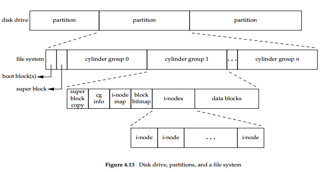
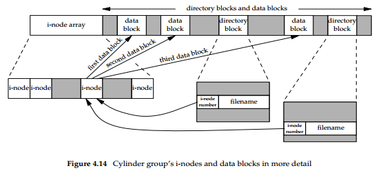
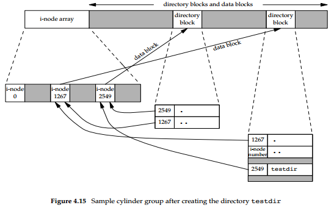
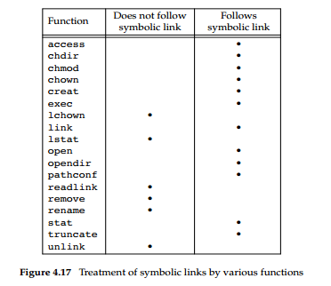
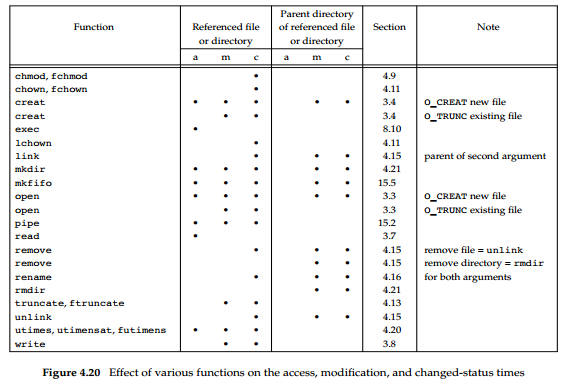

# Advanced Programming in the Unix Environment

## 4 Files and Directories

### 4.2 stat, fstat, fstatat, and lstat Functions

1. stat, fstat, fstatat, and lstat Functions
```
#include <sys/stat.h>

int stat(const char *restrict pathname, struct stat *restrict buf );
int fstat(int fd, struct stat *buf );
int lstat(const char *restrict pathname, struct stat *restrict buf );
int fstatat(int fd, const char *restrict pathname, struct stat *restrict buf, int flag);

// All four return: 0 if OK, −1 on error
```

2. The `lstat` function is similar to `stat`, but when the named file is a symbolic link, lstat returns information about the symbolic link, not the file referenced by the symbolic link.

3. The definition of the structure `stat` can differ among implementations, but it could look like
```
struct stat {
    mode_t st_mode; /* file type & mode (permissions) */
    ino_t st_ino; /* i-node number (serial number) */
    dev_t st_dev; /* device number (file system) */
    dev_t st_rdev; /* device number for special files */
    nlink_t st_nlink; /* number of links */
    uid_t st_uid; /* user ID of owner */
    gid_t st_gid; /* group ID of owner */
    off_t st_size; /* size in bytes, for regular files */
    struct timespec st_atim; /* time of last access */
    struct timespec st_mtim; /* time of last modification */
    struct timespec st_ctim; /* time of last file status change */
    blksize_t st_blksize; /* best I/O block size */
    blkcnt_t st_blocks; /* number of disk blocks allocated */
};
```

### 4.3 File Types

1. The File Types on a Unix system are
    - Regular file. The most common type of file, which contains data of some form. There is no distinction to the UNIX kernel whether this data is text or binary. Any interpretation of the contents of a regular file is left to the application processing the file. Note: One notable exception to this is with **binary executable files**. To execute a program, the kernel must understand its format. All binary executable files conform to a format that allows the kernel to identify where to load a program’s text and data.
    - Directory file. A file that contains the names of other files and pointers to information on these files. Any process that has read permission for a directory file can read the contents of the directory, but only the kernel can write directly to a directory file.
    - Block special file. A type of file providing buffered I/O access in fixed-size units to devices such as disk drives.
    - Character special file. A type of file providing unbuffered I/O access in variable-sized units to devices. All devices on a system are either block special files or character special files.
    - FIFO. A type of file used for communication between processes. It’s sometimes called a named pipe.
    - Socket. A type of file used for network communication between processes. A socket can also be used for non-network communication between processes on a single host.
    - Symbolic link. A type of file that points to another file.

### 4.4 Set-User-ID and Set-Group-ID

1. Every process has six or more IDs associated with it.
    - The real user ID and real group ID identify who we really are. These two fields are taken from our entry in the password file when we log in. Normally, these values don’t change during a login session, although there are ways for a superuser process to change them.
    - The effective user ID, effective group ID, and supplementary group IDs determine our file access permissions.
    - The saved set-user-ID and saved set-group-ID contain copies of the effective user ID and the effective group ID, respectively, when a program is executed.

2. When we execute a program file, the effective user ID of the process is usually the real user ID, and the effective group ID is usually the real group ID. However, we can also set a special flag in the file’s mode word (`st_mode`) that says, "When this file is executed, set the effective user ID of the process to be the owner of the file (`st_uid`)." Similarly, we can set another bit in the file’s mode word that causes the effective group ID to be the group owner of the file (`st_gid`). These two bits in the file’s mode word are called the **set-user-ID** bit and the **set-group-ID** bit.

3. The **set-user-ID** bit and the **set-group-ID** bit are contained in the file’s `st_mode` value. These two bits can be tested against the constants `S_ISUID` and `S_ISGID`, respectively

4. 'ls -l' combines multiple bits into the third character of each set of permissions as follows:
    - 's': If the set-user-ID or set-group-ID bit and the corresponding executable bit are both set.
    - 'S': If the set-user-ID or set-group-ID bit is set but the corresponding executable bit is not set.
    - 't': If the restricted deletion flag or sticky bit, and the other-executable bit, are both set. The restricted deletion flag is another name for the sticky bit.
    - 'T': If the restricted deletion flag or sticky bit is set but the other-executable bit is not set.
    - 'x': If the executable bit is set and none of the above apply.
    - '-': Otherwise.

### 4.5 File Access Permissions

1. The `st_mode` value also encodes the access permission bits for the file. There are nine permission bits for each file, divided into three categories.

| st_mode mask | Meaning |
| ------------ | ------- |
| S_IRUSR | user-read |
| S_IWUSR | user-write |
| S_IXUSR | user-execute |
| S_IRGRP | group-read |
| S_IWGRP | group-write |
| S_IXGRP | group-execute |
| S_IROTH | other-read |
| S_IWOTH | other-write |
| S_IXOTH | other-execute |

2. The rules of file access permissions
    - whenever we want to open any type of file by name, we must have execute permission in each directory mentioned in the name, including the current directory, if it is implied. This is why the execute permission bit for a directory is often called the search bit.
    - We must have write permission for a file to specify the `O_TRUNC` flag in the open function.
    - We cannot create a new file in a directory unless we have write permission and execute permission in the directory.
    - To delete an existing file, we need write permission and execute permission in the directory containing the file. We do not need read permission or write permission for the file itself.
    - Execute permission for a file must be on if we want to execute the file using any of the seven exec functions. The file also has to be a regular file.

3. Note that read permission for a directory and execute permission for a directory mean different things. Read permission lets us read the directory, obtaining a list of all the filenames in the directory. Execute permission lets us pass through the directory when it is a component of a pathname that we are trying to access.

4. The file access tests that the kernel performs each time a process opens, creates, or deletes a file depend on the owners of the file (`st_uid` and `st_gid`), the effective IDs of the process (effective user ID and effective group ID), and the supplementary group IDs of the process, if supported.

5. The tests performed by the kernel are as follows:
    - If the effective user ID of the process is 0 (the superuser), access is allowed. This gives the superuser free rein throughout the entire file system.
    - If the effective user ID of the process equals the owner ID of the file (i.e., the process owns the file), access is allowed if the appropriate user access permission bit is set. Otherwise, permission is denied.
    - If the effective group ID of the process or one of the supplementary group IDs of the process equals the group ID of the file, access is allowed if the appropriate group access permission bit is set. Otherwise, permission is denied.
    - If the appropriate other access permission bit is set, access is allowed.  Otherwise, permission is denied.

6. Note that if the process owns the file, access is granted or denied based only on the user access permissions; the group permissions are never looked at. Similarly, if the process does not own the file but belongs to an appropriate group, access is granted or denied based only on the group access permissions; the other permissions are not looked at.

### 4.6 Ownership of New Files and Directories

1. The user ID of a new file is set to the effective user ID of the process.

2. POSIX.1 allows an implementation to choose one of the following options to determine the group ID of a new file:
    - The group ID of a new file can be the effective group ID of the process.
    - The group ID of a new file can be the group ID of the directory in which the file is being created.

3. Using the second option—inheriting the directory’s group ID—assures us that all files and directories created in that directory will have the same group ID as the directory. This group ownership of files and directories will then propagate down the hierarchy from that point. This is used in the Linux directory /var/mail, for example.

### 4.7 access and faccessat Functions

1. Even though a process might be set-user-ID to root, it might still want to verify that the real user can access a given file. The access and faccessat functions base their tests on the real user and group IDs.
```
#include <unistd.h>

int access(const char *pathname, int mode);
int faccessat(int fd, const char *pathname, int mode, int flag);

// Both return: 0 if OK, −1 on error
```

2. The mode is either the value `F_OK` to test if a file exists, or the bitwise OR of any of the flags shown in the following Figure.

| mode | Description |
| ---- | ----------- |
| R_OK | test for read permission |
| W_OK | test for write permission |
| X_OK | test for execute permission |

### 4.8 umask Function

1. The umask function sets the file mode creation mask for the process and returns the previous value.
```
#include <sys/stat.h>

mode_t umask(mode_t cmask);

// Returns: previous file mode creation mask
```

2. The file mode creation mask is used whenever the process creates a new file or a new directory. Any bits that are on in the file mode creation mask are turned off in the file’s mode.

3. When writing programs that create new files, if we want to ensure that specific access permission bits are enabled, we must modify the umask value while the process is running. For example, if we want to ensure that anyone can read a file, we should set the umask to 0. Otherwise, the umask value that is in effect when our process is running can cause permission bits to be turned off.

4. All of the shells have a built-in umask command that we can use to set or print the current file mode creation mask.

### 4.9 chmod, fchmod, and fchmodat Functions

1. The chmod, fchmod, and fchmodat functions allow us to change the file access permissions for an existing file.
```
#include <sys/stat.h>

int chmod(const char *pathname, mode_t mode);
int fchmod(int fd, mode_t mode);
int fchmodat(int fd, const char *pathname, mode_t mode, int flag);

// All three return: 0 if OK, −1 on error
```

2. To change the permission bits of a file, the effective user ID of the process must be equal to the owner ID of the file, or the process must have superuser permissions.

3. The mode is specified as the bitwise OR of the constants shown in the following table.

| mode | Description |
| ---- | ----------- |
| S_ISUID | set-user-ID on execution |
| S_ISGID | set-group-ID on execution |
| S_ISVTX | saved-text (sticky bit) |
| S_IRWXU | read, write, and execute by user (owner) |
| S_IRUSR | read by user (owner) |
| S_IWUSR | write by user (owner) |
| S_IXUSR | execute by user (owner) |
| S_IRWXG | read, write, and execute by group |
| S_IRGRP | read by group |
| S_IWGRP | write by group |
| S_IXGRP | execute by group |
| S_IRWXO | read, write, and execute by other (world) |
| S_IROTH | read by other (world) |
| S_IWOTH | write by other (world) |
| S_IXOTH | execute by other (world) |

4. The chmod functions automatically clear two of the permission bits under the following conditions:
    - On systems, such as Solaris, that place special meaning on the sticky bit when used with regular files, if we try to set the sticky bit (`S_ISVTX`) on a regular file and do not have superuser privileges, the sticky bit in the mode is automatically turned off.
    - If the group ID of the new file does not equal either the effective group ID of the process or one of the process’s supplementary group IDs and if the process does not have superuser privileges, then the set-group-ID bit is automatically turned off. This prevents a user from creating a set-group-ID file owned by a group that the user doesn’t belong to.

### 4.10 Sticky Bit

1. On versions of the UNIX System that predated demand paging, the `S_ISVTX` bit was known as the sticky bit. If it was set for an executable program file, then the first time the program was executed, a copy of the program’s text was saved in the swap area when the process terminated.

2. Later versions of the UNIX System referred to this as the **saved-text** bit; hence the constant `S_ISVTX`. With today’s newer UNIX systems, most of which have a virtual memory system and a faster file system, the need for this technique has disappeared.

3. On contemporary systems, the use of the sticky bit has been extended. The Single UNIX Specification allows the sticky bit to be set for a directory. If the bit is set for a directory, a file in the directory can be removed or renamed only if the user has write permission for the directory and meets one of the following criteria:
    - Owns the file
    - Owns the directory
    - Is the superuser

### 4.11 chown, fchown, fchownat, and lchown Functions

1. The chown functions allow us to change a file’s user ID and group ID, but if either of the arguments owner or group is −1, the corresponding ID is left unchanged.
```
#include <unistd.h>

int chown(const char *pathname, uid_t owner, gid_t group);
int fchown(int fd, uid_t owner, gid_t group);
int fchownat(int fd, const char *pathname, uid_t owner, gid_t group, int flag);
int lchown(const char *pathname, uid_t owner, gid_t group);

// All four return: 0 if OK, −1 on error
```

### 4.12 File Size

1. The `st_size` member of the stat structure contains the size of the file in bytes. This field is meaningful only for regular files, directories, and symbolic links.

2. For a symbolic link, the file size is the number of bytes in the filename.

3. A regular file can contain "holes". Holes are created by seeking past the current end of file and writing some data.
```
$ ls -ls file.hole
8 -rw-r--r-- 1 along along 16394 10月  2 09:36 file.hole
// file size: 16394
// actual allocated size: 1024 * 8 = 8192
```

### 4.13 File Truncation

1. Sometimes we would like to truncate a file by chopping off data at the end of the file. Emptying a file, which we can do with the `O_TRUNC` flag to open, is a special case of truncation.
```
#include <unistd.h>

int truncate(const char *pathname, off_t length);
int ftruncate(int fd, off_t length);

// Both return: 0 if OK, −1 on error
```

2. These two functions truncate an existing file to length bytes. If the previous size of the file was greater than length, the data beyond length is no longer accessible. Otherwise, if the previous size was less than length, the file size will increase and the data between the old end of file and the new end of file will read as 0 (i.e., a hole is probably created in the file).

### 4.14 File Systems

1. We can think of a disk drive being divided into one or more partitions. Each partition can contain a file system, as shown in Figure 4.13.
    

2. If we examine the i-node and data block portion of a cylinder group in more detail, we could have the arrangement shown in Figure 4.14.
    

3. Every i-node has a link count that contains the number of directory entries that point to it. Only when the link count goes to 0 can the file be deleted (thereby releasing the data blocks associated with the file).

4. With a symbolic link, the actual contents of the file—the data blocks—store the name of the file that the symbolic link points to.

5. The i-node contains all the information about the file: the file type, the file’s access permission bits, the size of the file, pointers to the file’s data blocks, and so on. Most of the information in the stat structure is obtained from the i-node. Only two items of interest are stored in the directory entry: the filename and the i-node number.

6. Because the i-node number in the directory entry points to an i-node in the same file system, a directory entry can’t refer to an i-node in a different file system.（伍注：我想到的一个原因是：不同文件系统的inode编号会冲突。）

7. When renaming a file without changing file systems, the actual contents of the file need not be moved—all that needs to be done is to add a new directory entry that points to the existing i-node and then unlink the old directory entry. The link count will remain the same.

8. What about the link count field for a directory? Assume that we make a new directory in the working directory, as in Figure 4.15 shows the result.
    

9. Every subdirectory in a parent directory causes the parent directory’s link count to be increased by 1.

### 4.15 link, linkat, unlink, unlinkat, and remove Functions

1. We can use either the link function or the linkat function to create a link to an existing file.
```
#include <unistd.h>

int link(const char *existingpath, const char *newpath);
int linkat(int efd, const char *existingpath, int nfd, const char *newpath, int flag);

// Both return: 0 if OK, −1 on error
```

2. To remove an existing directory entry, we call the unlink function.
```
#include <unistd.h>

int unlink(const char *pathname);
int unlinkat(int fd, const char *pathname, int flag);

// Both return: 0 if OK, −1 on error
```

3. Only when the link count reaches 0 can the contents of the file be deleted. One other condition prevents the contents of a file from being deleted: as long as some process has the file open, its contents will not be deleted. When a file is closed, the kernel first checks the count of the number of processes that have the file open. If this count has reached 0, the kernel then checks the link count; if it is 0, the file’s contents are deleted.

4. The flag argument gives callers a way to change the default behavior of the unlinkat function. When the AT_REMOVEDIR flag is set, then the unlinkat function can be used to remove a directory, similar to using rmdir. If this flag is clear, then unlinkat operates like unlink.

5. If pathname is a symbolic link, unlink removes the symbolic link, not the file referenced by the link. There is no function to remove the file referenced by a symbolic link given the name of the link.

6. We can also unlink a file or a directory with the remove function. For a file, remove is identical to unlink. For a directory, remove is identical to rmdir.
```
#include <stdio.h>

int remove(const char *pathname);

// Returns: 0 if OK, −1 on error
```

### 4.16  rename and renameat Functions

1. A file or a directory is renamed with either the rename or renameat function.
```
#include <stdio.h>

int rename(const char *oldname, const char *newname);
int renameat(int oldfd, const char *oldname, int newfd, const char *newname);

// Both return: 0 if OK, −1 on error
```

2. There are several conditions to describe for these functions:
    - If oldname specifies a file that is not a directory, then we are renaming a file or a symbolic link. In this case, if newname exists, it cannot refer to a directory. If newname exists and is not a directory, it is removed, and oldname is renamed to newname. We must have write permission for the directory containing oldname and the directory containing newname, since we are changing both directories.
    - If oldname specifies a directory, then we are renaming a directory. If newname exists, it must refer to a directory, and that directory must be empty. If newname exists and is an empty directory, it is removed, and oldname is renamed to newname. Additionally, when we’re renaming a directory, newname cannot contain a path prefix that names oldname.
    - If either oldname or newname refers to a symbolic link, then the link itself is processed, not the file to which it resolves.
    - We can’t rename dot or dot-dot. More precisely, neither dot nor dot-dot can appear as the last component of oldname or newname.
    - As a special case, if oldname and newname refer to the same file, the function returns successfully without changing anything.

### 4.17 Symbolic Links

1. A symbolic link is an indirect pointer to a file, unlike the hard links, which pointed directly to the i-node of the file.

2. Symbolic links were introduced to get around the limitations of hard links.
    - Hard links normally require that the link and the file reside in the same file system.
    - Only the superuser can create a hard link to a directory (when supported by the underlying file system).

3. There are no file system limitations on a symbolic link and what it points to, and anyone can create a symbolic link to a directory.

4. When using functions that refer to a file by name, we always need to know whether the function follows a symbolic link. Figure 4.17 summarizes whether the functions described in this chapter follow a symbolic link.
    

5. One exception to the behavior summarized in Figure 4.17 occurs when the open function is called with both `O_CREAT` and `O_EXCL` set. In this case, if the pathname refers to a symbolic link, open will fail with errno set to EEXIST. This behavior is intended to close a security hole so that privileged processes can’t be fooled into writing to the wrong files.

6. It is possible to **introduce loops** into the file system by using symbolic links. Most functions that look up a pathname return an errno of **ELOOP** when this occurs.

7. When we open a file, if the pathname passed to open specifies a symbolic link, open follows the link to the specified file. If the file pointed to by the symbolic link doesn’t exist, open returns an error saying that it can’t open the file. This response can confuse users who aren’t familiar with symbolic links.

### 4.18 Creating and Reading Symbolic Links

1. A symbolic link is created with either the symlink or symlinkat function.
```
#include <unistd.h>

int symlink(const char *actualpath, const char *sympath);
int symlinkat(const char *actualpath, int fd, const char *sympath);

// Both return: 0 if OK, −1 on error
```

2. Because the open function follows a symbolic link, we need a way to open the link itself and read the name in the link. The readlink and readlinkat functions do this.
```
#include <unistd.h>

ssize_t readlink(const char* restrict pathname, char *restrict buf, size_t bufsize);
ssize_t readlinkat(int fd, const char* restrict pathname, char *restrict buf, size_t bufsize);

// Both return: number of bytes read if OK, −1 on error
```

### 4.19 File Times

1. Three time fields are maintained for each file.

| Field | Description | Example | ls option |
| ----- | ----------- | ------- | --------- |
| st_atim | last-access time of file data | read | -u |
| st_mtim | last-modification time of file data | write | default |
| st_ctim | last-change time of i-node status | chmod, chown | -c |

2. The `ls` command displays or sorts only on one of the three time values.
    - By default, when invoked with either the `-l` or the `-t` option, it uses the modification time of a file.
    - The `-u` option causes the ls command to use the access time
    - The `-c` option causes it to use the changed-status time.

3. Figure 4.20 summarizes the effects of the various functions that we’ve described on these three times.
    

### 4.20 futimens, utimensat, and utimes Functions

1. Several functions are available to change the access time and the modification time of a file. The futimens and utimensat functions provide nanosecond granularity for specifying timestamps, using the timespec structure.
```
#include <sys/stat.h>

int futimens(int fd, const struct timespec times[2]);
int utimensat(int fd, const char *path, const struct timespec times[2], int flag);

// Both return: 0 if OK, −1 on error
```

2. In both functions, the first element of the times array argument contains the access time, and the second element contains the modification time.

3. Timestamps can be specified in one of four ways:
    - The times argument is a null pointer. In this case, both timestamps are set to the current time.
    - The times argument points to an array of two timespec structures. If either tv_nsec field has the special value UTIME_NOW, the corresponding timestamp is set to the current time. The corresponding tv_sec field is ignored.
    - The times argument points to an array of two timespec structures. If either tv_nsec field has the special value UTIME_OMIT, then the corresponding timestamp is unchanged. The corresponding tv_sec field is ignored.
    - The times argument points to an array of two timespec structures and the tv_nsec field contains a value other than UTIME_NOW or UTIME_OMIT. In this case, the corresponding timestamp is set to the value specified by the corresponding tv_sec and tv_nsec fields.

4. Both futimens and utimensat are included in POSIX.1. A third function, utimes, is included in the Single UNIX Specification as part of the XSI option.
```
#include <sys/time.h>

int utimes(const char *pathname, const struct timeval times[2]);

// Returns: 0 if OK, −1 on error
```

### 4.21 mkdir, mkdirat, and rmdir Functions

1. Directories are created with the mkdir and mkdirat functions, and deleted with the rmdir function.
```
#include <sys/stat.h>

int mkdir(const char *pathname, mode_t mode);
int mkdirat(int fd, const char *pathname, mode_t mode);

Both return: 0 if OK, −1 on error
```

2. A common mistake is to specify the same mode as for a file: read and write permissions only. But for a directory, we normally want at least one of the execute bits enabled, to allow access to filenames within the directory.

3. An empty directory is deleted with the rmdir function. Recall that an empty directory is one that contains entries only for dot and dot-dot.
```
#include <unistd.h>

int rmdir(const char *pathname);

// Returns: 0 if OK, −1 on error
```

### 4.22 Reading Directories

1. To simplify the process of reading a directory, a set of directory routines were developed and are part of POSIX.1.
```
#include <dirent.h>

DIR *opendir(const char *pathname);
DIR *fdopendir(int fd);
// Both return: pointer if OK, NULL on error

struct dirent *readdir(DIR *dp);
// Returns: pointer if OK, NULL at end of directory or error

void rewinddir(DIR *dp);

int closedir(DIR *dp);
// Returns: 0 if OK, −1 on error

long telldir(DIR *dp);
// Returns: current location in directory associated with dp

void seekdir(DIR *dp, long loc);
```

### 4.23 chdir, fchdir, and getcwd Functions

1. Every process has a current working directory. This directory is where the search for all relative pathnames starts.

2. We can change the current working directory of the calling process by calling the chdir or fchdir function.
```
#include <unistd.h>

int chdir(const char *pathname);
int fchdir(int fd);

// Both return: 0 if OK, −1 on error
```

3. Each program is run in a separate process, so the current working directory of the shell is unaffected by the call to chdir in the program. For this reason, the chdir function has to be called directly from the shell, so the cd command is built into the shells.

4. We can get the current working directory by calling the getcwd function.
```
#include <unistd.h>

char *getcwd(char *buf, size_t size);

// Returns: buf if OK, NULL on error
```

### 4.24 Device Special Files

1. Every file system is known by its major and minor device numbers, which are encoded in the primitive system data type `dev_t`. The major number identifies the device driver and sometimes encodes which peripheral board to communicate with; the minor number identifies the specific subdevice. Each file system on the same disk drive would usually have the same major number, but a different minor number.

2. We can usually access the major and minor device numbers through two macros defined by most implementations: major and minor. (Wu: They are defined in `sys/sysmacros.h`)

3. The `st_dev` value for every filename on a system is the device number of the file system containing that filename and its corresponding i-node.

4. Only character special files and block special files have an `st_rdev` value. This value contains the device number for the actual device.
