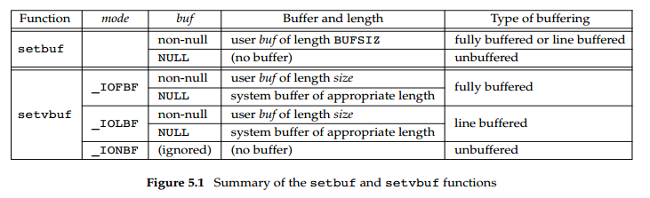
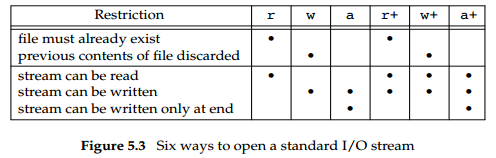

# Advanced Programming in the Unix Environment

## 5 Standard I/O Library

### 5.2 Streams and FILE Objects

1. When we open or create a file with the standard I/O library, we say that we have associated a **stream** with the file.

2. A stream's orientation
    - Standard I/O file streams can be used with both single-byte and multibyte ("wide") character sets.
    - A stream’s orientation determines whether the characters that are read and written are single byte or multibyte.
    - Initially, when a stream is created, it has no orientation.
    - If a multibyte I/O function (see `<wchar.h>`) is used on a stream without orientation, the stream’s orientation is set to wide oriented. If a byte I/O function is used on a stream without orientation, the stream’s orientation is set to byte oriented.

3. Only two functions can change the orientation once set. The freopen function will clear a stream’s orientation; the fwide function can be used to set a stream’s orientation.
```
#include <stdio.h>
#include <wchar.h>

int fwide(FILE *fp, int mode);

// Returns: positive if stream is wide oriented, negative if stream is byte oriented, or 0 if stream has no orientation
```

5. fwide
    - If the mode argument is negative, fwide will try to make the specified stream byte oriented.
    - If the mode argument is positive, fwide will try to make the specified stream wide oriented.
    - If the mode argument is zero, fwide will not try to set the orientation, but will still return a value identifying the stream’s orientation.
    - fwide will not change the orientation of a stream that is already oriented.
    - There is no error return. The only recourse we have is to clear errno before calling fwide and check the value of errno when we return.

6. FILE
    - When we open a stream, the standard I/O function fopen returns a pointer to a **FILE object**.
    - This object is normally a structure that contains all the information required by the standard I/O library to manage the stream: the file descriptor used for actual I/O, a pointer to a buffer for the stream, the size of the buffer, a count of the number of characters currently in the buffer, an error flag, and the like.
    - Application software should never need to examine a FILE object. To reference the stream, we pass its FILE pointer as an argument to each standard I/O function.
    - We refer to a pointer to a FILE object, the type `FILE *`, as a **file pointer**.

### 5.3 Standard Input, Standard Output, and Standard Error

1. Three streams are predefined and automatically available to a process: standard input, standard output, and standard error. These streams refer to the same files as the file descriptors `STDIN_FILENO`, `STDOUT_FILENO`, and `STDERR_FILENO`, respectively.

2. These three standard I/O streams are referenced through the predefined file pointers **stdin, stdout, and stderr**. The file pointers are defined in the `<stdio.h>` header.

### 5.4 Buffering

1. The goal of the buffering provided by the standard I/O library is to use the minimum number of read and write calls. Also, this library tries to do its buffering automatically for each I/O stream, obviating the need for the application to worry about it.

2. Three types of buffering are provided:
    - Fully buffered. In this case, actual I/O takes place when the standard I/O buffer is filled. Files residing on disk are normally fully buffered by the standard I/O library. The buffer used is usually obtained by one of the standard I/O functions calling malloc the first time I/O is performed on a stream.
    - Line buffered. In this case, the standard I/O library performs I/O when a newline character is encountered on input or output. Line buffering is typically used on a stream when it refers to a terminal—standard input and standard output, for example.
    - Unbuffered. The standard I/O library does not buffer the characters. The standard error stream, for example, is normally unbuffered so that any error messages are displayed as quickly as possible, regardless of whether they contain a newline.

3. Line buffering comes with two caveats.
    - First, the size of the buffer that the standard I/O library uses to collect each line is fixed, so I/O might take place if we fill this buffer before writing a newline.
    - Second, whenever input is requested through the standard I/O library from either (a) an unbuffered stream or (b) a line-buffered stream (that requires data to be requested from the kernel), all line-buffered output streams are flushed.

4. ISO C requires the following buffering characteristics:
    - Standard input and standard output are fully buffered, if and only if they do not refer to an interactive device.
    - Standard error is never fully buffered.

5. Most implementations default to the following types of buffering:
    - Standard error is always unbuffered.
    - All other streams are line buffered if they refer to a terminal device; otherwise, they are fully buffered.

6. If we don’t like these defaults for any given stream, we can change the buffering by calling either the setbuf or setvbuf function.
```
#include <stdio.h>

void setbuf(FILE *restrict fp, char *restrict buf );
int setvbuf(FILE *restrict fp, char *restrict buf, int mode, size_t size);

// Returns: 0 if OK, nonzero on error
```

7. Figure 5.1 summarizes the actions of these two functions and their various options.
    

8. Be aware that if we allocate a standard I/O buffer as an automatic variable within a function, we have to close the stream before returning from the function. Also, some implementations use part of the buffer for internal bookkeeping, so the actual number of bytes of data that can be stored in the buffer can be less than size. **In general, we should let the system choose the buffer size and automatically allocate the buffer. When we do this, the standard I/O library automatically releases the buffer when we close the stream.**

9. At any time, we can force a stream to be flushed.
```
#include <stdio.h>

int fflush(FILE *fp);

// Returns: 0 if OK, EOF on error
```

10. The fflush function causes any unwritten data for the stream to be passed to the kernel. As a special case, if fp is NULL, fflush causes all output streams to be flushed.

### 5.5 Opening a Stream

1. The fopen, freopen, and fdopen functions open a standard I/O stream.
```
#include <stdio.h>

FILE *fopen(const char *restrict pathname, const char *restrict type);
FILE *freopen(const char *restrict pathname, const char *restrict type, FILE *restrict fp);
FILE *fdopen(int fd, const char *type);

// All three return: file pointer if OK, NULL on error
```

2. ISO C specifies 15 values for the type argument, shown in Figure 5.3. Using the character b as part of the type allows the standard I/O system to differentiate between a text file and a binary file. Since the UNIX kernel doesn’t differentiate between these types of files, specifying the character b as part of the type has **no effect**.
    

3. With fdopen, the meanings of the type argument differ slightly. The descriptor has already been opened, so opening for writing does not truncate the file. (If the descriptor was created by the open function, for example, and the file already existed, the `O_TRUNC` flag would control whether the file was truncated. The fdopen function cannot simply truncate any file it opens for writing.) Also, the standard I/O append mode cannot create the file (since the file has to exist if a descriptor refers to it).

4. When a file is opened with a type of append, each write will take place at the then current end of file. If multiple processes open the same file with the standard I/O append mode, the data from each process will be correctly written to the file.

5. When a file is opened for reading and writing (the plus sign in the type), two restrictions apply.
    - Output cannot be directly followed by input without an intervening fflush, fseek, fsetpos, or rewind.
    - Input cannot be directly followed by output without an intervening fseek, fsetpos, or rewind, or an input operation that encounters an end of file.

6. [Explanation for 5](https://stackoverflow.com/questions/52068914/why-cant-an-output-be-followed-by-an-input-and-vice-versa):
    - When working with a FILE stream, there is a single internal buffer used when either reading from or writing to the file.
    - When switching between reading and writing, that buffer must be cleared before switching modes, otherwise data loss could potentially occur. Each of the operations mentioned above perform the required flushing of the buffer.

7. Note that if a new file is created by specifying a type of either w or a, we are not able to specify the file’s access permission bits. However, we can restrict these permissions by adjusting our **umask** value.

8. An open stream is closed by calling `fclose`.
```
#include <stdio.h>

int fclose(FILE *fp);

// Returns: 0 if OK, EOF on error
```

9. Any buffered output data is flushed before the file is closed. Any input data that may be buffered is discarded. If the standard I/O library had automatically allocated a buffer for the stream, that buffer is released.

10. When a process terminates normally, either by calling the exit function directly or by returning from the main function, all standard I/O streams with unwritten buffered data are flushed and all open standard I/O streams are closed.

### 5.6 Reading and Writing a Stream

1. Once we open a stream, we can choose from among three types of unformatted I/O:
    - Character-at-a-time I/O. We can read or write one character at a time, with the standard I/O functions handling all the buffering, if the stream is buffered.
    - Line-at-a-time I/O. If we want to read or write a line at a time, we use fgets and fputs. Each line is terminated with a newline character, and we have to specify the maximum line length that we can handle when we call fgets.
    - Direct I/O. This type of I/O is supported by the fread and fwrite functions. For each I/O operation, we read or write some number of objects, where each object is of a specified size. These two functions are often used for binary files where we read or write a structure with each operation.

2. Three functions allow us to read one character at a time.
```
#include <stdio.h>

int getc(FILE *fp);
int fgetc(FILE *fp);
int getchar(void);  // equivalent to getc(stdin)

// All three return: next character if OK, EOF on end of file or error
```

3. The difference between getc and fgetc is that getc can be implemented as a macro, whereas fgetc cannot be implemented as a macro. This means three things.
    - The argument to getc should not be an expression with side effects, because it could be evaluated more than once.
    - Since fgetc is guaranteed to be a function, we can take its address. This allows us to pass the address of fgetc as an argument to another function.
    - Calls to fgetc probably take longer than calls to getc, as it usually takes more time to call a function.

4. Note that these functions return the same value whether an error occurs or the end of file is reached. To distinguish between the two, we must call either ferror or feof.
```
#include <stdio.h>

int ferror(FILE *fp);
int feof(FILE *fp);

// Both return: nonzero (true) if condition is true, 0 (false) otherwise

void clearerr(FILE *fp);
```

5. In most implementations, two flags are maintained for each stream in the FILE object. Both flags are cleared by calling clearerr.
    - An error flag
    - An end-of-file flag

6. After reading from a stream, we can push back characters by calling ungetc.
```
#include <stdio.h>

int ungetc(int c, FILE *fp);

// Returns: c if OK, EOF on erro
```

7. Although ISO C allows an implementation to support any amount of pushback, an implementation is required to provide only a single character of pushback. We should not count on more than a single character.

8. Output functions are available that correspond to each of the input functions we’ve already described.
```
#include <stdio.h>

int putc(int c, FILE *fp);
int fputc(int c, FILE *fp);
int putchar(int c);  // equivalent to putc(c, stdout);

// All three return: c if OK, EOF on error
```

### 5.7 Line-at-a-Time I/O

1. Line-at-a-time input is provided by the fgets functions.
```
#include <stdio.h>

char *fgets(char *restrict buf, int n, FILE *restrict fp);

// Returns: buf if OK, NULL on end of file or error
```

2. This function reads up through and including the next newline, but no more than n − 1 characters, into the buffer. The buffer is always null terminated.

3. Line-at-a-time output is provided by fputs.
```
#include <stdio.h>

int fputs(const char *restrict str, FILE *restrict fp);

// Returns: non-negative value if OK, EOF on error
```

4. The function fputs writes the null-terminated string to the specified stream. **The null byte at the end is not written.** Note that this need not be line-at-a-time output, since the string need not contain a newline as the last non-null character. Usually, this is the case — the last non-null character is a newline—but it’s not required.

### 5.9 Binary I/O

1. The following two functions are provided for binary I/O.
```
#include <stdio.h>

size_t fread(void *restrict ptr, size_t size, size_t nobj, FILE *restrict fp);

size_t fwrite(const void *restrict ptr, size_t size, size_t nobj, FILE *restrict fp);

// Both return: number of objects read or written
```

2. These functions have two common uses:
    - Read or write a binary array.
    - Read or write a structure.

### 5.10 Positioning a Stream

1. There are three ways to position a standard I/O stream:
    - The two functions ftell and fseek. They have been around since Version 7, but they assume that a file’s position can be stored in a long integer.
    - The two functions ftello and fseeko. They were introduced in the Single UNIX Specification to allow for file offsets that might not fit in a long integer. They replace the long integer with the off_t data type.
    - The two functions fgetpos and fsetpos. They were introduced by ISO C.  They use an abstract data type, fpos_t, that records a file’s position. This data type can be made as big as necessary to record a file’s position.

2. When porting applications to non-UNIX systems, use fgetpos and fsetpos.

3. ftell vs fseek vs rewind. Note: A stream can also be set to the beginning of the file with the rewind function.
```
#include <stdio.h>

long ftell(FILE *fp);
// Returns: current file position indicator if OK, −1L on error

int fseek(FILE *fp, long offset, int whence);
// Returns: 0 if OK, −1 on error

void rewind(FILE *fp);
```

4. ftello vs fseeko
```
#include <stdio.h>

off_t ftello(FILE *fp);
// Returns: current file position indicator if OK, (off_t)−1 on error

int fseeko(FILE *fp, off_t offset, int whence);
// Returns: 0 if OK, −1 on error
```

5. fgetpos vs fsetpos
```
#include <stdio.h>

int fgetpos(FILE *restrict fp, fpos_t *restrict pos);
int fsetpos(FILE *fp, const fpos_t *pos);

// Both return: 0 if OK, nonzero on error
```

### 5.11 Formatted I/O

1. Formatted output is handled by the five printf functions.
```
#include <stdio.h>

int printf(const char *restrict format, ...);
int fprintf(FILE *restrict fp, const char *restrict format, ...);
int dprintf(int fd, const char *restrict format, ...);

// All three return: number of characters output if OK, negative value if output error

int sprintf(char *restrict buf, const char *restrict format, ...);

// Returns: number of characters stored in array if OK, negative value if encoding error

int snprintf(char *restrict buf, size_t n, const char *restrict format, ...);

// Returns: number of characters that would have been stored in array. If buffer was large enough, negative value if encoding error
```

2. The format specification controls how the remainder of the arguments will be encoded and ultimately displayed. Each argument is encoded according to a conversion specification that starts with a percent sign (%).

3. A conversion specification has four optional components, shown in square brackets below:
```
%[flags][fldwidth][precision][lenmodifier]convtype
```

4. Flags

| Flag | Description |
| ---- | ----------- |
| ’ | (apostrophe) format integer with thousands grouping characters |
| - | left-justify the output in the field |
| + | always display sign of a signed conversion |
| (space) | prefix by a space if no sign is generated |
| # | convert using alternative form (include 0x prefix for hexadecimal format, for example) |
| 0 | prefix with leading zeros instead of padding with sp |

5. The fldwidth component specifies a minimum field width for the conversion. If the conversion results in fewer characters, it is padded with spaces. The field width is a **non-negative decimal integer or an asterisk**.

6. The precision component specifies the minimum number of digits to appear for integer conversions, the minimum number of digits to appear to the right of the decimal point for floating-point conversions, or the maximum number of bytes for string conversions. The precision is **a period (.) followed by a optional non-negative decimal integer or an asterisk**.

7. Either the field width or precision (or both) can be an asterisk. In this case, an integer argument specifies the value to be used. The argument appears directly **before the argument** to be converted.

8. The lenmodifier component specifies the size of the argument.

| Length modifier | Description |
| --------------- | ----------- |
| hh | signed or unsigned char |
| h | signed or unsigned short |
| l | signed or unsigned long or wide character |
| ll | signed or unsigned long long |
| j | intmax_t or uintmax_t |
| z | size_t |
| t | ptrdiff_t |
| L | long double |

9. convtype

| Conversion type | Description |
| --------------- | ----------- |
| d,i | signed decimal |
| o | unsigned octal |
| u | unsigned decimal |
| x,X | unsigned hexadecimal |
| f,F | double floating-point number |
| e,E | double floating-point number in exponential format |
| g,G | interpreted as f, F, e, or E, depending on value converted |
| a,A | double floating-point number in hexadecimal exponential format |
| c | character (with l length modifier, wide character) |
| s | string (with l length modifier, wide character string) |
| p | pointer to a void |
| n | pointer to a signed integer into which is written the number of characters written so far |
| % | a % character |
| C | wide character (XSI option, equivalent to lc) |
| S | wide character string (XSI option, equivalent to ls) |

10. The following five variants of the printf family are similar to the previous five, but the variable argument list (...) is replaced with arg.
```
#include <stdarg.h>
#include <stdio.h>

int vprintf(const char *restrict format, va_list arg);
int vfprintf(FILE *restrict fp, const char *restrict format, va_list arg);
int vdprintf(int fd, const char *restrict format, va_list arg);
// All three return: number of characters output if OK, negative value if output error

int vsprintf(char *restrict buf, const char *restrict format, va_list arg);
// Returns: number of characters stored in array if OK, negative value if encoding error

int vsnprintf(char *restrict buf, size_t n, const char *restrict format, va_list arg);
// Returns: number of characters that would have been stored in array. If buffer was large enough, negative value if encoding error
```

11. Formatted input is handled by the three scanf functions.
```
#include <stdio.h>

int scanf(const char *restrict format, ...);
int fscanf(FILE *restrict fp, const char *restrict format, ...);
int sscanf(const char *restrict buf, const char *restrict format, ...);

// All three return: number of input items assigned, EOF if input error or end of file before any conversion
```

12. The format specification controls how the arguments are converted for assignment. The percent sign (%) indicates the beginning of a conversion specification.  Except for the conversion specifications and white space, other characters in the format have to match the input. If a character doesn’t match, processing stops, leaving the remainder of the input unread.

13. There are three optional components to a conversion specification, shown in square brackets below:
```
%[*][fldwidth][m][lenmodifier]convtype
```

14. The optional leading asterisk is used to **suppress conversion**. Input is converted as specified by the rest of the conversion specification, but the result is not stored in an argument.

15. The fldwidth component specifies the maximum field width in characters. The lenmodifier component specifies the size of the argument to be initialized with the result of the conversion.

16. The optional m character between the field width and the length modifier is called the assignment-allocation character. It can be used with the %c, %s, and `%[` conversion specifiers to **force a memory buffer to be allocated** to hold the converted string. In this case, the corresponding argument should be the address of a pointer to which the address of the allocated buffer will be copied. If the call succeeds, the caller is **responsible for freeing the buffer** by calling the free function when the buffer is no longer needed.

17. the scanf family supports functions that use variable argument lists as specified by <stdarg.h>.
```
#include <stdarg.h>
#include <stdio.h>

int vscanf(const char *restrict format, va_list arg);
int vfscanf(FILE *restrict fp, const char *restrict format, va_list arg);
int vsscanf(const char *restrict buf, const char *restrict format, va_list arg);

// All three return: number of input items assigned, EOF if input error or end of file before any conversion
```

18. 慎用scanf！坑多。[A beginners' guide away from scanf](http://sekrit.de/webdocs/c/beginners-guide-away-from-scanf.html)

### 5.13 Temporary Files

1. The ISO C standard defines two functions that are provided by the standard I/O library to assist in creating temporary files.
```
#include <stdio.h>

char *tmpnam(char *ptr);
// Returns: pointer to unique pathname

FILE *tmpfile(void);
// Returns: file pointer if OK, NULL on error
```

2. If ptr is NULL, the generated pathname is stored in a static area, and a pointer to this area is returned as the value of the function. Subsequent calls to tmpnam can overwrite this static area. (Thus, if we call this function more than once and we want to save the pathname, we have to save a copy of the pathname, not a copy of the pointer.)

3. The Single UNIX Specification defines two additional functions as part of the XSI option for dealing with temporary files: mkdtemp and mkstemp.
```
#include <stdlib.h>

char *mkdtemp(char *template);
// Returns: pointer to directory name if OK, NULL on error

int mkstemp(char *template);
// Returns: file descriptor if OK, −1 on error
```

4. The name is selected using the template string. This string is a pathname whose last six characters are set to XXXXXX.  The function replaces these placeholders with different characters to create a unique pathname. If successful, these functions modify the template string to reflect the name of the temporary file.

5. Unlike tmpfile, the temporary file created by mkstemp is not removed automatically for us. If we want to remove it from the file system namespace, we need to unlink it ourselves.

6. Use of tmpnam and tempnam does have at least one drawback: a window exists between the time that the unique pathname is returned and the time that an application creates a file with that name. During this timing window, another process can create a file of the same name. **The tmpfile and mkstemp functions should be used instead**, as they don’t suffer from this problem. (Wu: Don't use tmpnam!)

### 5.14 Memory Streams

1. In Version 4, the Single UNIX Specification added support for **memory streams**. These are standard I/O streams for which there are no underlying files, although they are still accessed with FILE pointers. All I/O is done by transferring bytes to and from buffers in main memory.

2. As we shall see, even though these streams look like file streams, several features make them **more suited for manipulating character strings**.

3. First, whenever a memory stream is opened for append, the current file position is set to **the first null byte in the buffer**. If the buffer contains no null bytes, then the current position is set to **one byte past the end of the buffer**. When a stream is not opened for append, the current position is set to the beginning of the buffer.

4. Because the append mode determines the end of the data by the first null byte, **memory streams aren’t well suited for storing binary data** (which might contain null bytes before the end of the data).

5. A null byte is written at the current position in the stream whenever we increase the amount of data in the stream’s buffer and call fclose, fflush, fseek, fseeko, or fsetpos. (Wuestion: In Figure 5.15, why there is no null byte appended after calling fclose?)

### 5.15 Alternatives to Standard I/O

1. One inefficiency inherent in the standard I/O library is the amount of data copying that takes place. When we use the line-at-a-time functions, fgets and fputs, the data is usually **copied twice**: once between the kernel and the standard I/O buffer (when the corresponding read or write is issued) and again between the standard I/O buffer and our line buffer.

2. The Fast I/O library [**fio(3)** in AT&T 1990a] gets around this by having the function that reads a line return a pointer to the line instead of copying the line into another buffer.

3. Korn and Vo [1991] describe another replacement for the standard I/O library: **sfio**. This package is similar in speed to the fio library and normally faster than the standard I/O library.

4. Krieger, Stumm, and Unrau [1992] describe another alternative that uses mapped files — the **mmap** function. This new package is called **ASI**, the Alloc Stream Interface.

### Exercises

1. [Exercise 5.5]
    - Q: How would you use the fsync function with a standard I/O stream?
    - A: Call fsync after each call to fflush. The argument to fsync is obtained with the fileno function. Calling fsync without calling fflush might do nothing if all the data were still in memory buffers.
