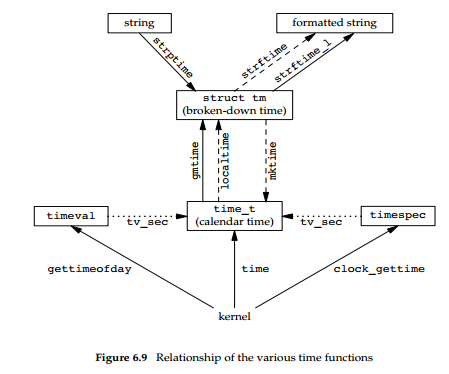
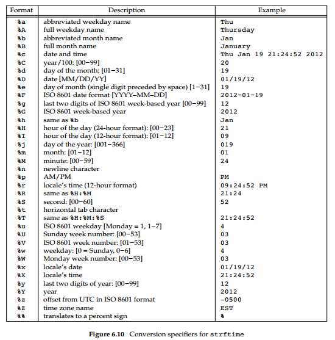
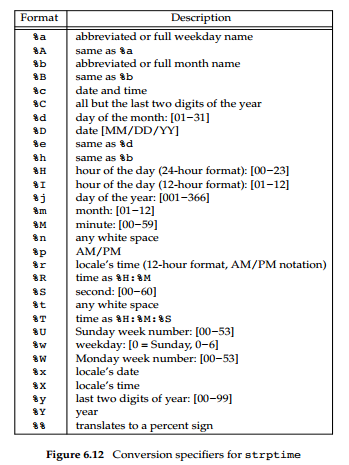

# Advanced Programming in the Unix Environment

## 6 System Data Files and Information

### 6.1 Introduction

1. A UNIX system requires numerous data files for normal operation: the password file /etc/passwd and the group file /etc/group are two files that are frequently used by various programs.

2. For larger systems, a sequential scan through the password file becomes time consuming. We want to be able to store these data files in a format other than ASCII text, but still provide an interface for an application program that works with any file format.

### 6.2 Password File

1. The UNIX System’s password file, called the user database by POSIX.1, contains the fields shown in the following code. These fields are contained in a passwd structure that is defined in `<pwd.h>`.
```
/* The passwd structure.  */
struct passwd
{
  char *pw_name;		/* Username.  */
  char *pw_passwd;		/* Password.  */
  __uid_t pw_uid;		/* User ID.  */
  __gid_t pw_gid;		/* Group ID.  */
  char *pw_gecos;		/* Real name.  */
  char *pw_dir;			/* Home directory.  */
  char *pw_shell;		/* Shell program.  */
};
```

2. The encrypted password field contains a single character as a placeholder where older versions of the UNIX System used to store the encrypted password.  Because it is a security hole to store the encrypted password in a file that is readable by everyone, encrypted passwords are now kept elsewhere.

3. Some fields in a password file entry can be empty. If the encrypted password field is empty, it usually means that the user does not have a password. (This is not recommended.)  And an empty comment field has no effect.

4. There are several alternatives to using `/dev/null` to prevent a particular user from logging in to a system. For example, `/bin/false` is often used as the login shell. It simply exits with an unsuccessful (nonzero) status; the shell evaluates the exit status as false. It is also common to see `/bin/true` used to disable an account; it simply exits with a successful (zero) status. Some systems provide the nologin command, which prints a customizable error message and exits with a nonzero exit status.

5. POSIX.1 defines two functions to fetch entries from the password file. These functions allow us to look up an entry given a user’s login name or numerical user ID.
```
#include <pwd.h>

struct passwd *getpwuid(uid_t uid);
struct passwd *getpwnam(const char *name);

// Both return: pointer if OK, NULL on error
```

6. These two POSIX.1 functions are fine if we want to look up either a login name or a user ID, but some programs need to go through the entire password file. Three functions can be used for this purpose: getpwent, setpwent, and endpwent.
```
#include <pwd.h>

struct passwd *getpwent(void);
// Returns: pointer if OK, NULL on error or end of file

void setpwent(void);
void endpwent(void);
```

7. When using getpwent, we must always be sure to close these files by calling endpwent when we’re through.

### 6.3 Shadow Passwords

1. The encrypted password is a copy of the user’s password that has been put through a one-way encryption algorithm. Because this algorithm is one-way, we can’t guess the original password from the encrypted version.

2. To make it more difficult to obtain the raw materials (the encrypted passwords), systems now store the encrypted password in another file `/etc/shadow`, often called the shadow password file. Minimally, this file has to contain the user name and the encrypted password. Other information relating to the password is also stored here.  
```
// #include <shadow.h>

/* Structure of the password file.  */
struct spwd
{
    char *sp_namp;		/* Login name.  */
    char *sp_pwdp;		/* Encrypted password.  */
    long int sp_lstchg;		/* Date of last change.  */
    long int sp_min;		/* Minimum number of days between changes.  */
    long int sp_max;		/* Maximum number of days between changes.  */
    long int sp_warn;		/* Number of days to warn user to change the password.  */
    long int sp_inact;		/* Number of days the account may be inactive.  */
    long int sp_expire;		/* Number of days since 1970-01-01 until account expires.  */
    unsigned long int sp_flag;	/* Reserved.  */
};
```

3. On Linux 3.2.0 and Solaris 10, a separate set of functions is available to access the shadow password file, similar to the set of functions used to access the password file.
```
#include <shadow.h>

struct spwd *getspnam(const char *name);
struct spwd *getspent(void);
// Both return: pointer if OK, NULL on error

void setspent(void);
void endspent(void);
```

### 6.4 Group File

1. The UNIX System’s group file `/etc/group`, called the group database by POSIX.1, contains the fields in the following code. These fields are contained in a group structure that is defined in `<grp.h>`.
```
/* The group structure.	 */
struct group
{
    char *gr_name;		/* Group name.	*/
    char *gr_passwd;		/* Password.	*/
    __gid_t gr_gid;		/* Group ID.	*/
    char **gr_mem;		/* Member list.	*/
};
```

2. We can look up either a group name or a numerical group ID with the following two functions, which are defined by POSIX.1.
```
#include <grp.h>

struct group *getgrgid(gid_t gid);
struct group *getgrnam(const char *name);

// Both return: pointer if OK, NULL on error
```

3. If we want to search the entire group file, we need the following functions.
```
#include <grp.h>

struct group *getgrent(void);
// Returns: pointer if OK, NULL on error or end of file

void setgrent(void);
void endgrent(void);
```

### 6.5 Supplementary Group IDs

1. With 4.2BSD, the concept of **supplementary group IDs** was introduced. Not only did we belong to the group corresponding to the group ID in our password file entry, but we could also belong to as many as **16** additional groups. The file access permission checks were modified so that in addition to comparing the the file’s group ID to the process effective group ID, it was also compared to all the supplementary group IDs.

2. Three functions are provided to fetch and set the supplementary group IDs.
```
#include <unistd.h>

int getgroups(int gidsetsize, gid_t grouplist[]);

// Returns: number of supplementary group IDs if OK, −1 on error

#include <grp.h> /* on Linux */
#include <unistd.h> /* on FreeBSD, Mac OS X, and Solaris */

int setgroups(int ngroups, const gid_t grouplist[]);

#include <grp.h> /* on Linux and Solaris */
#include <unistd.h> /* on FreeBSD and Mac OS X */

int initgroups(const char *username, gid_t basegid);
// Both return: 0 if OK, −1 on error
```

### 6.6 Implementation Differences

1. On many systems, the user and group databases are implemented using the **Network Information Service (NIS)**. This allows administrators to edit a master copy of the databases and distribute them automatically to all servers in an organization. Client systems contact servers to look up information about users and groups.

2. NIS+ and the Lightweight Directory Access Protocol (LDAP) provide similar functionality. Many systems control the method used to administer each type of information through the `/etc/nsswitch.conf` configuration file.

### 6.7 Other Data Files

1. Numerous other files are used by UNIX systems in normal day-to-day operation. For example, the BSD networking software has one data file for the services provided by the various network servers (`/etc/services`), one for the protocols (`/etc/protocols`), and one for the networks (`/etc/networks`).

2. The general principle is that every data file has at least three functions:
    - A `get` function that reads the next record, opening the file if necessary. These functions normally return a pointer to a structure. A null pointer is returned when the end of file is reached. Most of the get functions return a pointer to a static structure, so we always have to copy the structure if we want to save it.
    - A `set` function that opens the file, if not already open, and rewinds the file. We use this function when we know we want to start again at the beginning of the file.
    - An `end` entry that closes the data file. As we mentioned earlier, we always have to call this function when we’re done, to close all the files.

3. Additionally, if the data file supports some form of keyed lookup, routines are provided to search for a record with a specific key.

4. The following table shows some of these routines, which are common to UNIX systems.

| Description | Data file | Header | Structure | Additional keyed lookup functions |
| ----------- | --------- | ------ | --------- | --------------------------------- |
| passwords | /etc/passwd | <pwd.h> | passwd | getpwnam, getpwuid |
| groups | /etc/group | <grp.h> | group | getgrnam, getgrgid |
| shadow | /etc/shadow | <shadow.h> | spwd | getspnam |
| hosts | /etc/hosts | <netdb.h> | hostent | getnameinfo, getaddrinfo |
| networks | /etc/networks | <netdb.h> | netent | getnetbyname, getnetbyaddr |
| protocols | /etc/protocols | <netdb.h> | protoent | getprotobyname, getprotobynumber |
| services | /etc/services | <netdb.h> | servent | getservbyname, getservbyport |

### 6.8 Login Accounting

1. Two data files provided with most UNIX systems are the `utmp` file, which keeps track of all the users currently logged in, and the `wtmp` file, which keeps track of all logins and logouts. (Wu: The structure of utmp is defined in utmp.h file. In Linux, the corresponding files are `/var/run/utmp` and `/var/log/wtmp`.)

2. On login, one of these structures was filled in and written to the utmp file by the login program, and the same structure was appended to the wtmp file. On logout, the entry in the utmp file was erased—filled with null bytes—by the init process, and a new entry was appended to the wtmp file. This logout entry in the wtmp file had the ut_name field zeroed out.

3. Special entries were appended to the wtmp file to indicate when the system was rebooted and right before and after the system’s time and date was changed.

4. The `who(1)` program read the utmp file and printed its contents in a readable form. Later versions of the UNIX System provided the `last(1)` command, which read through the wtmp file and printed selected entries.

### 6.9 System Identification

1. POSIX.1 defines the uname function to return information on the current host and operating system.
```
#include <sys/utsname.h>

int uname(struct utsname *name);

// Returns: non-negative value if OK, −1 on error
```

2.  POSIX.1 defines only the minimum fields in the structure, which are all character arrays, and it’s up to each implementation to set the size of each array. Some implementations provide additional fields in the structure.
```
struct utsname {
    char sysname[]; /* name of the operating system */
    char nodename[]; /* name of this node */
    char release[]; /* current release of operating system */
    char version[]; /* current version of this release */
    char machine[]; /* name of hardware type */
};
```

3. The information in the utsname structure can usually be printed with the `uname(1)` command.

4. Historically, BSD-derived systems provided the gethostname function to return only the name of the host. This name is usually the name of the host on a TCP/IP network.
```
#include <unistd.h>

int gethostname(char *name, int namelen);

// Returns: 0 if OK, −1 on error
```

5. The gethostname function, which is now defined as part of POSIX.1, specifies that the maximum host name length is `HOST_NAME_MAX`.

6. There is also a `hostname(1)` command that can fetch or set the host name. (The host name is set by the superuser using a similar function, `sethostname`.) The host name is normally set at bootstrap time from one of the start-up files invoked by `/etc/rc` or init.

### 6.10 Time and Date Routines

1. The basic time service provided by the UNIX kernel counts the number of seconds that have passed since the Epoch: 00:00:00 January 1, 1970, **Coordinated Universal Time (UTC)**.

2.  The UNIX System has always differed from other operating systems in:
    - keeping time in UTC instead of the local time
    - Automatically handling conversions, such as daylight saving time
    - Keeping the time and date as a single quantity

3. The time function returns the current time and date.
```
#include <time.h>

time_t time(time_t *calptr);

// Returns: value of time if OK, −1 on error
```

4. The time value is always returned as the value of the function. If the argument is nonnull, the time value is also stored at the location pointed to by calptr.

5. The real-time extensions to POSIX.1 added support for multiple system clocks. A clock is identified by the clockid_t type. Standard values are summarized in the following table.

| Identifier | Option | Description |
| ---------- | ------ | ----------- |
| CLOCK_REALTIME | &nbsp | real system time |
| CLOCK_MONOTONIC | \_POSIX_MONOTONIC_CLOCK | real system time with no negative jumps |
| CLOCK_PROCESS_CPUTIME_ID | \_POSIX_CPUTIME | CPU time for calling process |
| CLOCK_THREAD_CPUTIME_ID | \_POSIX_THREAD_CPUTIME | CPU time for calling thread |

6. The clock_gettime function can be used to get the time of the specified clock. The time is returned in a timespec structure, which expresses time values in terms of seconds and nanoseconds.
```
#include <sys/time.h>

int clock_gettime(clockid_t clock_id, struct timespec *tsp);

// Returns: 0 if OK, −1 on error
```

7. We can use the clock_getres function to determine the resolution of a given system clock.
```
#include <sys/time.h>

int clock_getres(clockid_t clock_id, struct timespec *tsp);

// Returns: 0 if OK, −1 on error
```

8. To set the time for a particular clock, we can call the clock_settime function.
```
#include <sys/time.h>

int clock_settime(clockid_t clock_id, const struct timespec *tsp);

// Returns: 0 if OK, −1 on error
```

9. Version 4 of the Single UNIX Specification specifies that the gettimeofday function is now obsolescent. However, a lot of programs still use it, because it provides greater resolution (up to a microsecond) than the time function.
```
#include <sys/time.h>

int gettimeofday(struct timeval *restrict tp, void *restrict tzp);

// Returns: 0 always
```

10. The only legal value for tzp is NULL; other values result in unspecified behavior.

11. Figure 6.9 shows the relationships between the various time functions.
    

12. The two functions localtime and gmtime convert a calendar time into what’s called a broken-down time, a tm structure.
```
#include <time.h>

struct tm *gmtime(const time_t *calptr);

struct tm *localtime(const time_t *calptr);

// Both return: pointer to broken-down time, NULL on error
```

```
struct tm { /* a broken-down time */
    int tm_sec; /* seconds after the minute: [0 - 60] */
    int tm_min; /* minutes after the hour: [0 - 59] */
    int tm_hour; /* hours after midnight: [0 - 23] */
    int tm_mday; /* day of the month: [1 - 31] */
    int tm_mon; /* months since January: [0 - 11] */
    int tm_year; /* years since 1900 */
    int tm_wday; /* days since Sunday: [0 - 6] */
    int tm_yday; /* days since January 1: [0 - 365] */
    int tm_isdst; /* daylight saving time flag: <0, 0, >0 */
};
```

13. The difference between localtime and gmtime is that the first converts the calendar time to the local time, taking into account the local time zone and daylight saving time flag, whereas the latter converts the calendar time into a broken-down time expressed as UTC.

14. The function mktime takes a broken-down time, expressed as a local time, and converts it into a time_t value.
```
#include <time.h>

time_t mktime(struct tm *tmptr);

// Returns: calendar time if OK, −1 on error
```

15. The strftime function is a printf-like function for time values. It is complicated by the multitude of arguments available to customize the string it produces.
```
#include <time.h>

size_t strftime(char *restrict buf, size_t maxsize, const char *restrict format, const struct tm *restrict tmptr);

// Returns: number of characters stored in array if room, 0 otherwise
```

16. Figure 6.10 describes the 37 ISO C conversion specifiers.
    

17. The strptime function is the inverse of strftime. It takes a string and converts it into a broken-down time.
```
#include <time.h>

char *strptime(const char *restrict buf, const char *restrict format, struct tm *restrict tmptr);

// Returns: pointer to one character past last character parsed, NULL otherwise
```

18. The conversion specifiers for the strptime function are summarized in Figure 6.12.
    

19. We mentioned that the three functions in Figure 6.9 with dashed lines were affected by the TZ environment variable: localtime, mktime, and strftime. If defined, the value of this environment variable is used by these functions instead of the default time zone. If the variable is defined to be a null string, such as TZ=, then UTC is normally used. (Wu: We can set TZ by adding "TZ=Asia/Shanghai" before the command we want to run. For more timezone information, you can check the `/usr/share/zoneinfo` directory`.)
