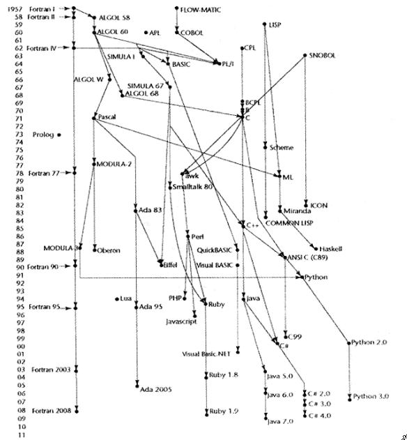

# 《程序设计语言原理》读书笔记

## 语言评估标准
程序设计语言的最重要的评估标准有4个：可读性、可写性、可靠性与代码。此外，还有通用性（在广泛范围内可应用的程度）及定义良好性（程序设计语言官方定义文档的完整性及准确程度）等评估标准。

### 语言的评估标准和影响这些评估标准的语言特征

语言特征            | 可读性 | 可写性 | 可靠性
------------------- | ------ | ------ | ------
简单性              |   *    |   *    |   *
正交性              |   *    |   *    |   *
控制结构            |   *    |   *    |   *
数据类型与数据结构  |   *    |   *    |   *
语法设计            |   *    |   *    |   *
支持抽象            |        |   *    |   *
表达性              |        |   *    |   *
类型检测            |        |        |   *
异常处理            |        |        |   *
别名使用            |        |        |   *

### 可读性

#### 简单性对可读性的影响

* 一种语言的整体简单性极大地影响着它的可读性，一种具有大量基本结构的语言较只有少量基本结构的语言要难学得多。

* 特性的多样化、运算符重载可能会降低程序的可读性。

* 过分追求语言的简单性也不妥。汇编语言缺乏较为复杂的控制语句，导致清晰性不佳；而且由于其语句简单，编写类似功能的程序，往往需要使用比高级语言多得多的语句。

#### 正交性对可读性的影响

* 程序设计语言的正交性指的是，使用该语言中相对少量的基本结构，经过相对少的组合步骤，可以构成该语言的控制结构与数据结构。

* 正交性的意义是独立于它在程序中出现的上下文的。语言的正交性来自于它的基本结构的对称关系。缺乏正交性会导致语言规则的异常。正交性越好，异常规则就会越少，因而较容易被人们学习、阅读和理解。

* 过分追求正交性也会有问题。高度正交性会导致过量的各种结合，导致不必要的复杂性。

* 部分人认为，函数式语言是简单性与正交性的有机结合。

#### 控制结构对可读性的影响

* 缺乏控制语句导致很差的可读性。能够从头到尾顺序读完的程序，比需要读者从一条语句跳跃到另一条语句来跟踪程序的执行顺序要好读得多。

#### 数据类型与数据结构对可读性的影响

* 用布尔数据类型比用数值数据类型来表示标志，其可读性更好；用结构体比用一组相似数组来记录员工档案，其可读性更好。

#### 语法设计对可读性的影响

* 将标识符的长度限制得很短会降低语言的可读性。

* 语言中特殊字的形式将极大地影响程序的外观及与此相关联的程序的可读性。如Ada使用end if来终止选择结构、使用end loop来终止循环结构，而C语言统一使用大括号}。前者可读性更好，但导致更多的保留字。

* 设计程序语言中的语句时，使其字面形式至少部分第表明它们的功用，有助于增强可读性。人们对Unix shell的不满之一，是它们的形式并非总是提示它们的功能，比如新手接触grep时很难联系到g/regular\_expression/g的含义。

### 可写性

#### 简单性与正交性对可写性的影响

* 一组较少量的基本结构以及一套相互一致的组合规则，能提高可写性。因为程序员只需学习一套简单的基本结构，就能针对复杂问题设计出解决方法。

* 过分的正交性有损于可写性。因为当基本结构的任意组合几乎都合法时，就很难检查出程序中的错误。

#### 支持抽象对可写性的影响

* 抽象指的是通过合理省略许多细节的方式，来定义并使用复杂结构或复杂运算的能力。

* 程序设计语言可以支持两种不同类型的抽象：过程抽象与数据抽象。

* 过程抽象举例：采用子程序来实现程序中的重复语句，这样明显方便编写。

* 数据抽象举例：使用类来表示二叉树节点结构，表达自然，方便编写。

#### 表达性对可写性的影响

* 表达性值一种程序设计语言具有相对方便、非繁琐的方式来说明运算。比如`count++`比`count=count+1`更方便简洁。

### 可靠性

#### 类型检测对可靠性的影响

* 编译时的类型检测要比运行时的类型检测更为理想。因为运行时的类型检测是高代价的。程序中的错误发现得越早，改正错误的代码就越低。

#### 异常处理对可靠性的影响

* 异常处理一般指中断运行时错误（以及所发现的其他非正常情况）并改正错误然后继续运行的能力。异常处理显然有助于提高程序的可靠性。

#### 使用别名对可靠性的影响

* 使用别名指的是用两个以上的名字来访问同一个存储单元。使用别名是程序设计语言中的一个危险特性。程序员必须时刻记住，如果多个指针指向同一个对象，改变一个指针所指向的值，其他指针所指向的值也会随之改变。

#### 可读性与可写性对可靠性的影响

* 一个程序越容易编写，则其正确的可能性越大。

* 在软件生命周期的编写与维护阶段，程序的可读性都会影响其可读性。

### 代价

影响程序设计语言代价的三个重要因素是程序开发、软件维护及可靠性。

* 训练程序员使用这种语言的代价，取决于语言的简单性与正交性。

* 使用这种语言来编写程序的代价，取决于语言的可写性，也部分取决于这种语言的设计目的与特定应用问题的接近程度。

* 在这种语言中编译程序的代价，取决于其编译器。注意：编译器产生采用优化技术可以减少产生代码的规模及提高代码的执行速度但会导致编译时间增长。

* 程序运行的代价，取决于执行效率。要求进行大量运行时类型检测的语言必将阻碍代码的高速执行。

* 语言实现系统的代价。Java能够快速被人们接受的原因之一，是该语言有免费的编译器/解释器系统。

* 可靠性差的代价。造成经济损失甚至更严重的后果。

* 程序维护的代价，主要取决于语言的可读性。

## 语言设计

### 语言分类

程序设计语言通常可以分为四类：命令式语言、函数式语言、逻辑语言以及面向对象语言。

### 影响语言设计的因素

影响语言设计的因素中，最为重要的是计算机体系结构及程序设计方法学。

#### 计算机体系结构

* 过去50年中，绝大多数语言都是依据冯·诺依曼体系来设计的。冯·诺依曼体系是指：数据与程序都被存储于同一存储器，执行指令的中央处理器（CPU）与存储器是分开的。因此，指令和数据必须从存储器传输到CPU，而CPU运行的结果又必须传回存储器。

* 由于冯·诺依曼体系结构，命令式语言的核心特形成有：模拟存储单元的变量、基于传输操作的赋值语句，以及迭代形式的循环运算。

* 函数式语言进行计算的主要方式是将函数作用于给定参数之上，在函数式语言中的程序设计可以没有变量、没有赋值语句以及没有循环。

* 在一种能够允许函数式语言程序高效率运行的、非冯·诺依曼体系结构的计算机出现之前，函数式语言是不可能替代命令式语言的。 在过去25年间产生的并行体系结构计算机，有望加快函数式程序的执行速度，但其速度仍然不足以与命令式程序的执行速度相比。

#### 程序设计方法学

* 20世纪60年代末至70年代初期，人们开始深入分析软件开发的过程及程序设计语言的设计问题，其中一个重要原因是：随着硬件成本的降低及软件费用的增加，计算机的主要代价从硬件转向软件。

* 20世纪70年代产生的新的软件开发方法学被称为自顶向下设计、逐步求精。当时发现程序设计语言的主要缺点是不完全的类型检测，以及不适宜的控制语句（需要运用太多的goto语句）。

* 20世纪70年代后期，开始了从面向过程转移到面向数据的程序设计方法学。在面向数据的软件开发的演进中，最后一步是20世纪80年代初期的面向对象的程序设计。

### 语言设计中的权衡

#### 可靠性与执行代价的权衡

Java语言要求索引数组元素时必须检查下标，C语言则不作要求，这导致C语言的执行速度比语义上相同的Java程序要快得多，但Java程序则更为可靠。

#### 可读性与可写性的权衡

APL语言具有一整套功能强大、用于数组操作数的运算符，对于那些具有多个数组运算的应用，APL语言的可写性很高，但可读性极差。著名作者Daniel McCracken曾经写道，他花费了四个小时来阅读和理解一个仅有四行的APL程序。

#### 可写性与可靠性的权衡

C++中的指针可以以各种不同的方式来操作，导致数据寻址极为灵活，但带来指针所具有的潜在可靠性问题。

### 实现方法

#### 计算机的分层概念

一台典型计算机系统所提供的虚拟计算机的分层接口，由内到外依次是：
1. 裸机。主要组成部分是存储器和处理器。
2. 宏指令解释器。
3. 操作系统。提供系统资源管理、输入和输出操作、文件管理系统、文字以及程序编辑器等基本操作。
4. 语言实现系统。例如C编译器、Java虚拟器和Scheme解释器等。由于语言实现系统需要许多操作系统工具，所以它是与操作系统接口打交道的。

#### 实现程序设计语言的三种一般方法：
1. 编译。编译的过程一般是：词法分析-->语法分析-->中间代码生成（及语义分析）-->代码生成
2. 单纯解释。解释器的作用就如同一个机器的软件模拟，它的取值-执行周期的对象是高级语言中的程序语句而非机器指令。JavaScript和PHP等语言采用这种实现方法。
3. 混合实现系统。介于编译器与单纯解释器之间。这类系统将高级语言的程序翻译成一种专为方便解释而设计的中间语言。Perl采用这种实现方法。

## 主要程序设计语言的发展

### 常用高级语言概貌

### Plankalkul

* 1943年至1945年，德国科学家Konrad Zuse开发了一种用来表达计算的语言Plankalkul，意为“程序微积分学”。

* Plankalkul语言最简单的数据类型是单个字位类型，从字位类型构造出整数与浮点数。浮点类型使用两两互补的标记法以及“隐藏字位”方案。现在人们使用这种方案来避免存储一个数值的标准化小数部分的最高字位。

* Plankalkul语言包括了数组和记录。记录可以嵌套记录。

* Plankalkul最有趣的特性之一是用数学表达式来表示程序变量之间的关系。

### 伪代码

此处的“伪代码”与现在与现在一般意义上的不同，它指的是下面将要讨论的短代码和快速编码等语言。

#### 机器语言

最初的程序设计都是使用机器代码来完成，机器代码存在以上问题：

* 使用数值代码来说明指令，导致程序非常难读。
* 使用绝对地址，导致程序的修改非常困难。

这些问题是促使人们发明汇编器和汇编语言的主要动力。此外，当时大部分程序设计问题需要有浮点数的算术运算，以及便于数组使用的下标索引方法。而20世纪40年代末至50年代初的计算机体系结构并不支持这些功能，从而导致较高级语言的发展。

#### 短代码（Short Code）

* 1949年，John Mauchly为BINAC计算机开发了一种被称为短代码（Short Code）的新语言，后来被移植到UNIVAC I计算机上。

* UNIVAC存储器的字具有72个字位，这72个字位被组合成12个6字位的字节。短代码是由编好码的、将被求值的数学表达式组成。这些代码是字节对的数值形式，并且大多数方程适合被包含进一个子内。比如：`X0 = SQRT(ABS(Y0))`可以编码成一个字`00 X0 03 20 06 Y0`

* 短代码不翻译成机器码，相反它由单纯解释器来实现。当时人们将这种过程称为自动程序设计。

#### 快速编码（Speedcoding）

* 1954年，John Backus为IBM 701计算机开发了快速编码（Speedcoding）解释器，使其能包括浮点数的操作，从而扩展机器语言。

* Speedcoding解释器有效地将701机器转换成一个具有虚拟的三地址浮点数的计算器，从而支持在浮点数据上进行四种算术运算的虚拟指令，以及进行平方根、正弦、正切、指数和对数等运算的虚拟指令。

#### 相关工作

* 1950年，剑桥大学的David J. Wheeler提出一种方法，使用可以重新定位地址的块结构来部分地解决绝对地址的问题。

* 1951年，剑桥大学的Maurice V. Wilkes扩展这种思路设计了一种汇编程序，可以组合选择的子程序，并分配存储空间。

### Fortran

* 20世纪50年代的计算机上缺乏浮点数运算的硬件，因此必须使用软件来模拟所有浮点数运算，这一过程极为耗时，因此解释过程的开销就成为可以接受的代价。

* 1954年在硬件上兼有索引检索与浮点数运算指令的IBM 704系统的诞生，至少为科学计算领域预示了解释器时代的结束。

* IBM的John Backus和他的工作小组于1945年11月前发表了题目为“The IBM Mathematical FORmula TRANslating System: FORTRAN”的报告，描述了被成为Fortran 0的Fortran语言实现之前的第一个版本。

* Fortran是第一种广泛应用的高级语言，它的成功显著地改变了计算机的使用方式。后来几乎所有的程序设计语言都得益于Fortran语言。

### LISP

#### 历史背景

* 从20世纪50年代中期开始，许多不同领域的人们（如语言学、心理学和数学等领域）对人工智能产生了兴趣。语言学家们关心的是自然语言的处理，心理学家感兴趣的是模拟人类大脑信息的存储与检索，以及其他的一些大脑的基本过程，数学家们感兴趣的是某些特定智能过程的机器化，例如定理的证明。所有这些方面的研究达成了一致的结论：必须开发一些方法，使得计算机能处理链表中的符号数据。

* 1958年的夏天，John McCarthy在IBM信息研究部门研究符号运算，并且为进行这种类型的运算开发一组语言需求，其中包括：数学函数的控制流程方法，如递归与条件表达式；动态地分配链表结构的需要，以及将废弃的表结构以某种隐式方式解除分配。由于当时的Fortran表处理语言FLPL不支持这些需求，McCarthy当时十分清楚：必须要发明一种新的语言。

* 1958年的秋天，John McCarthy和Marvin Minsky组成了MIT人工智能项目，这个项目的第一个重要工作是开发一个表处理系统，他们首先实现了Advice Taker程序，而这个程序成为开发表处理语言LISP的动力。

#### 语言概述

* 纯LISP只有两种数据结构：原子与表。

* 函数式程序中的所有运算都是通过在自变量上应用函数来完成。函数式程序不需要赋值语句、变量和循环等语法。

* Scheme和COMMON LISP是LISP语言的两种方言。

### ALGOL 60

* ALGOL 60的出现源自人们企图设计一种科学应用领域的通用语言。当时现有的语言包括Fortran都是围绕单一的计算机体系结构开发的。

* 1958年5月，GAMM（应用数学与力学协会）和ACM（美国计算机协会）在苏黎世举行第一次联合设计语言的会议，设计的语言被命名为ALGOL（ALGOrithmic Language），意为算法语言。

* ALGOL 58将Fortran的许多语言特性通用化，并增加一些新的结构和概念：
    * 形式化了数据类型的概念，非浮点数的变量需要用显性的类型声明。
    * 增加复合语句的概念。
    * 标识符可以具有任意长度，而Fortran语言规定标识符最多6个字符。
    * 数组可以具有任意的维数，而Fortran规定数组最多只能有3个维数。
    * 允许嵌套选择语句，而Fortran不允许。

* 1960年，第二次ALGOL会议对ALGOL 58进行了重大修改，得到ALGOL 60：
    * 引入了块结构的概念。
    * 允许使用两种不同的方式进行子程序参数的传递：按值传递与按名传递。
    * 允许递归过程。
    * 允许栈动态数组。栈动态数组的下标范围由变量来指定，所以数组的大小是在执行到数组声明、为数组分配存储空间时确定的。

### COBOL

* 1959年5月，由美国国防部资助、以商务通用应用语言为主题的第一次正式会议在五角大楼举行。会议一致通过了通用商务语言（Common Business Language）应该具有的一般特性：
    * 这种语言应该尽可能使用英语。
    * 这种语言必须易于使用，深圳不惜牺牲一些语言功能为代价，以扩宽可以运用计算机程序的群众基础。
    * 在语言设计上不应过分受限于语言实现问题。

* COBOL语言初创了许多崭新的概念：
    * COBOL 60的DEFINE动词是第一种宏指令的高级语言结构。
    * 最早出现于Plankalkul语言中的层次数据结构首次被实现于COBOL语言中。
    * COBOL也是允许名称真正具有含义的第一种语言，因为它允许长达30个字符的长名字以及连字符（-）。

* 由于COBOL语言的功能极好地满足了其应用领域的需要，自从COBOL语言出现以后，再也没有人试图设计一种新的商务应用语言。

### BASIC

