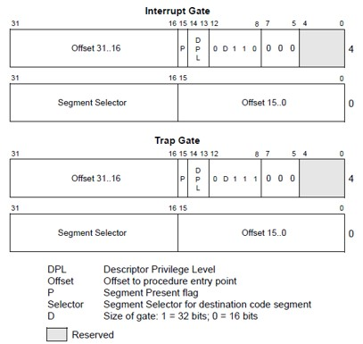

# 《Tsinghua os mooc》第1~4讲 启动、中断、异常和系统调用

## 资源

1. [OS2018Spring课程资料首页](http://os.cs.tsinghua.edu.cn/oscourse/OS2018spring)

2. [uCore OS在线实验指导书](https://chyyuu.gitbooks.io/ucore_os_docs/content/)

3. [ucore实验基准源代码](https://github.com/chyyuu/ucore_os_lab)

4. [MOOC OS习题集](https://xuyongjiande.gitbooks.io/os_exercises/content/index.html)

5. [OS课堂练习](https://chyyuu.gitbooks.io/os_course_exercises/content/)

6. [Piazza问答平台](https://piazza.com/connect) 暂时无法注册

## 疑问

1. 为什么用户态和内核态不能共用一个栈？为什么系统调用时要切换到内核栈？

2. x86的中断号哪些是硬中断、哪些是软中断或异常？

3. x86中断描述符中的DPL是多少？

4. DPL, CPL, RPL仍未理解？

5. 感觉获取中断处理例程的过程略麻烦：首先根据中断向量索引IDT表获得中断门描述符，从中断门描述符中获得段选择子，根据段选择子索引GDT表获得段起始地址，再加上中断门描述符中的偏移，得到中断处理例程的地址。为什么不直接在中断门描述符中保持段起始地址，这样就不用再索引GDT了？

## 第一讲 操作系统概述

1. 操作系统内核包括串口驱动、磁盘驱动、字符设备I/O、块设备I/O等。

2. 内核特征
    * 并发：计算机系统中同时存在多个运行的程序，需要OS管理和调度
    * 共享：“同时”访问、互斥共享
    * 虚拟：利用多道程序设计技术，让每个用户都觉得有一个计算机专门为他服务
    * 异步：

3. 操作系统需要管理的资源有：内存、进程及线程、处理机、文件系统。

4. 课程设计
    * ucore+模块化改进（可加载模块完善、动态链接库完善、内核功能的模块化改进）
    * 目前可以在树莓派上运行ucore，但对HDMI接口的支持不是很好

5. 操作系统为什么改变
    * 原则：设计随着各种相关技术的改变而做出一定的改变
    * 在过去二十年底层技术有极大的改变

6. 分时系统的CPU在不同程序之间调度，所以其CPU使用率相对多道程序系统有所下降，但能协调CPU使用时长不一的多个用户程序，提高了用户效率。

7. 微内核 vs 外核 VS 虚拟机
    * 微内核：尽可能把内核功能移到用户空间，用户模块间的通信使用消息传递
    * 外核：在内核里放更少的东西，只保留保护和隔离的作用，将资源管理的功能移到用户控件。
    * 虚拟机：在操作系统和硬件之间增加了一层虚拟机管理器（VMM）。虚拟机跟硬件打交道，操作系统跟虚拟机打交道。虚拟机负责资源的隔离，操作系统负责资源的管理。

## 第二讲 实验零 操作系统实验环境准备

1. ucore使用了面向对象的编程方法。
    * 面向对象编程方法。虽然ucore是用C语言开发的，但可以通过函数指针来建立一个通用的数据结构来提供统一的接口，而具体实现可以不一样。
    * 通用数据结构。如双向链表。

2. [type \*)0)->member in C?](https://stackoverflow.com/questions/13723422/why-this-0-in-type0-member-in-c):   
The pointer to zero is used to get a proper instance, but as typeof is resolved at compile-time and not at run-time the address used in the pointer doesn't have to be a proper or valid address.

3. 80386共有4种运行模式：实模式、保护模式、SMM模式和虚拟8086模式。
    - 实模式：这是个人计算机早期的8086处理器采用的一种简单运行模式，当时微软的MS-DOS操作系统主要就是运行在8086的实模式下。80386加电启动后处于实模式运行状态，在这种状态下地址总线只有20根，软件可访问的物理内存空间不能超过1MB，且无法发挥Intel 80386以上级别的32位CPU的4GB内存管理能力。实模式将整个物理内存看成分段的区域，程序代码和数据位于不同区域，操作系统和用户程序并没有区别对待，而且每一个指针都是指向实际的物理地址。对于每一个由段寄存器的内容确定的“基地址”，即使这个段的实际长度萧瑜64KB，一个进程总是能够访问从此开始64KB的连续地址空间，而无法加以限制。而且进程可以随意修改段选择子。这样用户程序的一个指针如果指向了操作系统区域或其他用户程序区域，并修改了内容，那么其后果就很可能是灾难性的。这主要是Intel x86的向下兼容需求导致其一直存在。其他一些CPU，比如ARM、MIPS等就没有实模式，而是只有类似保护模式这样的CPU模式。
    - 保护模式：保护模式的一个主要目标是确保应用程序无法对操作系统进行破坏。实际上，80386就是通过在实模式下初始化控制寄存器（如GDTR，LDTR，IDTR与TR等管理寄存器）以及页表，然后再通过设置CR0寄存器使其中的保护模式使能位置位，从而进入到80386的保护模式。当80386工作在保护模式下的时候，其所有的32根地址线都可供寻址，物理寻址空间高达4GB。在保护模式下，支持内存分页机制，提供了对虚拟内存的良好支持。保护模式下80386支持多任务，还支持优先级机制，不同的程序可以运行在不同的特权级上。特权级一共分0～3四个级别，操作系统运行在最高的特权级0上，应用程序则运行在比较低的级别上；配合良好的检查机制后，既可以在任务间实现数据的安全共享也可以很好地隔离各个任务。
    - 实模式 vs 保护模式的其他差别
        - 实模式下physical_addr = linear_addr = 16 * base + offset，其中base和offset均为16 bit；保护模式下linear_addr = base + offset，其中base和offset均为32 bit，如果不开启页机制，则physical_addr = linear_addr，如果开启页机制，则physical_addr由linear_addr经过页机制转换得到，两者一般不相等。
        - 实模式下没有段选择子和GDT的概念，保护模式下才有。事实上，实模式下的段寄存器装的16 bit全部为段基址，保护模式下的段寄存器装的16 bit中，13 bit为段描述符在GDT/LDT中的索引，2 bit为DPL，1 bit为TI（标识是GDT还是LDT）

4. 物理地址 vs 线性地址
    * 物理内存地址空间：处理器提交到总线上用于访问计算机系统中的内存和外设的最终地址，一个计算机系统只有一个物理地址空间
    * 线性地址空间：在操作系统的虚存管理下每个运行的应用程序能访问的地址空间，每个运行的应用程序都认为自己独享整个计算机系统的地址空间，这样可让多个运行的应用程序之间相互隔离
    * 逻辑地址空间：应用程序直接使用的地址空间
    * 段机制启动、页机制未启动：逻辑地址 -> 段机制处理 -> 线性地址 = 物理地址
    * 段机制和页机制都启动：逻辑地址 -> 段机制处理 -> 线性地址 -> 页机制处理 -> 物理地址 

5. EFLAGS寄存器相关控制/标志位的含义
    - CF(Carry Flag)：进位标志位；
    - PF(Parity Flag)：奇偶标志位；
    - AF(Assistant Flag)：辅助进位标志位；
    - ZF(Zero Flag)：零标志位；
    - SF(Singal Flag)：符号标志位；
    - IF(Interrupt Flag)：中断允许标志位,由CLI，STI两条指令来控制；设置IF位使CPU可识别外部（可屏蔽） 中断请求，复位IF位则禁止中断，IF位对不可屏蔽外部中断和故障中断的识别没有任何作用；
    - DF(Direction Flag)：向量标志位，由CLD，STD两条指令来控制；
    - OF(Overflow Flag)：溢出标志位；
    - IOPL(I/O Privilege Level)：I/O特权级字段，它的宽度为2位,它指定了I/O指令的特权级。如果当前的特权级别在数值上小于或等于IOPL，那么I/O指令可执行。否则，将发生一个保护性故障中断；
    - NT(Nested Task)：控制中断返回指令IRET，它宽度为1位。若NT=0，则用堆栈中保存的值恢复EFLAGS，CS和EIP从而实现中断返回；若NT=1，则通过任务切换实现中断返回。在ucore中，设置NT为0。

6. 开发工具
    - 源码编辑和阅读工具
        - eclipse-CDT：基于Eclipse的C/C++集成开发环境、跨平台、丰富的分析理解代码的功能
        - Understand：跨平台、丰富的分析理解代码的功能
        - vim: Linux/unix中的传统编辑器，类似有emacs等，可通过exuberant-ctags、cscope等实现代码定位
    - 源码比较工具
        - diff/patch：命令行工具，使用简单
        - meld：图形界面的工具，功能相对直观和方便，类似的工具还有 kdiff3、diffmerge、P4merge
    - 硬件模拟器：QEMU可模拟多种CPU硬件环境，本实验中，用于模拟一台intel x86-32的计算机系统。类似的工具还有BOCHS, SkyEye等。
    - 开发编译调试工具
        - gcc：C语言编译器
        - gdb：执行程序调试器
        - ld：链接器
        - objdump：对ELF格式执行程序文件进行反编译、转换执行格式等操作的工具
        - nm：查看执行文件中的变量、函数的地址
        - readelf：分析ELF格式的执行程序文件
        - make：软件工程管理工具， make命令执行时，需要一个 makefile 文件，以告诉
        - make命令如何去编译和链接程序
        - dd：读写数据到文件和设备中的工具
    - markdown文本格式的编写和阅读工具
        - 编写工具 haroopad
        - 阅读工具 gitbook

## 第三讲 启动、中断、异常和系统调用

1. x86系统启动时计算机内存布局
    - 启动时地址空间只有1MB（范围为0x00000000 ~ 0x000FFFFF）
    - 这1MB中最低的640KB（范围为0x00000000 ~ 0x000A0000）称为Low Memory，这是启动时PC能够使用的RAM内存
    - 剩下的384KB（范围为0x000A0000 ~ 0x000FFFFF）预留给硬件特殊用途，比如VGA输出缓存区、Firmware及BIOS等
    - 这1MB中最高的64KB（范围为0x000F0000 ~ 0x000FFFFF）存放BIOS文件
    - 到了32位的80386 CPU时代，内存空间扩大到了4G，多了段机制和页机制，但Intel依然很好地保证了80386向后兼容8086。地址空间的变化导致无法直接采用8086的启动约定。如果把BIOS启动固件编址在0xF000起始的64KB内存地址空间内，就会把整个物理内存地址空间隔离成不连续的两段，一段是0xF000以前的地址，一段是1MB以后的地址，这很不协调。为此，intel采用了一个折中的方案：默认将执行BIOS ROM编址在32位内存地址空间的最高端，即位于4GB地址的最后一个64KB内。

```
+------------------+  <- 0xFFFFFFFF (4GB)
|      32-bit      |
|  memory mapped   |
|     devices      |
|                  |
/\/\/\/\/\/\/\/\/\/\

/\/\/\/\/\/\/\/\/\/\
|                  |
|      Unused      |
|                  |
+------------------+  <- depends on amount of RAM
|                  |
|                  |
| Extended Memory  |
|                  |
|                  |
+------------------+  <- 0x00100000 (1MB)
|     BIOS ROM     |
+------------------+  <- 0x000F0000 (960KB)
|  16-bit devices, |
|  expansion ROMs  |
+------------------+  <- 0x000C0000 (768KB)
|   VGA Display    |
+------------------+  <- 0x000A0000 (640KB)
|                  |
|    Low Memory    |
|                  |
+------------------+  <- 0x00000000
```

2. 对于Intel 80386的体系结构而言，PC机中的系统初始化软件由BIOS (Basic Input Output System，即基本输入/输出系统，其本质是一个固化在主板Flash/CMOS上的软件)和位于软盘/硬盘引导扇区中的OS BootLoader（在ucore中的bootasm.S和bootmain.c） 一起组成。BIOS实际上是被固化在计算机ROM（只读存储器） 芯片上的一个特殊的软件，为上层软件提供最底层的、最直接的硬件控制与支持。

3. BIOS启动固件的组成
    * 基本输入输出的程序
    * 系统配置信息，比如从哪里启动（磁盘、U盘、光盘等）
    * 开机后自检程序
    * 系统自启动程序
    * 将加载程序BootLoader从磁盘的引导扇区加载到0x7c00

> bios将boot loader加载到地址为0x7c00的物理内存中，这是硬件设计中约定俗成的规定。"If everything is in order, said first sector will be placed at RAM address 0000:7C00, and the BIOS's role is over as it transfers control to 0000:7C00 (that is, it JMPs to that address)."

4. 为什么不直接由BIOS加载操作系统，而是先由BIOS加载BootLoader，而BootLoader再去加载操作系统？答：不同操作系统的文件系统不同，BIOS不可能全部能识别。（伍注：这里有点像分层的思想，为了适配各种不同操作系统的加载，在BIOS与操作系统之间加多一层boot loader，Boot loader来负责识别和加载各种系统，而BIOS的任务得以减轻，并且可以做得相对简单和稳定）

5. BIOS初始化过程
    * 硬件自检POST
    * 检测系统中内存和显卡等关键部件的存在和工作状态
    * 查找并执行显卡等接口卡BIOS，进行设备初始化；
    * 执行系统BIOS，进行系统检测（检测和配置系统中安装的即插即用设备）
    * 更新CMOS中的扩展系统配置数据ESCD
    * 按指定启动顺序从软盘、硬盘或光驱启动

6. x86系统启动过程
    - BIOS：系统加电，BIOS初始化硬件
    - 主引导记录（MBR）：BIOS读取主引导扇区代码，得到主引导记录。MBR共512字节，其格式如下：
        - 启动代码：446字节。检查分区表正确性，加载并跳转到磁盘上的引导程序
        - 硬盘分区表：64字节。描述分区状态和位置，每个分区描述信息占据16字节
        - 结束标志字：2字节(55AA)。主引导记录的有效标志
    - 活动分区：主引导扇区代码读取活动分区的引导扇区代码。格式如下：
        - 跳转指令：跳转到启动代码
        - 启动代码：跳转到加载程序
        - 文件卷头：文件系统描述信息
        - 结束标志：55AA
    - 加载程序/OS：引导扇区代码读取文件系统的加载程序。从文件系统中读取启动配置信息，根据启动菜单（其中包含可选的操作系统内核列表和加载参数）的信息加载指定内核并跳转到内核执行。

7. 中断、异常和系统调用比较
    - 定义
        - 中断：由CPU外部设备引起的外部事件如I/O中断、时钟中断、控制台中断等是异步产生的（即产生的时刻不确定） ，与CPU的执行无关，我们称之为异步中断(asynchronous interrupt)也称外部中断,简称中断(interrupt)。
        - 异常：把在CPU执行指令期间检测到不正常的或非法的条件(如除零错、地址访问越界)所引起的内部事件称作同步中断(synchronous interrupt)，也称内部中断，简称异常(exception)。异常进一步分类为故障(Fault)、陷阱(Trap)和中止(Abort)。
        - 系统调用：把在程序中使用请求系统服务的系统调用而引发的事件（通过INT指令来触发），称作陷入中断(trap interrupt)，也称软中断(soft interrupt)，系统调用(system call)简称trap。
    - 源头
        - 中断：来自硬件设备的处理请求，包括串口、硬盘、网卡、时钟等。
        - 异常：应用程序意想不到的行为（非法指令或者其他原因导致当前指令执行失败）
        - 系统调用：应用程序主动请求操作提供服务
    - 响应方式
        - 中断：异步
        - 异常：同步
        - 系统调用：异步或同步
    - 处理机制
        - 中断：持续，对用户应用程序是透明的
        - 异常：杀死或者重新执行意想不到的应用程序指令
        - 系统调用：等待和持续

8. 外部中断：通过CPU的硬件引脚引入的中断。80386有两根引脚INTR和NMI接受外部中断请求信号，INTR接受可屏蔽中断请求，NMI接受不可屏蔽中断请求。
    - 不可屏蔽中断（NMI）：当系统出现掉电、内存校验错误、端口校验错误等紧急事件时，CPU必须立即进行处理，此类中断请求信号应该通过CPU的NMI引脚接入。
    - 可屏蔽中断（INTR）：外设提出，CPU响应中断需满足两个要求：一是未被屏蔽，中断信号可送达CPU引脚；二是CPU允许中断。在80386中，标志寄存器EFLAGS中的IF标志决定是否屏蔽可屏蔽中断请求。

9. 内部中断：内部中断均是不可屏蔽中断，除单步中断外所有内部中断优先级都高于外部中断。内部中断通常由三种情况引起：
    - 中断指令`INT n` （386之后称为“陷阱”）
    - CPU的某些运算错误（386之后称为“异常”），包括除零（INT 0）和溢出错误（INT 4）等
    - 由调试程序Debug设置的中断，比如单步中断（INT 1）和断点中断（INT 3）.单步中断可以通过软件将TF设置为1或0予以允许或禁止。

10. 中断向量（参考[LINUX-内核-中断分析](https://blog.csdn.net/haolianglh/article/details/51946687)）
    - 每个中断和异常是由0～255之间的一个数来标识。在Intel中，把这个8位的无符号整数叫做一个向量（vector），所以，x86中中断和异常都有自己的向量。其中，异常和非屏蔽中断两者的向量是固定的，而可屏蔽中断的向量可以通过对中断控制器的编程来改变。
    - 0~4号中断向量分别对应除零、单步、NMI、断点和溢出。
    - 8086中10H～1FH为BIOS中断调用，比如10H为字符显示，13H为磁盘扇区读写，15H为检测内存大小，16H为键盘输入。
    - x86体系结构的异常和非屏蔽中断占用了0～19这20个中断向量。且其中仅有2号向量用于非屏蔽中断，其余19个全部分类为异常。
    - 128（即0x80）号向量被系统调用占用。不同系统调用通过系统调用号进一步区分。执行int指令前系统调用号会被放置在某个固定的寄存器中，比如Linux的系统调用号是由eax传入的。
    - 在x86体系中，外部可屏蔽中断，也就是物理IRQ所对应的中断向量号，占用了32～238这个范围（128系统调用除外）。 

> 问题： 加电后是否使能了中断机制？理由？伍注：我觉得应该是尚未使能，建立中断机制所需做的事情应该尚未完成，比如IDTR表和IDT表的初始化等。


11. 中断响应过程
    - 关中断。CPU自动关闭中断，禁止接受其他中断请求；并清除TF标志，防止在进入中断服务程序之前单步运行。
    - 保存断点。CPU自动将标志寄存器PSW内容以及断点（下一条要执行的指令的CS和IP）压栈。
    - 转中断服务程序。
        - CPU识别中断源（中断类型号）
        - CPU根据中断类型号找到中断服务程序入口地址。每个中断或异常与一个中断服务例程（Interrupt Service Routine ，简称ISR）关联，其关联关系存储在中断描述符表（ Interrupt Descriptor Table，简称IDT）。而IDT的起始地址和大小保存在中断描述符表寄存器IDTR中。
        - CPU跳转到中断服务例程。注意不同特权级的中断切换对堆栈的影响：如果CPU原来就处于内核态，则特权级不变，栈也不变，仍然是内核栈，只需将err_code, eip, cs, eflags压栈，然后跳转到中断服务例程即可。如果CPU原来处于用户态，则特权级将由3跳到0，用户栈切换到内核栈，这时除了将err_code, eip, cs, eflags压入内核栈外，还需要压入记录用户栈地址的ss和esp信息。
    
> 备注：在内核态产生中断后，CPU处于内核态；在用户态产生中断后，CPU也会跳转到内核态。

12. 中断处理过程
    - 保护现场
    - 开中断：在中断处理程序执行过程中，可根据需要重新打开中断，以响应更高优先级的中断
    - 中断服务：执行具体的中断服务操作
    - 关中断：目的是为了在恢复现场时不受“打扰”
    - 恢复现场
    - 中断返回

13. 函数调用和系统调用的区别
    - 系统调用：INT和IRET指令用于系统调用。系统调用时，需要堆栈切换和特权级的转换
    - 函数调用：CALL和RET用于常规调用。常规调用时没有堆栈切换。
    - 系统调用相比函数调用开销更大：
        - 需要硬件引导
        - 第一次进行相关系统调用时，需要建立内核堆栈
        - 当到达内核态后，操作系统需要严格检查系统调用传递的参数，确保不破坏整个系统的系统调用实现
        - 执行系统调用可导致进程等待某事件发生，从而可引起进程切换
        - 需要将内核态映射到用户态的地址空间（更新页面映射权限）
        - 内核态独立地址空间（缓存有变化，TLB失效）

## 第四讲 实验一 BootLoader启动ucore os

1. x86上电时，各个寄存器都有初始值，其中CS初始值为0xf000，ip初始值为0xfff0，其他寄存器大部分初始值为0.注意：实模式下，linear_addr = base * 16 + offset。而在保护模式下，段式内存管理机制中，linear_addr = base + offset.

2. 为什么需要内联汇编而不是全部用C语言？
    - C语言不能描述所有的机器指令，比如C语言中没有加载页表、全局描述符表或中断描述符表的语句
    - 另一方面，在C语言中嵌入汇编代码，来实现手动优化

3. Link Address是指编译器指定代码和数据所需要放置的内存地址，由链接器配置。Load Address是指程序被实际加载到内存的位置（由程序加载器ld配置） 。一般由可执行文件结构信息和加载器可保证这两个地址相同。Link Addr和LoadAddr不同会导致：
    - 直接跳转位置错误
    - 直接内存访问(只读数据区或bss等直接地址访问)错误
    - 堆和栈等的使用不受影响，但是可能会覆盖程序、数据区域 注意：也存在Link地址和Load地址不一样的情况（例如：动态链接库） 。

4. 一般而言，ss:[ebp+4]处为返回地址，ss:[ebp+8]处为第一个参数值（最后一个入栈的参数值，此处假设其占用4字节内存） ，ss:[ebp-4]处为第一个局部变量，ss:[ebp]处为上一层ebp值。由于ebp中的地址处总是“上一层函数调用时的ebp值”，而在每一层函数调用中，都能通过当时的ebp值“向上（栈底方向） ”能获取返回地址、参数值，“向下（栈顶方向） ”能获取函数局部变量值。如此形成递归，直至到达栈底。这就是函数调用栈。

5. 段：分段机制将内存划分成以起始地址和长度限制这两个二维参数表示的内存块，这些内存块就称之为段（Segment）。而在分段存储管理机制的保护模式下，每个段由如下三个参数进行定义：段基地址(Base Address)、段界限(Limit)和段属性(Attributes)。

6. 分段机制涉及4个关键内容
    * 段描述符表（包含多个段描述符的“数组”）
    * 段描述符（描述段的属性）：数组元素。其中B/D位标记默认大小（0为16位，1为32位），TYPE是段类型，S是描述符类型。
    * 段选择子（段寄存器，用于定位段描述符表中表项的索引）：数组索引
    * 逻辑地址：由段选择子selector和段偏移offset组成

7. 保护模式下，有两个段表：GDT（Global Descriptor Table）和LDT（Local Descriptor Table），每一张段表可以包含8192 (2^13)个描述符，因而最多可以同时存在2 * 2^13 = 2^14个段。虽然保护模式下可以有这么多段，逻辑地址空间看起来很大，但实际上段并不能扩展物理地址空间，很大程度上各个段的地址空间是相互重叠的。目前所谓的64TB（2^(14+32)=2^46）逻辑地址空间是一个理论值，没有实际意义。在32位保护模式下，真正的物理空间仍然只有2^32字节那么大。

8. 段描述符：长度为8个字节，含有3个主要字段：段基地址（base）、段长度（limit）和段属性。详见[数据段描述符和代码段描述符（一）](https://blog.csdn.net/longintchar/article/details/50489889)。
```
 31	  —    24  23  22  21	 20	  19    —   16   15 14 - 13 12  11  10   9   8     7   —	0
+-------------+---+---+---+-----+--------------+---+-------+---+---+---+---+---+-------------+
| Base[31:24] |	G | D | L | AVL	| Limit[19:16] | P |  DPL  | 1 | 1 | C | R | A | Base[23:16] | 
|              Base Address[15:0]              |          Segment Limit[15:0]
            |
- G=Granularity. If clear, the limit is in units of bytes, with a maximum of 220 bytes. If set, the limit is in units of 4096-byte pages, for a maximum of 232 bytes.
- D=Default operand size. If clear, this is a 16-bit code segment; if set, this is a 32-bit segment
- L=Long-mode segment. If set, this is a 64-bit segment (and D must be zero), and code in this segment uses the 64-bit instruction encoding
- AVL=Available. For software use, not used by hardware
- P=Present. If clear, a "segment not present" exception is generated on any reference to this segment
- DPL=Descriptor privilege level. Privilege level required to access this descriptor
- C=Conforming. Code in this segment may be called from less-privileged levels
- R=Readable. If clear, the segment may be executed but not read from
- A=Accessed. This bit is set to 1 by hardware when the segment is accessed, and cleared by software
```


9. 数据段选择子的整个内容可由程序直接加载到各个段寄存器（如SS或DS等） 当中。这些内容里包含了请求特权级（Requested Privilege Level，简称RPL） 字段。然而，代码段寄存器（CS） 的内容不能由装载指令（如MOV） 直接设置，而只能被那些会改变程序执行顺序的指令（如JMP、INT、CALL） 间接地设置。而且CS拥有一个由CPU维护的当前特权级字段（Current Privilege Level，简称CPL） 。代码段寄存器中的CPL字段（2位） 的值总是等于CPU的当前特权级，所以只要看一眼CS中的CPL，你就可以知道此刻的特权级了。
```
15                                                 3    2        0
+--------------------------------------------------+----+--------+
|          Index                                   | TI |   RPL  |
+--------------------------------------------------+----+--------+
TI = Table Indicator: 0 = GDT, 1 = LDT
```

10. 转换逻辑地址（Logical Address,应用程序员看到的地址）到物理地址（Physical Address, 实际的物理内存地址）分以下两步：
    * 分段地址转换：CPU把逻辑地址（由段选择子selector和段偏移offset组成）中的段选择子的内容作为段描述符表的索引，找到表中对应的段描述符，然后把段描述符中保存的段基址加上段偏移值，形成线性地址（Linear Address）。如果不启动分页存储管理机制，则线性地址等于物理地址。 
    * 分页地址转换，这一步中把线性地址转换为物理地址。（注意：这一步是可选的，由操作系统决定是否需要。）

11. 中断描述符表
    * 每个中断或异常与一个中断服务例程（Interrupt Service Routine ，简称ISR）关联，其关联关系存储在中断描述符表（Interrupt Descriptor Table，简称IDT）。在32位保护模式下，中断向量表也称为中断描述符表
    * IDT的起始地址和大小保存在中断描述符表寄存器IDTR中。
    * 中断描述符表（IDT）中每个表项叫做一个门描述符，由8个字节组成，根据中断号可以找到对应的门描述符，根据门描述符中的段选择子可以在GDT表中查询对应的段描述符，得到段基址，再加上门描述符中的偏移，可以得到中断服务例程的地址。
    *  “门”的含义是指当中断发生时必须先访问这些“门”，能够“开门”（即将要进行的处理需通过特权检查，符合设定的权限等约束）后，然后才能进入相应的处理程序。
    * 在IDT中门描述符包括3种类型：中断门描述符、陷阱门描述符、任务门描述符。
    * 中断向量表的建立和初始化工作是由BIOS在计算机启动时完成的。当计算机启动后，操作系统和用户程序再根据自己的需要，修改某些中断的入口地址，使它指向自己的代码。




12. IDT可以位于内存的任意位置，CPU通过IDT寄存器（IDTR） 的内容来寻址IDT的起始地址。指令LIDT和SIDT用来操作IDTR。两条指令都有一个显示的操作数：一个6字节表示的内存地址。指令的含义如下：
    - LIDT（Load IDT Register） 指令：使用一个包含线性地址基址和界限的内存操作数来加载IDT。操作系统创建IDT时需要执行它来设定IDT的起始地址。这条指令只能在特权级0执行。
    - SIDT（Store IDT Register） 指令：拷贝IDTR的基址和界限部分到一个内存地址。这条指令可以在任意特权级执行

13. Interrupts/Exceptions应该使用Interrupt Gate和Trap Gate，它们之间的唯一区别就是：当调用Interrupt Gate时，Interrupt会被CPU自动禁止；而调用Trap Gate时，CPU则不会去禁止或打开中断，而是保留它原来的样子。所谓“自动禁止”，指的是CPU跳转到interrupt gate里的地址时，在将EFLAGS保存到栈上之后，清除EFLAGS里的IF位，以避免重复触发中断。在中断处理例程里，操作系统可以将EFLAGS里的IF设上,从而允许嵌套中断。但是必须在此之前做好处理嵌套中断的必要准备，如保存必要的寄存器等。二在ucore中访问Trap Gate的目的是为了实现系统调用。用户进程在正常执行中是不能禁止中断的，而当它发出系统调用后，将通过Trap Gate完成了从用户态（ring 3） 的用户进程进了核心态（ring 0） 的OS kernel。如果在到达OS kernel后禁止EFLAGS里的IF位，第一没意义（因为不会出现嵌套系统调用的情况） ，第二还会导致某些中断得不到及时响应，所以调用Trap Gate时，CPU则不会去禁止中断。

14. 特权级：保护模式中最重要的一个思想就是通过分级把代码隔离了起来，不同的代码在不同的级别 ，使大多数情况下都只和同级代码发生关系。 Intel 的80286以上的cpu可以识別4个特权级(或特权层) ，0级到3级。数值越大特权越小。一般用把系统内核放在0级，系统的其他服务程序位于1、2级，3级则是应用软件。
    * [DPL,RPL,CPL 之间的联系和区别](https://blog.csdn.net/better0332/article/details/3416749)
    * [一个操作系统的实现:关于CPL、RPL、DPL](http://www.cnblogs.com/pang123hui/archive/2010/11/27/2309924.html)

15. RPL的值可自由设置，并不一定要求RPL>=CPL，但是当RPL\<CPL时，实际起作用的就是CPL了，因为访问时的特权级保护检查要判断：max(RPL,CPL)<=DPL是否成立。所以RPL可以看成是每次访问时的附加限制，RPL=0时附加限制最小，RPL=3时附加限制最大。

16. 8259A芯片
    - 引脚
        - D7～D0：8条三态数据线，与系统总线相连（传输中断向量需要使用）
        - IRQ7～IRQ0：8条中断请求输入线
        - INT：输出至CPU的中断请求信号，高有效
        - INTA：来自CPU的中断请求应答信号，低有效
    - 各功能部件
        - 数据总线缓冲器。
        - 读写控制电路。一个8259A只占用两个端口地址，由A0来选择
        - 级联缓冲器/比较器。用于8259A的级联扩展
        - 控制电路。控制和协调芯片内各部件工作
        - 中断屏蔽寄存器IMR。当IMR的第i位为1时，禁止来自IRi引脚的中断请求
        - 优先级判别器PR。当同时出现多个中断请求时，判别先处理优先级最高的中断请求；当允许中断嵌套时，PR判断新来的中断能否产生嵌套
        - 8位中断请求寄存器IRR。8位对应IR0～IR7。某根线上有中断请求，则IRR对应位被置为1.
        - 正在服务中断寄存器ISR。收到第一个INTA外，被响应的中断所对应的ISR位被置为1.
    - 工作方式
        - ICW1～ICW4：初始化命令字，在8259A初始化时设置
        - OCW1～OCW3：操作命令字，系统运行过程中，由应用程序设定，以实现对中断处理过程的动态管控
    - 工作流程
        - 8259A通过发送一个INTR(Interrupt Request）信号给CPU，通知CPU有一个中断到达。
        - CPU收到这个信号后，会暂停执行下一条指令，然后发送一个INTA(Interrupt Acknowledge）信号给8259A。
        - 8259A收到这个信号之后，马上将ISR中对应此中断请求的Bit设置，同时IRR中相应的bit会被reset。
        - 随后，CPU会再次发送一个INTA信号给8259A，要求它告诉CPU此中断请求的中断向量（0到255的一个数）。
        - 8259A根据被设置的起始向量号（起始向量号通过中断控制字ICW2被初始化）加上中断请求号计算出中断向量号，并将其放置在Data Bus上。
        - CPU从Data Bus上得到这个中断向量之后，就去IDT中找到相应的中断服务程序ISR，并调用它。


17. 中断处理中硬件负责完成的两个工作
    - 硬件中断处理过程1（起始）：从CPU收到中断事件后，打断当前程序或任务的执行，根据某种机制跳转到中断服务例程去执行的过程。其具体流程如下：
        - CPU在执行完当前程序的每一条指令后，都会去确认在执行刚才的指令过程中中断控制器（如8259A）是否发送中断请求过来，如果有，***那么CPU就会在相应的时钟脉冲到来时从总线上读取中断请求对应的中断向量***；
        - CPU根据得到的中断向量（以此为索引）到IDT中找到该向量对应的中断描述符，中断描述符里保存着中断服务例程的段选择子；
        - CPU使用IDT查到的中断服务例程的段选择子从GDT中取得相应的段描述符，段描述符里保存了中断服务例程的段基址和属性信息，此时CPU就得到了中断服务例程的起始地址，并跳转到该地址；
        - CPU会根据CPL和中断服务例程的段描述符的DPL信息确认是否发生了特权级的转换。比如当前程序正运行在用户态，而中断程序是运行在内核态的，则意味着发生了特权级的转换，这时CPU会从当前程序的TSS信息（该信息在内存中的起始地址存在TR寄存器中）里取得该程序的内核栈地址，即包括内核态的ss和esp的值，并立即将系统当前使用的栈切换成新的内核栈。这个栈就是即将运行的中断服务程序要使用的栈。紧接着就将当前程序使用的用户态的ss和esp压到新的内核栈中保存起来；
        - CPU需要开始保存当前被打断的程序的现场（即一些寄存器的值），以便于将来恢复被打断的程序继续执行。这需要利用内核栈来保存相关现场信息，即依次压入当前被打断程序使用的eflags，cs，eip，errorCode（如果是有错误码的异常）信息；CPU利用中断服务例程的段描述符将其第一条指令的地址加载到cs和eip寄存器中，开始执行中断服务例程。这意味着先前的程序被暂停执行，中断服务程序正式开始工作。
    - 硬件中断处理过程2（结束）：每个中断服务例程在有中断处理工作完成后需要通过操作系统启动过程iret（或iretd）指令恢复被打断的程序的执行。CPU执行IRET指令的具体过程如下：
        - 程序执行这条iret指令时，首先会从内核栈里弹出先前保存的被打断的程序的现场信息，即eflags，cs，eip重新开始执行；
        - 如果存在特权级转换（从内核态转换到用户态），则还需要从内核栈中弹出用户态栈的ss和esp，这样也意味着栈也被切换回原先使用的用户态的栈了；
        - 如果此次处理的是带有错误码（errorCode）的异常，CPU在恢复先前程序的现场时，并不会弹出errorCode。这一步需要通过软件完成，即要求相关的中断服务例程在调用iret返回之前添加出栈代码主动弹出errorCode。

### lab1处理流程总结

1. 从实模式切换到保护模式
    - 打开A20门
    - 在GDT设置已有段描述符的信息
    - 设置好DS、ES等寄存器的值，使它们指向GDT中对应的项
    - 加载GDT的地址到GDTR寄存器中
    - 设置cr0寄存器的最低位PE，从而使能保护模式
    
2. 中断机制的建立
    - 初始化8259A可编程中断控制器芯片，需要严格按照一定的顺序写入ICW1～ICW4这四个初始化命令字
    - 在IDT中设置256个门描述符的信息，包括每个中断向量的中断服务例程地址及DPL等
    - 加载IDT的地址到IDTR寄存器中

## 参考资料

1. x86启动顺序
    - Chap. 2.5 (Control Registers) ), Vol. 3, Intel® and IA-32 Architectures Software Developer’s Manual
    - Chap. 3 (Protected-Mode Memory Management), Vol. 3, Intel® and IA-32 Architectures Software Developer’s Manual
    - Chap. 9.l (Initialization Overview), Vol. 3, Intel® and IA-32 Architectures Software Developer’s Manual
    - An introduction to ELF format: http://wiki.osdev.org/ELF

2. x86中断处理：Chap. 6, Vol. 3, Intel® and IA-32 Architectures Software Developer’s Manual

3. [Understanding the Stack](http://www.cs.umd.edu/class/sum2003/cmsc311/Notes/Mips/stack.html)

4. [第八章：中断与可编程中断控制器8259A](http://staff.ustc.edu.cn/~hufy/Microcomputer/2018_ch8_%B5%DA%B0%CB%D5%C2%CE%A2%BB%FA%D6%D0%B6%CF%CF%B5%CD%B3.pdf)

5. [详解8259A](https://blog.csdn.net/longintchar/article/details/79439466)

6. [激活A20地址线详解](http://wenku.baidu.com/view/d6efe68fcc22bcd126ff0c00.html)

