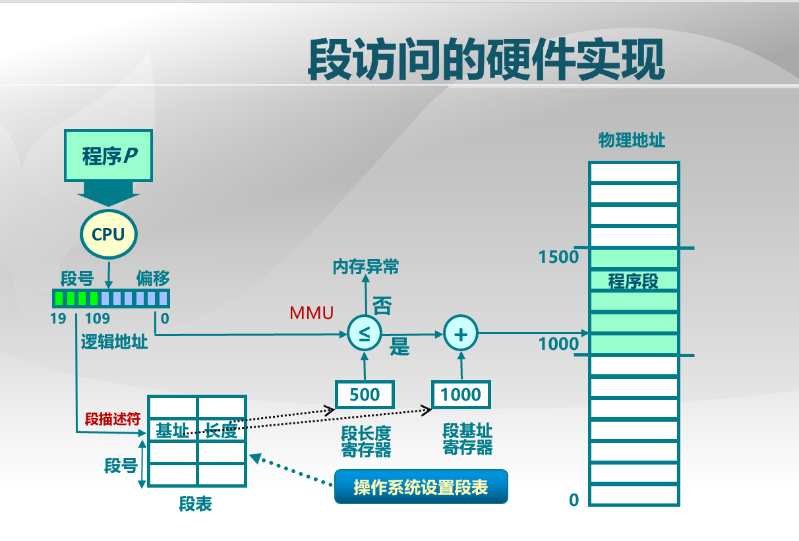

# 《Tsinghua OS MOOC》第五~七讲笔记

## 资源

1. [OS2018Spring课程资料首页](http://os.cs.tsinghua.edu.cn/oscourse/OS2018spring)

2. [uCore OS在线实验指导书](https://chyyuu.gitbooks.io/ucore_os_docs/content/)

3. [ucore实验基准源代码](https://github.com/chyyuu/ucore_os_lab)

4. [MOOC OS习题集](https://xuyongjiande.gitbooks.io/os_exercises/content/index.html)

5. [OS课堂练习](https://chyyuu.gitbooks.io/os_course_exercises/content/)

6. [Piazza问答平台](https://piazza.com/connect) 暂时无法注册

## 疑问

1. 段式内存管理中，逻辑地址由段选择子和段偏移量两部分组成？段选择子占16位，低3位为TI（指示是GDT还是LDT）和RPL，也就是说逻辑地址中含有TI和RPL信息？但好像内存地址只包含位置信息的吧？答：
    - 逻辑地址是由段选择子和段偏移量组成。用逻辑地址的段选择子索引GDT得到段基址，段基址加上逻辑地址的段偏移量得到线性地址，因此，线性地址只含有位置信息，而逻辑地址除位置信息外还含有TI和RDL等信息。

2. cs，ds，es，fs，gs及ss等段选择子及gdt是怎么初始化的？答：
    - 在boot loader的开始阶段，CPU工作在实模式，cs初始值为0xf000, 其他段寄存器都初始化为0. 初始化gdt时，实际上只有2个有效的段描述符，分别对应代码段和数据段，它们在gdt表中的偏移分别为0x8和0x10，而TI=0，表示这是gdt表；DPL=0，表示当前是内核态权限。因此，代码段和数据段的段选择子分别为0x8和0x10. 从gdt的初始值可以看出数据段和代码段的段基址均为0.
    ```
    .set PROT_MODE_CSEG,        0x8         # kernel code segment selector
    .set PROT_MODE_DSEG,        0x10        # kernel data segment selector
    ```
    - 当boot loader加载完kernel，会跳转到kernel代码中继续执行。lab1中，在kern_init执行到pmm_init时，会重新初始化gdt表和加载各个段寄存器，并且将各个段的段基址设置为0.

3. 段式管理基址中，访问内存时，先用逻辑地址的段选择子索引全局描述符表得到base，再加上逻辑地址中的offset得到线性地址，这样不是很麻烦、效率很低吗？

4. 中断、异常及系统调用是怎样完成特权级从户态切换到内核态的？

5. 未理解段页式内存管理机制中的内存转换原理？按书中所说，我们要将一个逻辑地址转换成物理地址，需要经过以下步骤：首先，逻辑地址由段选择子和段偏移组成，用逻辑地址的段选择子索引GDT得到段基址，段基址和段偏移组成线性地址，这个线性地址由可以分为页目录表索引、页表索引和页内偏移。我的疑问是：逻辑地址的段偏移是16位，而页内偏移是12位，这个是怎么转换的？难道说段偏移的高4位是属于页表索引的低4位？

## 第五讲 物理内存管理：连续内存分配

1. 源代码中的函数或变量的地址的最终确定，需要经历两次重定位：链接时和将程序加载到内存中时。通常在可执行文件的前面部分有个重定位表，记录需要重定位的符号。

2. 关于地址生成时机，在执行时生成比在编译和链接时生成的好处：后者在加载到内存前已经是绝对地址，不能再挪动，而有时本程序或其他程序内存空间不够而确实需要挪动，这时使用前者的方案可以适应这种场景。

3. 内部碎片 vs 外部碎片
    - 内部碎片：分配内存内部的未被使用内存
    - 外部碎片：分配单元之间的未被使用内存

4. 三种内存分配策略
    - 最先匹配
        - 原理：空闲分区列表按照地址顺序排序
        - 优点：简单、在高地址空间有大块的空闲分区
        - 缺点：外部碎片、分配大块时较慢
    - 最佳匹配
        - 原理：空闲分区列表按由小到大排序
        - 优点：大部分分配的尺寸较小时，效果很好
        - 缺点：外部碎片、容易产生很多无用的小碎片、释放分区较慢（判断合并时要搜索地址相邻的分区）
    - 最差匹配（这种分配策略有什么好处？）
        - 原理：空闲分区列表按由大到小排序
        - 优点：中等大小的分配较多时，效果最好；避免出现太多的小碎片
        - 缺点：释放分区较慢；外部碎片；容易破坏大的空闲分区，因此后续较难分配大的分区

> 问题：我们现在的操作系统使用连续内存分配吗？我的理解：应该不是。OS首先将内存划分成N个页，然后每次进程申请内存时，根据其申请大小分配k个页给它，这k个页可能是连续的也可能不连续。因此现代OS使用的策略都是非连续内存分配。

5. 碎片整理方案
    - 碎片紧凑：通过移动分配给进程的内存分区，来合并外部碎片。碎片紧凑的条件：所有的程序可动态重定位。
    - 分区对换（Swapping in/out）：通过抢占并回收处于等待状态的进程分区，来增大可用内存空间。回收的进程分区一般放在外存的swap区（对换区）中。

6. 伙伴系统（Buddy System）
    - 若待分配空间不小于当前空闲分区的一半，则将当前空闲分区整块给该进程；否则将当前分区均分成两份，再继续比较。
    - 释放过程：把释放掉的块放入空闲块数组，合并满足合并条件的块。
    - 合并条件：大小相同（均为2^i）、地址相邻，低地址空闲块起始地址为2^(i+1)的位数。
    - 用途：Linux和Unix系统中的内核内存分配都应用了伙伴系统

7. 地址检查：操作系统根据进程的逻辑地址访问物理内存前，需要检查逻辑地址对应的偏移量是否不大于段长度。

8. ucore的物理内存管理 
```
struct pmm_manager {
	const char *name;
	void (*init)(void);
	void (*init_memmap)(struct Page *base, size_t n);
	struct Page *(*alloc_pages)(size_t order);
	void (*free_pages)(struct Page *base, size_t n);
	size_t (*nr_free_pages)(void);
	void (*check)(void);
};
```

9. ucore的伙伴系统实现
```
const struct pmm_manager buddy_pmm_manager = {
	.name = "buddy_pmm_manager",
	.init = buddy_init,
	.init_memmap = buddy_init_memmap,
	.alloc_pages = buddy_alloc_pages,
	.free_pages = buddy_free_pages,
	.nr_free_pages = buddy_nr_free_pages,
	.check = buddy_check,
};
```

## 第六讲 物理内存管理：非连续内存分配

1. 连续内存分配的缺点
    - 分配给程序的物理内存必须连续
    - 存在外碎片和内碎片
    - 内存分配的动态修改困难
    - 内存利用率低

2. 段式存储管理和页式存储管理的一个区别：前者以段为单位，每个段内存较大；后者以页为单位，每页内存相对较小。

3. 段访问的硬件实现：

4. 帧（frame）
    - 物理内存被划分为大小相同的帧
    - 物理地址由二元组(f, o)表示，f代表帧号（F位，共有2^F个帧），o代表段内偏移（S位，每帧有2^S个字节），物理地址 = f * 2^S + o.

5. 页（Page）
    - 进程逻辑地址空间被划分为大小相同的页
    - 页内偏移 = 帧内偏移
    - 一般情况下，页号 != 帧号
    - 逻辑地址由二元组(p, o)表示，p代表页号（P位，共有2^P个页），o代表页内偏移（S位，每页有2^S个字节），逻辑地址 = p * 2^S + o.

6. 页帧 vs 页面
    - 页帧：帧，物理页面，Frame，Page Frame
    - 页面：页，逻辑页面，Page
    - 逻辑地址的页号是连续的，物理地址的帧号不是连续的，不是所有的页都有对应的帧
    - 页面到页帧的转换：即逻辑地址到物理地址的转换，其转换关系保存在页表中，由MMU/TLB来实现转换：用页号来索引页表，得到帧号，左移S位加上页内偏移，即得到物理地址。

7. 页表
    - 每个进程都有一个页表，进程的每个页面对应页表中的一项，页表会随进程状态而动态变化
    - 每个进程都有一个页表基址寄存器(PTBR: Page Table Base Register)，用来存储页表的地址。

8. 为什么每个进程都有一个页表？而不是共用？
    - CSAPP中提到，这样每个进程的虚拟地址空间相互独立。
    - 操作系统需要为每个进程维护一个页表，页表给出了该进程的每一页对应的物理地址。处理器必须知道如何访问当前进程的页表，因此每个进程都需要一个PTBR来保存自己的页表地址。给出逻辑地址（页号，偏移量），处理器使用页表产生物理地址（页框号，偏移量）。
    - 进程每一页在页表中都有一项，因此页表可以很容易地按页号对进程的所有页进行索引（从0页开始）。（伍注：“进程每一页”应该是指进程需要使用的有效页面，而不包括它不需要使用的页面，不然每个进程的页表都记录所有页面，会浪费内存）
    - 操作系统为当前内存中未被占用、可供占用的所有页框（即物理页）维护一个空闲页框列表。

9. 页表项标志：
    - 存在位（resident bit）：逻辑页面是否有一个物理页面与之对应，有则置1。
    - 修改位（dirty bit）
    - 引用位（reference bit）
    - 读/写位（Read/Write）
    - 用户/超级用户（User/Supervisor）

10. 逻辑页的存在位为0是什么状态？逻辑页是怎么初始化的？
    答：存在位为0，还要看地址是否为空，空地址表示这个虚拟页没有被分配，非空地址则表示该虚拟页在磁盘中的起始位置（该虚拟页已经被分配，但目前被换出到磁盘了）。

11. 页式存储管理基址的性能问题
    - 内存访问性能问题：访问一个内存单元需要2次内存访问，第1次获取页表项，第2次访问数据。解决方法：缓存，比如使用快表。
    - 页表大小问题：页表可能很大，导致占用较大的存储空间。解决方法：间接访问，比如使用多级页表。

12. 快表（TLB: Translation Look-aside Buffer）
    - TLB存储在CPU中，并且使用关联存储(associative memory)实现，具备快速访问性能
    - 如果TLB命中，物理页号可以很快被获取
    - 如果TLB未命中，对应的表项被更新到TLB中

12. 多级页表
    - 建立页表树，减少每级页表的长度。
    - 多级页表可以减少页表的大小。因为如果在一级页表中知道某个页面目录不存在，那么就不用存储其二级、三级页表的信息了。
    - 多级页表的第一级页表又叫页面目录表（PDT，Page Directory Table），其物理地址存储在cr3寄存器中；第二级是页表PT。注：cr3又叫页表目录基址寄存器或页基址寄存器。

13. 页寄存器和反置页面的思路：不让页表与逻辑地址空间的大小相对应，让页表与物理地址空间的大小相对应。

14. 段页式存储管理
    - 段式存储在内存保护方面有优势，页式存储在内存利用和优化转移到后备存储方面有优势
    - 实现方式：在段式存储管理基础上，给每个段加一级页表
    - 内存共享：通过指向相同的页表基址，实现进程间的段共享。

15. When operating in protected mode, some form of segmentation must be used. There is no mode bit to disable segmentation. The use of paging, however, is optional.

## 第七讲 实验二：物理内存管理

1. x86特权级
    - Linux和uCore特权级一般只用两级：Level 0（最高）和Level 3（最低）。
    - 一些指令（比如特权指令）只能执行在ring 0 (e.g. lgdt).
    - CPU在如下时刻会检查特权级：访问数据段、访问页、进入中断服务例程
    - 如果特权级检查失败，会报错：General Protection Fault!

2. 特权级要求
    - CPL是CS寄存器的特权级，RPL是DS、ES、FS和GS寄存器的特权级，两者代表访问者的特权级
    - DPL是段描述符或门描述符的特权级，代表被访问者的特权级
    - 访问门时，CPL <= DPL[门] & CPL >= DPL[段]（伍注：中断、异常或陷入时，用户态程序要访问内核态的内存空间，因此访问者的特权级必然不大于段描述符的特权级，但又不小于门描述符的特权级才允许访问。）
    - 访问段时，max(CPL, RPL) <= DPL[段]

3. 特权级转换
    - 执行INT指令时，会发生特权级转换，从ring3转换到ring0，这时内核栈中会压入用户态程序在中断时的寄存器信息，包括Error Code、EIP、CS、EFLAGS、ESP和SS等
    - ring0 to ring3: 首先构造出模拟用户态中断时的一个栈（这里不太理解？），并将里面的CS的CPL和SS段选择子的RPL都设置为3，然后执行IRET指令，该指令会将内核栈保存的寄存器信息弹出到相关寄存器中，这样就回到用户态了。
    - 发生中断后，在执行中断处理例程之前，首先硬件需要把应用程序发生中断瞬间的寄存器信息压入内核栈中（这是硬件做的吗？）
    - ring3 to ring0: 同样是构造出一个栈，并将里面的CS的CPL设置为0，然后执行IRET指令，这样就进入内核态了。
    - 特权级转换时，不同特权级的堆栈信息（esp和ss）保存在任务状态段（TSS, Task State Segment）中。TSS段描述符信息保存在GDT中，但为了快速获取TSS段的信息，CPU也专门用一个寄存器来保存其信息。

5. 全局描述符表GDT（也称为段表）占用空间较大，因此存放在内存中，而非CPU中。为了提高内存访问的效率，在CPU的MMU单元中也会存储各个段的基本信息。

6. 如何理解lab2的地址映射？
```
a. Allocate a page as directory table
b. Clear the page allocated
c. Map 0xC0000000-0xF8000000(va) to 0x00000000-0x38000000(pa)
d. Map 0x00000000-0x00100000(va) to 0x00000000-0x00100000(pa) 
e. Set CR3 & bit 31 of CR0
f. Update GDT
g. Unmap 0x00000000-0x100000
```

7. 在页表项中存放的地址内容是线性地址（啥意思？）

8. 启动页机制：将cr0寄存器的最高位也就是bit 31置位。

9. 段表 vs 页表 vs GDT/LDT
（以下出自[进程中有多少个段表、多少个页表？](https://blog.csdn.net/yangkuiwu/article/details/53166283)）
    - 如果存储器采用基本分页机制，那么操作系统会为每个进程或任务建立一个页表（这个页表可能是一级的也可能是多级的）。整个操作系统中有多个进程在运行，那么系统就会有多个页表。页表在内存中的存储位置由寄存器CR3给出。
    - 如果存储器采用基本分段机制，那么操作系统会为每个进程或任务建立一个段表（一般不用多级），用于记录数据段、代码段等各类段在内存中的具体位置。
    - 如果采用段页式结合的机制，那么一般一个进程或任务，操作系统会给其建立一个段表，而段表中的每个段又会对应一个页表，也就是说，段页式机制的每个进程有一个段表，有多个页表。
    - 对于典型的linux系统而言，操作系统会维护一个全局描述符表（相当于系统的段表），全局描述符表中用于记录系统任务和用户任务的描述符，其中用户任务的描述符又指向用户任务的局部描述符表（相当于用户任务的段表）。

10. 操作系统需要知道了解整个计算机系统中的物理内存如何分布的，哪些可用，哪些不可用。其基本方法是通过BIOS中断调用来帮助完成的。详情参考《ucore_os_docs》 lab2附录A的介绍。

## 参考资料

1. x86特权级：《Intel And IA-32 Architecture Software Developer's Manual》 Vol.1 第6.3.5节和Vol3 第7章

2. x86 MMU：《Manual》vol.3 Chap 3 & chap 4
