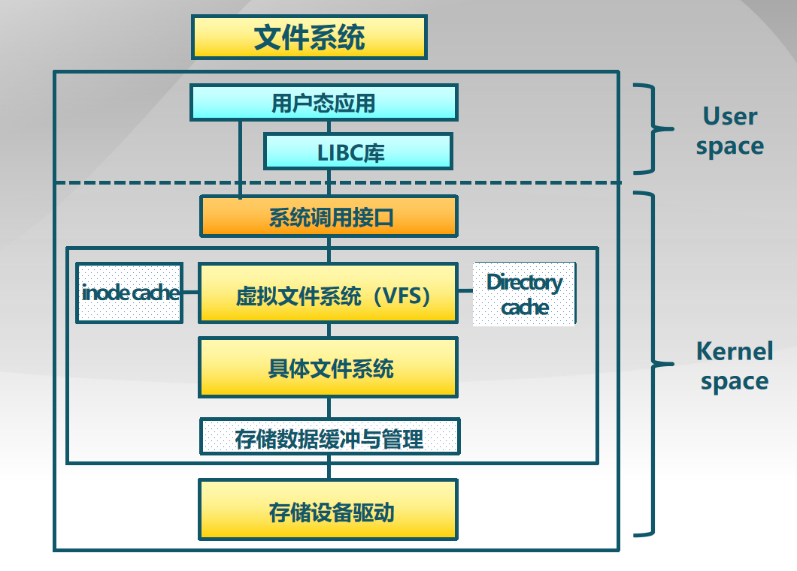
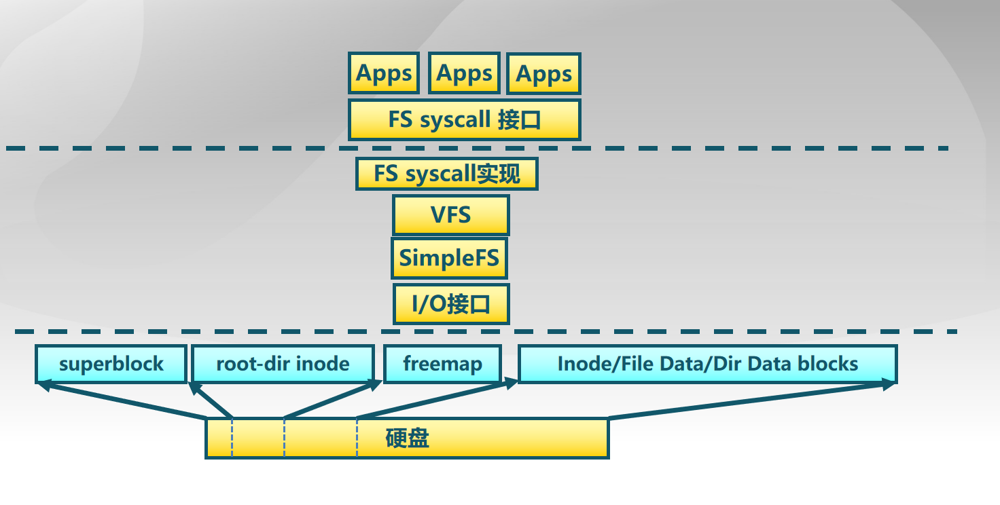

# 《Tsinghua os mooc》第21~22讲 文件系统

## 第二十一讲 文件系统

1. 文件系统是操作系统中管理持久性数据的子系统，提供数据存储和访问功能。
    - 组织、检索、读写访问数据
    - 大多数计算机系统都有文件系统
    - Google 也是一个文件系统

2. 文件是具有符号名，由字节序列构成的数据项集合
    - 文件系统的基本数据单位
    - 文件名是文件的标识符号

3. 文件系统的功能
    - 分配文件磁盘空间
        - 管理文件块（位置和顺序）
        - 管理空闲空间(位置)
        - 分配算法 (策略)
    - 管理文件集合
        - 定位：文件及其内容
        - 命名：通过名字找到文件
        - 文件系统结构：文件组织方式
    - 数据可靠和安全
        - 安全：多层次保护数据安全
        - 可靠：持久保存文件，避免系统崩溃、媒体错误、攻击等

4. 文件头：文件系统元数据中的文件信息
    - 文件属性：名称、类型、位置、大小、保护、创建者、创建时间、最近修改时间、…
    - 文件存储位置和顺序

5. 文件描述符
    - 进程访问文件数据前必须先“打开”文件，操作系统为每个进程维护一个打开文件表，文件描述符是打开文件的标识
    - 文件指针：记录最近一次读写位置。每个进程分别维护自己的打开文件指针
    - 文件打开次数：当前打开文件的次数。最后一个进程关闭文件时，将其从打开文件表中移除
    - 文件的磁盘位置：缓存数据访问信息
    - 访问权限：每个进程的文件访问模式信息

6. 文件的用户视图和系统视图
    - 文件的用户视图：持久的数据结构
    - 系统访问接口：字节序列的集合(UNIX)，系统不关心存储在磁盘上的数据结构
    - 文件的系统视图：数据块的集合，数据块是逻辑存储单元，而扇区是物理存储单元。

7. 文件系统中的基本操作单位是数据块
    - 例如, getc()和putc()即使每次只访问1字节的数据，也需要缓存目标数据4096字节
    - 进程读文件：获取字节所在的数据块，返回数据块内对应部分
    - 进程写文件：获取数据块，修改数据块中对应部分，写回数据块

8. 文件别名
    - 硬链接: 多个文件项指向一个文件
    - 软链接: 以“快捷方式”指向其他文件，通过存储真实文件的逻辑名称来实现

9. 文件表示：如何表示分配给一个文件数据块的位置和顺序
    - 分配方式
        - 连续分配
        - 链式分配
        - 索引分配
    - 指标
        - 存储效率：外部碎片等
        - 读写性能：访问速度

10. 连续分配：文件头指定起始块和长度
    - 优点
        - 文件读取表现好
        - 高效的顺序和随机访问
    - 缺点
        - 存在外部碎片
        - 文件增长问题

11. 链式分配：文件以数据块链表方式存储，文件头包含了到第一块和最后一块的指针
    - 优点
        - 创建、增大、缩小很容易
        - 没有碎片
    - 缺点
        - 无法实现真正的随机访问
        - 可靠性差，破坏一个链，后面的数据块就丢了

12. 索引分配：为每个文件创建一个索引数据块，指向文件数据块的指针列表，文件头包含了索引数据块指针
    - 优点
        - 创建、增大、缩小很容易
        - 没有碎片
        - 支持直接访问
    - 缺点
        - 当文件很小时，存储索引的开销
        - 如何处理大文件?（链式索引块、多级索引块）

13. UFS多级索引分配
    - 文件头包含13个指针
        - 前10个指针指向数据块
        - 第11个指针指向索引块
        - 第12个指针指向二级索引块
        - 第13个指针指向三级索引块
    - 效果
        - 提高了文件大小限制阈值
        - 动态分配数据块，文件扩展很容易
        - 小文件开销小
        - 只为大文件分配间接数据块，大文件在访问数据块时需要大量查询


14. 内部碎片 vs 外部碎片
    - 内部碎片就是已经被分配出去（能明确指出属于哪个进程）却不能被利用的内存空间 
    - 外部碎片是处于任何两个已分配区域或页面之间的空闲存储块。这些存储块的总和可以满足当前申请的长度要求，但是由于它们的地址不连续或其他原因，使得系统无法满足当前申请。

## 第二十二讲 实验八 文件系统

1. 文件系统层次结构图



2. lab8文件系统具有繁多的数据结构和函数调用，为分析硬盘上的数据与内存中的数据的关系，可采取以下思路
    - 自下而上，谁访问谁
    - 自上而下，谁包含谁

3. SFS硬盘布局
```
superblock | root-dir inode | freemap | Inode/File Data/Dir Data blocks
```

2. 文件系统的抽象
    - 文件
    - 目录项
    - 索引节点
    - 安装点
