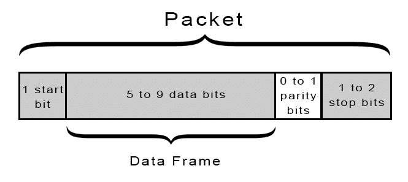
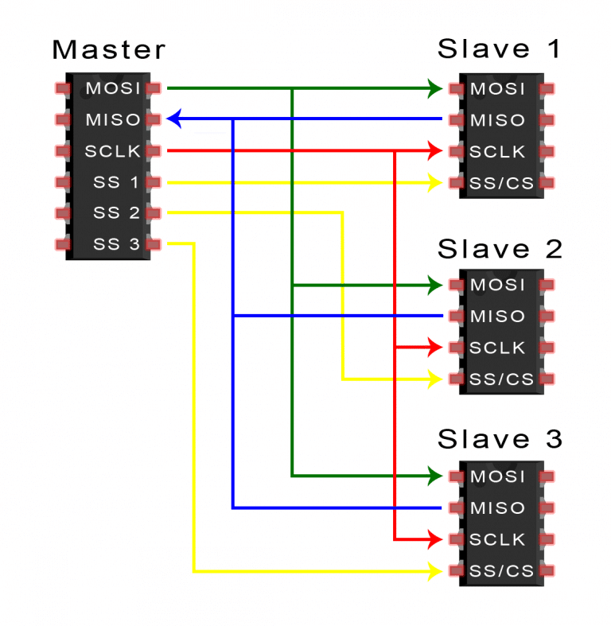
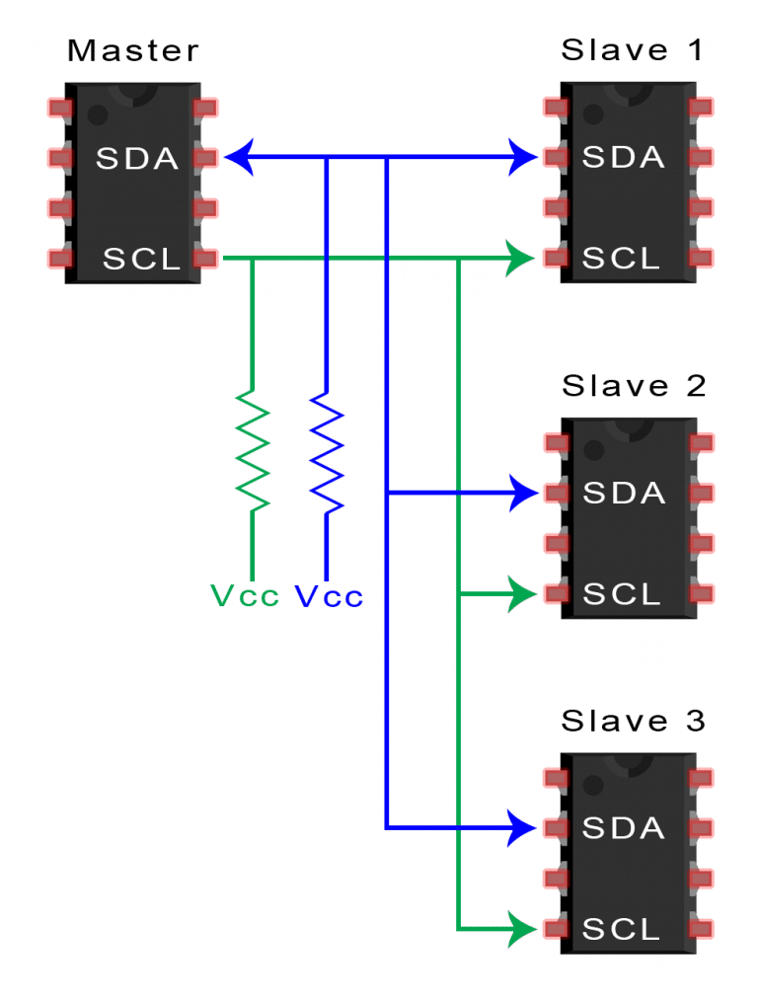
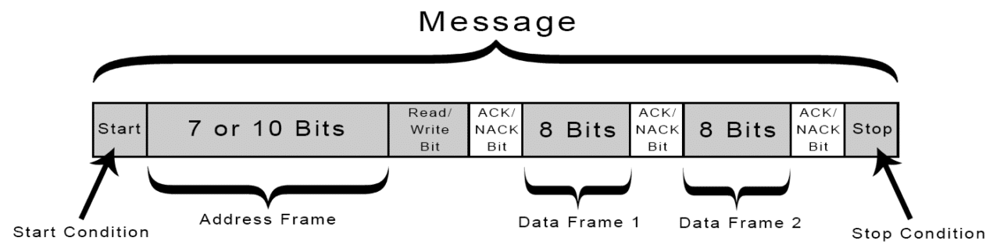

# 电子设备通信协议/电路学习笔记

## Questions

1. 接口转换的原理是什么？usb-to-uart, usb-to-ethernet, usb-to-can, etc.

## Serial port

1. In computing, a serial port is a **serial communication interface** through which information transfers in or out sequentially **one bit at a time**.

2. While interfaces such as Ethernet, FireWire, and USB also send data as a serial stream, **the term serial port usually denotes hardware compliant with RS-232 or a related standard**, such as RS-485 or RS-422.（伍注：通常情况下，我们说的“串口”是指与RS232兼容的硬件接口）

3. Modern consumer PCs have largely replaced serial ports with higher-speed standards, primarily USB. However, serial ports are still frequently used in applications demanding **simple, low-speed interfaces**, such as industrial automation systems, scientific instruments, point of sale systems and some industrial and consumer products.

4. Server computers may use a serial port as a **control console for diagnostics**, while networking hardware (such as routers and switches) commonly use serial console ports for **configuration, diagnostics, and emergency maintenance access**. To interface with these and other devices, **USB-to-serial** converters can quickly and easily add a serial port to a modern PC.

1. Hardware abstraction
    - Unix-like operating systems usually label the serial port devices `/dev/tty*`. TTY is a common trademark-free abbreviation for teletype, a device commonly attached to early computers' serial ports, and * represents a string identifying the specific port; the syntax of that string depends on the operating system and the device. On Linux, 8250/16550 UART hardware serial ports are named `/dev/ttyS*`, USB adapters appear as `/dev/ttyUSB*` and various types of virtual serial ports do not necessarily have names starting with tty.
    - The DOS and Windows environments refer to serial ports as COM ports: COM1, COM2,..etc. Ports numbered greater than COM9 should be referred to using the `\\.\COM10` syntax.

## UART

1. UART stands for **Universal Asynchronous Receiver/Transmitter**. It’s not a communication protocol like SPI and I2C, but a **physical circuit** in a microcontroller, or a stand-alone IC. A UART’s main purpose is to transmit and receive serial data.

2. Only two wires are needed to transmit data between two UARTs. Data flows from the Tx pin of the transmitting UART to the Rx pin of the receiving UART.
    

3. UARTs transmit data **asynchronously**, which means there is **no clock signal** to synchronize the output of bits from the transmitting UART to the sampling of bits by the receiving UART. Instead of a clock signal, the transmitting UART adds **start and stop bits** to the data packet being transferred. These bits define the beginning and end of the data packet so the receiving UART knows when to start reading the bits.
    

4. The UART that is going to transmit data receives the data from a data bus. The data bus is used to send data to the UART by another device like a CPU, memory, or microcontroller. Data is transferred from the data bus to the transmitting UART in parallel form. After the transmitting UART gets the parallel data from the data bus, it adds a start bit, a parity bit, and a stop bit, creating the data packet. Next, the data packet is output serially, bit by bit at the Tx pin. The receiving UART reads the data packet bit by bit at its Rx pin. The receiving UART then converts the data back into parallel form and removes the start bit, parity bit, and stop bits. Finally, the receiving UART transfers the data packet in parallel to the data bus on the receiving end. (伍注：核心即串/并转换）

5. ADVANTAGES
    - Only uses two wires
    - No clock signal is necessary
    - Has a parity bit to allow for error checking
    - The structure of the data packet can be changed as long as both sides are set up for it
    - Well documented and widely used method

6. DISADVANTAGES
    - The size of the data frame is limited to a maximum of 9 bits
    - Doesn’t support multiple slave or multiple master systems
    - The baud rates of each UART must be within 10% of each other

## UART vs RS232

1. UART is responsible for sending and receiving a sequence of bits. At the output of a UART these bits are usually represented by logic level voltages. These bits can become RS-232, RS-422, RS-485, or perhaps some proprietary spec.

2. RS-232 specifies voltage levels. Notice that some of these voltage levels are negative, and they can also reach ±15V. Larger voltage swing makes RS-232 more resistant to interference (albeit only to some extent).

3. A microcontroller UART can not generate such voltages levels by itself. This is done with help of an additional component: RS-232 line driver. A classic example of an RS-232 line driver is MAX232. If you go through the datasheet, you'll notice that this IC has a charge pump, which generates ±10V from +5V.

4. While two pieces of hardware may have UARTs, you don't know that they'll connect without damage, or communicate properly unless you know they have the same pinout and voltage standards, or include a converter or specially wired cable specific to the interconnection of these two specificl devices. To avoid the need for special converters or cables, the manufacturers may choose to follow the RS-232 standard. You know, then, that a standard RS-232 cable will connect the two.

5. UARTs do not typically interface directly with RS-232. You will need to convert the output of the UART to the +/-12V standard that RS-232 requires. A complete RS-232 interface will typically involve both a UART and an RS-232 level converter. Further, the RS-232 standard includes the definition of several other signalling pins besides TX and RX, which you may need to use depending on the equipment you need to connect to. These will also need to be level converted, and your UART may, or may not, support these signals. If it does not you will have to control them with your software/firmware directly.

6. So while a UART may help you implement an RS-232 interface, it is not an RS-232 interface itself.

## SPI

1. SPI stands for **Serial Peripheral Interface**.

2. SD card modules, RFID card reader modules, and 2.4 GHz wireless transmitter/receivers all use SPI to communicate with microcontrollers.

3. One unique benefit of SPI is the fact that data can be transferred **without interruption**. **Any number** of bits can be sent or received in a continuous stream. With I2C and UART, data is sent in packets, limited to a specific number of bits. Start and stop conditions define the beginning and end of each packet, so the data is interrupted during transmission.

4. Devices communicating via SPI are in a **master-slave** relationship. The master is the controlling device (usually a microcontroller), while the slave (usually a sensor, display, or memory chip) takes instruction from the master.
    

5. The clock signal synchronizes the output of data bits from the master to the sampling of bits by the slave. One bit of data is transferred in each clock cycle, so the speed of data transfer is determined by the frequency of the clock signal. SPI communication is always initiated by the master since the master configures and generates the clock signal.

6. Any communication protocol where devices share a clock signal is known as **synchronous**. **SPI is a synchronous communication protocol.**

7. ADVANTAGEs
    - No start and stop bits, so the data can be streamed continuously without interruption
    - No complicated slave addressing system like I2C
    - Higher data transfer rate than I2C (almost twice as fast)
    - Separate MISO and MOSI lines, so data can be sent and received at the same time

8. DISADVANTAGES
    - Uses four wires (I2C and UARTs use two)
    - No acknowledgement that the data has been successfully received (I2C has this)
    - No form of error checking like the parity bit in UART
    - Only allows for a single master

## I2C

1. I2C stands for **Inter-Integrated Circuit**.

2. I2C combines the best features of SPI and UARTs. With I2C, you can connect multiple slaves to a single master (like SPI) and you can have multiple masters controlling single, or multiple slaves. Like UART communication, I2C only uses two wires to transmit data between devices:
    - SDA (Serial Data) – The line for the master and slave to send and receive data.
    - SCL (Serial Clock) – The line that carries the clock signal.

    

3. With I2C, data is transferred in messages. Messages are broken up into frames of data. Each message has an address frame that contains the binary address of the slave, and one or more data frames that contain the data being transmitted. The message also includes start and stop conditions, read/write bits, and ACK/NACK bits between each data frame.
    

4. ADVANTAGES
    - Only uses two wires
    - Supports multiple masters and multiple slaves
    - ACK/NACK bit gives confirmation that each frame is transferred successfully
    - Hardware is less complicated than with UARTs
    - Well known and widely used protocol

5. DISADVANTAGES
    - Slower data transfer rate than SPI
    - The size of the data frame is limited to 8 bits
    - More complicated hardware needed to implement than SPI

## 其他

1. TTL电平规定：
    - 对于输出电路：电压大于等于（≥）2.4V为逻辑1；电压小于等于（≤）0.4V为逻辑0；
    - 对于输入电路：电压大于等于（≥）2.0V为逻辑1；电压小于等于（≤）0.8V为逻辑0.

2. RS232采用负逻辑电平，即-15V~-3V代表逻辑"1"，+3V~+15V代表逻辑"0"。

## 参考资料

1. [BASICS OF THE SPI COMMUNICATION PROTOCOL](https://www.circuitbasics.com/basics-of-the-spi-communication-protocol)
2. [BASICS OF UART COMMUNICATION](https://www.circuitbasics.com/basics-uart-communication/#:~:text=UART%20stands%20for%20Universal%20Asynchronous,transmit%20and%20receive%20serial%20data.)
3. [BASICS OF THE I2C COMMUNICATION PROTOCOL](https://www.circuitbasics.com/basics-of-the-i2c-communication-protocol/)
4. [RS232电平、CMOS电平、TTL电平是什么，区别是什么？](https://zhuanlan.zhihu.com/p/68442247)
5. [(RS232电平和TTL电平有什么不同？如何转换？](https://zhuanlan.zhihu.com/p/33041966)
6. [Difference between UART and RS-232?](https://electronics.stackexchange.com/questions/110478/difference-between-uart-and-rs-232)
7. [Serial port](https://en.wikipedia.org/wiki/Serial_port)
