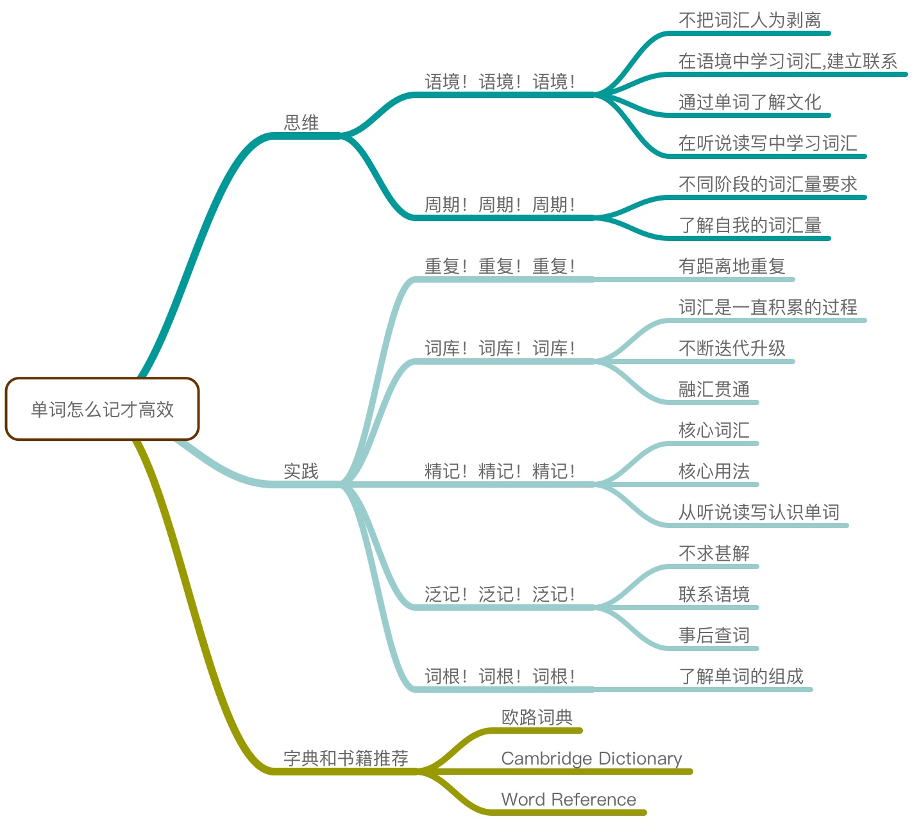

# 如何提高英语词汇量

本文主要汇总知乎上关于提高英语词汇量的答案。

## 你是如何将词汇量提升到 2 万，甚至 3 万的？

### 魏剑锋

1. 精读《经济学人》，配合大量原版书泛读，来达到快速提高词汇量的目的。

2. 目前关于如何提高词汇量主要有两种方法：
    - 背单词：背单词书，背词频表，使用各种各样的背单词应用辅助背单词（比如百词斩，扇贝，不背单词等）
    - 阅读：通过大量阅读来记单词，在阅读中自然积累生词

3. 通过背单词来提高词汇量这种方法存在的最大的问题是：它是一种非常低效的方法。

4. 我采取的策略是：阅读。更加具体的回答是：精读与泛读结合，配合英英词典，结合语境进行记忆。
    - 因为通过这种方式得到的单词只能算是消极词汇，你大概在阅读时能够认出它们，运气好一点时能够把它们听出来。当时距离会说，会用，还有很长一段距离要走。
    - 比如说对于"keen"这个单词，你看了一眼，知道了它差不多有"激烈的，热血的，渴望的，锋利敏捷的"这些意思，并且看了看例句。好了，好像记得七七八八了。但是对于"fervent,avid,enthusiastic,zealous"这些词，它们同样可以有“热心的”意思，你知道它们和"keen"之间的区别吗？ 下次阅读时碰到一个句子"They sell reliable products at very keen prices"，你能反应过来keen在句子中的意思吗？你能用这个单词造几个句子灵活应用到写作中吗？
    - 通过背单词的方法其实是把单词和语境生生割裂开来了。换句话说，通过这种方式记住的只是消极词汇。单词来得快，走得也快。

5. 在做精读的过程中有下面两点需要注意：(1) 选择合适难度的阅读材料 (2) 利用英英词典，软件等工具对阅读中碰到的单词进行查询以及整理。

6. 柯林斯词典有一个高达2.5亿的语料库，从语料库中筛选出了最常用的14600词用五星标注。其中五级（最常用词，以下逐级次之）680词，四级1040词（累计1720词），三级1580词（累计3300词），二级3200词（累计6500词），一级8100词（累计14600词）。根据语料库的统计结果，掌握五级四级的前1720詞，就可以读通英語资料的75%，掌握五、四、三、二級的6500詞，就可以读通英語资料的90%，掌握这14600詞，就可以读懂任何英語资料的95%，即从理论上说，任何一篇100词的文章里大概只有5个词不认识。

7. 如果你想要比较顺畅地读懂外刊以及大部分原版书的话，你的词汇量至少要达到14600以上。词汇量太低造成的一个直接后果是，阅读时大部分时间都会花在纠结生词的意思上，而不是用在理解文本意思乃至欣赏文章的语言美上。我个人感受是，词汇量超过20000后平时在阅读过程中碰到的生词会越来越少，对文章的理解也会越来越准确。

> 伍注：1. 阅读。2. 柯林斯五星词频。

### Noah

1. 单词表的选择。我找到了当今最准确的词频表：美国当代语料库 coca。

2. 背单词的方法。我对软件里自带的中文解释不放心。所以，我几乎每背一个单词的时候，都用有道词典来查一下这个词。看一下有道里柯林斯英汉双解词典里对这个词的解释，包括不同词性的意思和常见用法等，然后整理一下记到“完美规划”的备注里。

3. 从去年11月开始，我大概花了800-1000个小时来背这两万个单词，工作日平均每天5个小时，周末和节假日10个小时以上。新词在3月份就已全部背完，还在偶尔还有些复习工作。我严格按照软件的提示进行复习（不复习完是没法学新词的），现在基本记住了九成以上，少数没记住的，我相信在以后的复习和过滤当中也会被消灭掉的。

4. 然后，我又花了150-200个小时看了三本书。
    - 新东方英语语法新思维（初级中级高级三部） 这本书可以将语法和长难句一起搞掉。
    - 英语常用词疑难用法手册 ps,作者陈用仪简直是神。。。
    - Essential American Idioms Dictionary

> 伍注：coca 词频。

### 尼克六六

1. 通过阅读背单词，可以是可以，但是做好见效缓慢的准备。如果你不急，有一定词汇基础，并且有恒心坚持，慢慢的增长到2-3万词汇量没问题。但是如果没有词汇基础和时间条件，你会很难坚持，即使坚持也会比较痛苦。（我是无法理解看一页书查十几个词这种行为艺术）所以我更愿意把阅读作为复习单词和更加深入理解单词用法的一种方式，当然，还有享受流畅无障碍阅读带来的愉悦感。

2. 对了，你是问我怎么提高词汇量的？ 大概前前后后几个月，每天8小时刷单词书和单词软件刷出来的。

> 伍注：每天8小时。

### 匿名用户

1. 我的办法跟 @Noah 一样的，但我的强度比Noah大一倍，当时是二个半月就学完了词频的前二万个单词，每天加上复习，实际上每天要背600-700个单词左右，非常痛苦的一个时间段， 但过了这个时间就太好了，阅读什么的都没有问题。

2. 特别提醒的是，二万个看起来多，实际上远远不够，我身边的每一个印度同事，我都让他们测了一下 Test Your Vocabulary 都在三万多个左右，但中国同事，测试结果基本上在21000-24000之间，神奇的一致，跟印度同事差距是一万个单词量。（他们猜原因是几乎每个中国同事都有考过GRE，这个就是新东方GRE学完后的词汇量）

3. 背完单词后，不能休息，马上要加强性地大量的英语有效输入，英语输入的意思，就是听英语和看英语，或者看着听英语，就这三个。 个人的建议，不要古老的文学书，不要跟中国关系太密切的，要听和看现在的美国人最喜欢的，活生生的。 那么他们喜欢什么，从美国种族排行来看，白人、黑人、拉丁人占绝大多数，我推荐三本书《Stuff White People like》,《how to be black》,《hunger of Memory》。

4. 去美国从事技术工作的，建议看《the new new thing》和《things a little bird told me》还有Paul Graham所有的写作。

5. 杂志推荐《New Yorker》。

> 伍注：1. 背完单词要加强英语输入。 2. 每天背600-700个单词左右。

### 陈拉赫

1. 我不知道自己现在的词汇量有没有到2万甚至3万，但是我知道我已经奔向一条热爱背单词的不归路了。唯一能够征服单词的核心且持久的动力不是考试，而是一种**求知的冲动**；没有这种类似原始欲望的冲动，无论你是用透析阅读法还是别的什么大法神功，最终都会半途而废。

2. 我的求知冲动来自于对西方文学的热爱。

3. 我开始用扇贝单词，每天设定200个，不多也不少，保证每天可以用半个小时来完成任务。

4. 大概这么硬背了几个月之后，我开始随手翻看economist，发现原来GRE涵盖了很多文章中的生词。嘿嘿，快感来了！那感觉就像你平时不停地搜集弹药和武器，一旦真正上了战场你终于可以用那颗特别的子弹精准地击毙了那头曾经横亘在你面前怪兽。那感觉忒爽了。从此我都对电脑游戏没啥兴趣了，因为每次的英文阅读我都感觉自己在玩一场第一人称即时射击游戏，每击毙一头怪兽我都给自己精神奖励，每遇到一头新的怪兽我都如饥似渴地把它当做弹药收入囊中。再后来，我就再也没去想我的词汇量如何如何了，因为我知道自己已经在不知不觉中跑过了一条金线，这条金线可能是词汇量1万或1.5万，这不是一个具体的数字，而是一种状态，一种对着英文原著不再气喘吁吁的高度，一种通过艰辛努力重新拾回的自信，一种生命不再虚度的充实满足。

5. 我想，大概是**羞耻心和满足感**，不断驱使我去背单词的。到了现在，我已经没有什么特别的背单词方法了，只有扇贝200词还每天坚持着。

6. 我开始慢慢地接触英文原著了。

> 伍注：1. 求知的冲动。2. 羞耻心和满足感。（产生强烈共鸣。我背单词的一大动力是羞耻心。）

## 有什么相见恨晚的背单词方法？

### 潇峰学长

1. 当我们谈学习单词的时候，我们应该要时刻联系其背后的语境，在语境中学习单词，记录它在不同语境中的具体用法。只有这样，我们才能活学活用。

2. 语境（context）,指的是单词所在的场景，可以是一个词汇，可以是一个句子，也可以是一篇文章，更深层的是一个文化背景。比如英式英语与美式英语的拼写，用法，发音都存在着差异。比如单词颜色美式英语是color， 在英式英语则被拼写为“colour”。英国人经说“Brilliant”和“Cheers”，美国人则经常说“Cool”和“See you”。不同的表达和用法都体现着其背后的语境。不同的句子中，单词的意思也会有所改变。比如“Blue”单单指蓝色也可以在“He looks blue”表示一种低落的情绪。

3. 重复！重复！重复！是高效学习单词的关键。在我实践中，我会定期回顾单词库中的资料，有距离地重复，忘了就翻翻。

4. 词库！词库！词库！单词学习的大本营。平时在学习和生活中遇到的单词尽量养成随时随地入库的意识。

5. 精记！精记！精记！ 词汇的深度。对于核心常见词汇，我们不光光要认识它，还要掌握它的核心用法。我们要学习核心词的发音，拼写，常见词组，同义词，反义词以及掌握一些例句。

6. 泛记！泛记! 泛记! 词汇的广度。精记和泛记的结合可以很好在词汇的宽度和深度上取得一个平衡。

7. 词根！词根！词根！ 泛记的法宝。常用的总共200多个，我会把它们放在单词库的词根库中。

8. 字典推荐：欧路词典； Cambridge Dictionary; Word Reference。

> 伍注：1. 重复（复习）。2. 积累词库。3. 积累词根库。

### 栗之

1. 核心方法：精读垒词法：在精读中学习单词。

2. 阅读文章搭建出来的场景，就是单词记忆宫殿的一部分。而阅读中的上下文，为我们记忆单词提供了取之不尽的 locus，让我们在 locate 某个单词的时候，可以迅速找准位置。

3. 阅读，主要是精读，给我们的联想提供了更丰富的场景。记忆宫殿法提到，宫殿越完整，场景越丰富、形象，就给了我们越多的线索，越有助于记忆。

> 伍注：提供了阅读可以帮助记忆单词的一种解释。

### 赛门喵Simon

1. 并不是所有的单词都值得你平等对待，你应该把大部分时间花在7000个核心词汇上。之外的低频词汇，由于出现的概率最高也只有10%，即便遇到了再查阅也不会耽误太多时间，它们不应该占用你太多的时间和精力。

2. 当你的词汇量低于7000的时候，死记硬背绝对是最有效率的方式。

3. 这种只追求数量的方法可以迅速让你迈过英语学习的分水岭，但是它有一个非常大的**副作用**——单词本身虽然只是26个字母的排列组合，但是其往往蕴含着文化和语境的内涵。而我们身处英语文化之外，本身就缺失理解的文化基础，那么这种脱离语境的背单词方式是无法让我们真正理解一个单词的，更不要能够准确地运用单词了。

4. 上面提到的副作用是可以弥补的，方法就是通过后期大量的阅读。由于核心词汇的出现概率是90%，只要后期的阅读输入量足够，这就可以保证这些核心词汇反复不断地在不同语境中出现，那么对这些单词的理解就会一再不断地加深和完善。这样来看，只要保证后期的大量阅读，你大可不必担心死记硬背所带来的副作用。

5. 如果你的词汇量大于7000呢？这时候你不用刻意背单词了，挑选自己喜欢的英文材料，频道什么的，增大自己的阅读输入量。这有两个效果：第一就是会不断地巩固提升对7000核心词汇的理解，将其慢慢转变为你的主动词汇；第二就是你会遇到其余10%的高级词汇，这部分单词就通过阅读去记忆。

6. 开始之前科学的心理建设，以及在背单词之中正确的自我引导对于成功完成任务是极其有帮助的，这恰恰也是牛逼和平庸之间的差别，聪明人总是能够及早意识到自己的消极情绪，并且做出积极的自我引导。相反，平庸的人被自己的情绪左右，最终在焦虑中迷失自我。

7. 接受自己的不完美，出现懈怠不要自责，**鼓励自己做的更好**。当你进入这种正向循环之后，背单词变成了一件自然而然的事情。 坚持背单词要耗费意志力，意志力和身体状况息息相关。

8. 每天的单词任务一旦完成，马上就结束，并且给自己一个正向的自我肯定。这时候你对当天学习的心理印象是积极的，这种感受会随着时间的推移渐渐累积，逐渐形成一个具有成就感的积极的心理感受。那么，在每天开始学习之前，你的心态不会是消极痛苦的，而是一种愉悦的心态。很多人完成了当天的学习任务后，觉得自己好棒，然后想超额完成任务，最后把自己搞的精疲力尽，对学习的热情完全消失。如果每天的学习都以这种形式结束，那么学习在你心中的印象就是痛苦感的累积。所以学会见好就收，这样才能细水长流。

> 伍注：词汇量达到20000就不刻意背单词了，通过阅读来积累新单词。

## 参考资料

1. [你是如何将词汇量提升到 2 万，甚至 3 万的？](https://www.zhihu.com/question/26814125)
2. [有什么相见恨晚的背单词方法？](https://www.zhihu.com/question/48040579)
