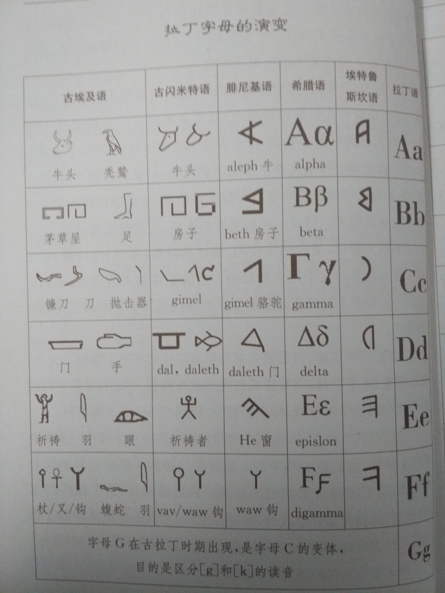
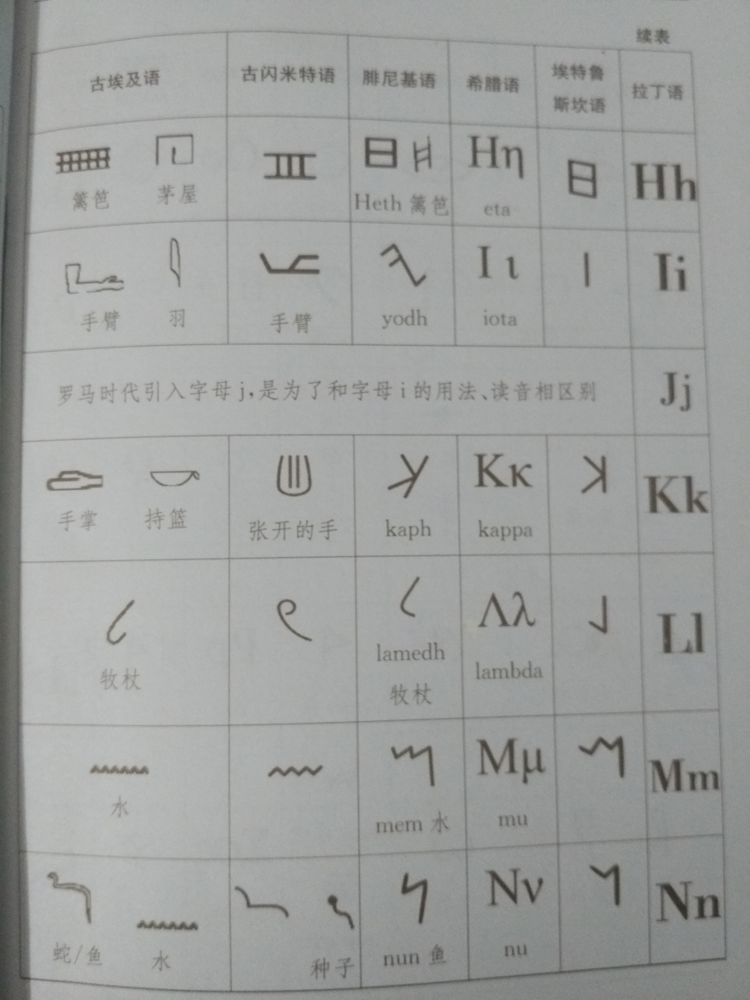
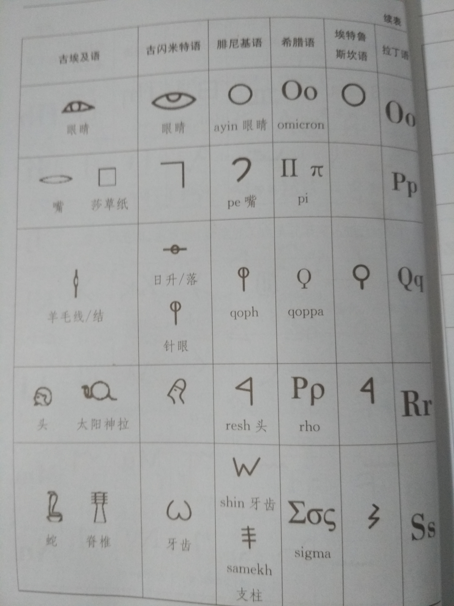
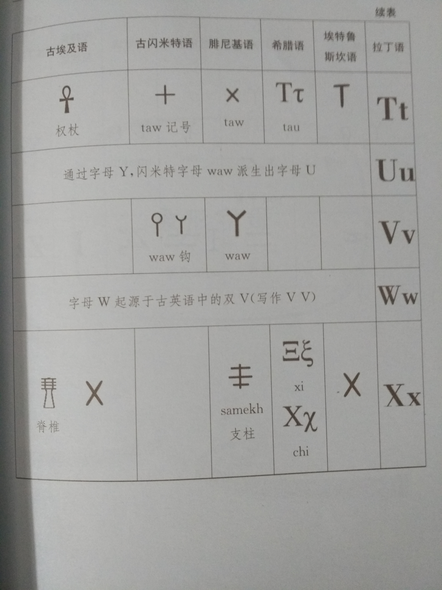
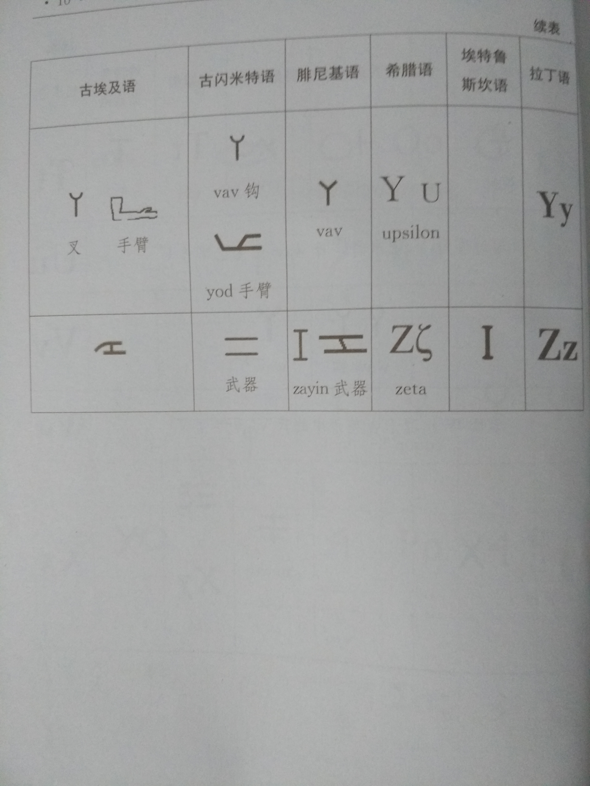

# 英文字母的象形意义

## 参考资料
1. [Phoenician alphabet](https://en.wikipedia.org/wiki/Phoenician_alphabet)
2. [Proto-Sinaitic script](https://en.wikipedia.org/wiki/Proto-Sinaitic_script)
3. 《字母象形记单词：追本溯源学英语》

## 基本概念

### 语系
参考维基百科词条[“语言系属分类”](https://zh.wikipedia.org/zh-cn/%E8%AF%AD%E8%A8%80%E7%B3%BB%E5%B1%9E%E5%88%86%E7%B1%BB)。
根据语言的语音、词汇和语法规则之间的某些对应关系，可以将全世界现存的约6900种语言分为若干语系，包括印欧语系、汉藏语系、尼日尔-刚果语系、亚非语系、南岛语系和南亚语系等。比如：英语属于印欧语系，汉语属于汉藏语系。

### 分析语
参考维基百科词条[“分析语”](https://zh.wikipedia.org/zh-cn/%E5%88%86%E6%9E%90%E8%AF%AD)。
分析语是与综合语相对的概念，二者差别是：
1. 分析语中大多数单词所含的不自由语素较少，而综合语中大多数单词所含的不自由语素较多。换言之，分析语无或较少合成词，而综合语中有大量合成词。
```
unbreakable: un-(不自由词素) + break(自由词素) + -able(不自由语素)
不易破损：“不”、“易”、“破”、“损”皆为自由词素
```

2. 分析语一般无词形变化，而综合语一般有词形变化。

### 综合语
参考维基百科词条["综合语"](https://zh.wikipedia.org/wiki/%E7%BB%BC%E5%90%88%E8%AF%AD)。
综合语分为三类：屈折语（比如英语）、黏着语（比如日语）和多式综合语。屈折语和黏着语的区别是：
1. 屈折语的词素趋向连在一起，难以分割，因为屈折语的一个词缀经常同时表达多种意思（换句话说同一个词缀和不同词素组合，该词缀表达的意思不一定相同），而黏着语的一个词缀一般倾向于只表达一种意思。
2. 屈折语一般不允许无限地添加词根、词缀，鲜有超长词出现，而黏着语能不受限制地在词素加上更多词缀作为修饰语。
3. 屈折语具有词形屈折变化，包括变位（指动词的时、体、式、态等范畴的变化）和变格（指名词、代词、形容词的格、数、性等范畴的变化）。

## 象形起源
英文字母的象形起源如下面几幅图片所示：






### 英语所属的语系和语族
英语属于印欧语系中的日耳曼语族，最初源自古印欧语，以西日耳曼语为主形成了古英语，而后进一步融合斯坎的纳维亚语、法语、拉丁语、希腊语、西班牙语等语言逐步形成现代英语。

### 英语字母源头
英语字母的源头是埃及象形文字和苏美尔象形文字，经由腓尼基字母、希腊字母、拉丁字母发展而来的。

### 苏美尔象形文字
字母文字的源头可以追溯至距今6000年左右的苏美尔文明（也叫美索不达米亚文明），苏美尔人在象形文字的基础上发明了楔形文字。

### 古埃及象形文字
古埃及文明比苏美尔文明稍晚一点，大约开始于5100多年前，当时创造的埃及象形文字主要掌握在祭司手中，也叫圣书体。苏美尔文明和埃及文明有一段很长的共存时期，它们地域相近，交流频繁，两种文明或文字之间相互影响。

### 腓尼基字母
大约4000年前，地中海沿岸的腓尼基人（希腊人对迦南人的称呼）以埃及象形文字为基础，创造了22个字母的腓尼基字母表，没有表示元音的字母或符号，书写从右向左。腓尼基字母是世界字母文字的源头，后来的希腊字母、拉丁字母、斯拉夫字母以及印度、阿拉伯、希伯来、波斯等民族的字母文字都是从此而来。值得一提的是希伯来语，它和腓尼基语言、文字的关系极为密切，至今仍在使用，通过基督教《圣经》的传播，希伯来文化对世界产生了巨大的影响。

### 希腊字母
大约3000年前，古希腊人在腓尼基字母的基础上添加了元音，使之增至24个字母，书写方式也变成从左向右。今天，希腊字母仍然广泛应用于学术领域，特别是数学、物理、生物、天文等学科。

### 拉丁字母
此后，约两千年前，希腊字母通过埃特鲁斯坎字母进一步发展成拉丁字母，也就是罗马字母。随着罗马帝国的扩张以及基督教的传播，拉丁字母传播到世界各地。到目前为止，整个西欧和美洲、澳洲、非洲大部分地区、东欧部分地区、亚洲部分地区的语言都采用了拉丁字母，中国的汉语拼音方案也是借用拉丁字母制订的。英文字母采用的就是拉丁字母。

## 象形字母
英文字母从象形文字到字母文字（表音文字）的转变有一定复杂性，比如以下几点：
1. 有些字母的演变过程并不十分明确，有时也存在一些争议。
2. 字母演变过程中存在形、音、意分离的现象，部分字母可能来自多个源头。比如，字母A可能来自埃及象形文字中牛头的图案，但读音却可能采用秃鹫的发音；字母X的字形来自埃及象形文字中的标记图案，但读音却采用了脊椎的发音。
3. 字母演变过程中有些来源相同或相似、发音相近的字母存在互换现象：`(b, p) (p, f) (b, v) (v, w) (c, g, k) (r, l) (m, n) (t, d) (c, s, z) (i, j, y) (f, ph) (v, f)`。一个典型例子是move和mobile，两者都有移动的意思，体现了v和b的互换。

### A
象形图案是牛角。相关含义有尖锐、牛角、反对、抵触等。典型词汇有angle（角）、acute（尖锐的、急性的）、a-/anti-（否定前缀）。

1. 牛角、强硬、尖锐
字母A来自埃及象形文字中的牛头图案，汉语中也常常用牛脾气来形容人的倔强、固执，由此引申出角、硬、强壮、鲁莽、反对（顶、抵）、尖锐的、刺激性的、切开、准确等含义。
    * angle 角
    * antenna 触角、天线
    * adamant 强硬的、固执的
    * audacity 大胆、鲁莽
    * acute 激烈的、尖锐的
    * almightly 全能的（A来自牛头，L来自牧羊杖，均有权威之意，在希伯来语中，这两个字母组在一起，表示至高的神、全能的意思）

2. 后退、削弱、否定
由牛角的抵触引申出后退、削弱、否定等含义。
    * aback 被吓一跳
    * abate 减弱
    * abbreviate 缩写
    * abdicate 退位
    * atheism 无神论

3. 第一、开始、重要、优秀
对腓尼基人和希伯来人而言，牛是最重要的生活必需品，它具有力量、强壮、领导者、父亲、一家之主、神等含义。A又排在字母表中的第一位，因此有第一、开始、重要、优秀等含义。
    * ability 能力
    * administrater 管理者
    * autocraft 独裁者
    * ancestor 祖先
    * awe 敬畏

4. 弧度、卷、拱、重要
在早期苏美尔和埃及信仰中，牛和月亮有一定关联，可能是来自牛角的弯月形，从而派生出弧度、卷、拱、重要等含义。
    * arc 弧
    * arch 拱形
    * archives 档案（可能早期的文件是卷起来保存的）
    * arch- 最重要的

5. 相连、联合
牛在犁田时常常用牛轭将两头牛连在一起，由此衍生出毗连、联合等含义。
    * adjacent 毗连的
    * ally 同盟国
    * associated 联合的

### B
象形图案是地基。相关含义有房屋、地基、创立、基础等。典型词汇有base（基底）、background（基础）、begin（开始）和build（创立）。

1. 房屋、地基、庭院
字母B在埃及和古闪米特象形文字以及腓尼基字母中意为房屋（帐篷）的平面图，有房屋、地基、庭院的意思。字母B对应着希腊字母表中的第二个字母beta，和闪语系中希伯来语、阿拉伯语以及腓尼基语字母表中的第二个字母beth同源，进入英语后beth表示房子的含义，作为词根构成bethel（圣殿）、Bethlehem（伯利恒，耶稣诞生地）等。
    * base 基底、底座
    * basement 地下室、底层
    * barn 谷仓、畜棚
    * bothy 茅屋
    * buildig 建筑物

2. 女性人名
beth经常用于女性人名的构成。
    * Beth 贝丝
    * Elizabeth 伊丽莎白（来自希伯来语，原意为神的誓言）
    * Bethany 贝丝妮（来自圣经中耶路撒冷附近的一个村名）

3. 第二、异
字母B形状上由两个半圆构成，可能由此派生出第二、异等含义。
    * beta 软件测试第二版
    * biennial 二年生植物
    * biway 旁道

4. 圆、球、弧度、泡
小写字母b含有一个半圆，表示圆、球、弧度、泡等含义。
    * ball 球
    * bubble 气泡
    * bracket 括号
  
5. 乳房
大写字母B形似两个半圆，因此引申出乳房等含义。
    * boob/bosom/breast 乳房
    * buxom 乳房丰满的
    * breed 繁殖、下崽
    * birth 出生

6. 弓箭
大写字母B形如弓箭。
    * bow 弓

7. 破碎
字母B发爆破音，常用于表示破碎等意思。
    * break 破碎
    * burst 突然破裂
    * bust 打破

### C
象形图案是刀。相关含义有圆月、弯刀、切割和分离等。典型词汇有cut（割）、sect（小块）、class（分类）、com-/con-（共同）。

1. 切割
字母C可能起源于埃及象形文字中的镰刀，因此其构成的单词词义大多与利器或刀具相关。
    * cut 割
    * carve 雕刻
    * chop 砍、剁
    * chisel 凿子
    * chisel 楔子
    * crosscut 横锯

2. 小团体、派别、共同
字母C由切割含义派生出小团体、派别等含义，进一步派生出共同等含义。
    * complicity 同谋
    * comrade 同志
    * concentrated 全神贯注的
    * cooperate 合作

3. 计算、准确
由字母C的切割含义也派生出计算、准确等含义。
    * calculate 计算
    * calibrate 校准
    * concise 简练的
    * correct 正确

4. 卷曲、皱褶、弯曲
字母C的形状也派生出卷曲、皱褶、弯曲之意。
    * cirrus 卷云
    * crimp 压皱
    * crinkle 皱纹
    * curve 弯曲

5. 抓、拿
字母C、G、K、Q在拉丁化的过程中有时相互借用，特别是希腊词汇进入拉丁语时，字母K多数转换为C，而字母K来源于手掌的象形文字。
    * cactus 仙人掌
    * catch 抓住
    * claw 爪
    * cadge 乞讨
    * clasp 握紧
    * clip 抽打

### D
象形图案是门。相关含义有关门、睡觉、防御和抵挡等。典型词汇有door（门）、domain（领域）、defend（保卫）、dream（做梦）。

1. 门、防卫、阻挡、隔开、睡觉
字母D来自埃及象形符号中门、门帘（或门栓）的图案，可能由此派生出防卫、阻挡、睡觉等含义。
    * door 门
    * dorm 宿舍
    * defend 保卫
    * damper 风门、挡板
    * dream 做梦

2. 去除、脱离、否定、回击
最常见的一个用法是用de-作为前缀表示去除、脱离、否定、回击等含义。
    * denude 使赤裸
    * deodorant 除臭剂
    * deny 否认
    * denounce 谴责

3. 去除、分开、不好
dis-前缀也表示去除、分开、不好的含义。
    * disadvantage 不利
    * disaster 灾难
    * disease 疾病
    * disband 解散

4. 疾病、不适
dis-派生出dys-表示疾病或不适。
    * dysentery 痢疾
    * dysfunction 机能失调
    * dyslexia 读写困难
    * dystrophy 营养不良

5. 二
门的作用是把里外分开，也许从中派生出“二”的含义。毕竟di-和bi-意思相似。
    * dialogue 对白
    * dichromatic 双色的
    * doubt 怀疑
    * duplicate 复制

6. 十二
从“二”又可派生出“十二”和“十”。December是十二月，原来是罗马历中的十月。
    * dozen 十二
    * dodecagon 十二边形
    * dodecagon 十二面体
    * decade 十年
    * decimal 十进制的

7. 液滴、短剑
D的形状像液滴或短剑。
    * dribble 流口水、滴细流
    * drink 饮料
    * drip 滴下
    * dagger 短剑

### E
象形图案是祈祷、羽毛。相关含义有狂野、欢庆、公正、永恒。典型词汇有exult（欢腾）、excite（使激动）、eternity（永生）、equity（公正）。

1. 祈祷、欢庆、庆祝活动
    * exorcize 用祈祷去除恶魔
    * exult 欢腾、喜悦
    * eager 渴求
    * elated 喜气洋洋的
    * excite 使激动、使兴奋

2. 羽毛、公平、公正
腓尼基字母E很可能来自埃及象形符号羽毛。古埃及人用羽毛象征女神玛特，她是真理、正义、秩序之神。人死后进入冥府接受审判，死者的心脏（良心）和玛特的羽毛一起放在天平的两边称重，只有比羽毛还轻的死者才能重生。因为对古埃及人来说，人的行为应该要符合玛特的道德标准。
    * ecdysis 换羽
    * eternity 永生，来世
    * ethic 道德标准、伦理法则
    * equity 公平、公正
    * equivalent 等价的、相等的

### F
象形图案是生命权杖。相关含义有生命之花、轻舞、飞扬。典型词汇有fight（战斗）、female（雌性）、life（生命）、float（浮）、fly（飞）。

1. 击打、征服
字母F起源于古埃及的锤形符号和钩/叉形权杖，是一种武器，常常用作法老的权杖，用于击打对手，表示征服。

    * fiasco 惨败
    * fib 击打
    * flagellate 鞭打
    * flail 连枷、打击
    * foe 敌人
    * fight 战斗

2. 生命
权杖在古埃及代表着神权和生命，意味着生命由神掌管。事实上，字母F和V构成的很多词汇的确与生命有关。
    * female 雌性的
    * fertilize 使受精
    * fanny 女性生殖器
    * fetal 胎儿
    * infant 婴儿

3. 羽毛
字母F与埃及象形文字中羽毛的形状也有一定相关。
    * feather 羽毛
    * fur 皮毛
    * fuzz 绒毛
    * fleece 羊毛
    * flush 惊飞

4. 浮、轻、流出、发射
字母F和羽毛形状的相似性，使得许多F开头或含有F的单词具有浮、轻、像水、火、光一样流出或发射等相关含义。
    * fire 火
    * flicker 闪烁
    * flow 流动
    * fountain 喷泉
    * fuse 融化

5. 植物
埃及象形文字中的羽毛也用于表示尼罗河边的莎草，就像风吹莎草的形状，从而派生出与植物相关的词汇。
    * flower 花
    * foliage 叶子
    * fruit 水果
    * fern 蕨类

### G
象形图案是种子发芽。相关含义有土地、萌发、伟大、新生。典型词汇有geography（地理学）、generate（产生）、gravity（重力）、great（伟大的）。

1. 地
字母G组成的许多单词似乎都和“地”有关，也许小写字母g很像土壤中发芽的种子。
    * geography 地理学
    * ground 地面
    * geology 地质学
    * glebe 土地、旱田

2. 发芽、生育、产生、起源
由土地、发芽的种子又衍生出发芽、生育、产生、起源等相关含义。
    * gene 基因
    * generate 产生
    * germinal 幼芽的
    * gestate 怀孕、孕育
    * grow 生长

3. 形状、几何
由“地形”派生出形状、几何等含义。
    * geometry 几何学
    * gesture 姿势、手势
    * graph 图表

4. 地基、重力
由“地”派生出地基、重力等含义。
    * gravitation 重力、沉下
    * gravity 重力、严重性
    * ground 地、场地
    * groundless 无根据的

5. 大、伟、重
在此基础上，进一步派生出与大、伟、重有关的词汇。
    * great 伟大的
    * giant 巨人
    * grand 伟大的、庄严的

6. 抓、取
字母C、G、K、Q在拉丁化的过程中有时相互借用，某些G开头的词汇可能从K而来，K的原意是手掌或者篮子。
    * grab 攫取
    * grasp 紧握
    * give 给
    * get 取
    * glean 拾落穗、收集

### H
象形图案是篱笆。相关含义有篱笆、围栏、安居、小屋。典型词汇有home（住宅、家）、house（房屋）、harbor（避难所）、hinder（阻碍）。

1. 篱笆、栅栏、房子
字母h来自埃及象形文字，是篱笆、栅栏的意思，围绕在帐篷周围；也可能代表房子。
    * home 住宅、家
    * household 家庭
    * hacienda 大农场
    * hotel 旅馆

2. 藏身处、保护、牵制
由“栅栏”、“房子”派生出藏身处、保护、牵制等含义。
    * harbor 避难所
    * hide 藏
    * hamper 牵制、阻碍
    * heaven 天堂

3. 相同的、类似的
住在同一栋房子的人的生活习俗大致相同，因此衍生出同种的、类似的含义。
    * homologous 同种的、类似的
    * homogeneous 同性质的、均一的
    * homosexual 同性恋的
    * homograph 同性异性字

### I
象形图案是手臂、羽毛。相关含义有伸手、点燃、反对、否定。典型词汇有identify（认出、识别）、ignite（着火、点燃）、inactive（不活跃的）。

1. 指向
字母I来自埃及象形文字的手臂或羽毛图案，从构词上很难发现规律，也许手臂代表指向。
    * I 我
    * identity 身份
    * identify 认出、识别

2. 火
小写字母i像小火苗。
    * ignite 着火、点燃

3. 否定
常见用法是用im-，in-，ir-置于词首表示否定意义。
    * immature 不成熟的
    * immobile 静止的
    * inactive 不活跃的
    * irregular 不规则的

4. 交叉、相互、插入
inter-表示交叉、相互、插入等含义。
    * interface 界面
    * internatinoal 国际的
    * interrupt 打断

5. 相同、不同
iso-既可以表示相同，也可以表示不同，体现“同即是不同”的哲学含义，因为所谓的“同”是相对于“异”而言的。
    * isobar 等压线
    * isotherm 等温线
    * isosceles 等腰三角形
    * isolate 孤立、隔离
    * isooctane 异辛烷

### J
象形图案是水滴、刺棒。相关含义有水滴、连续、尖锐、突出。典型词汇有judge（法官）、joyful（快乐的）、jet（喷射）、join（连接、参加）。

1. I、J、Y
最初字母I的发音有两种：[i]和[j]，在后莎士比亚时代，引入了字母J表达辅音，就像单词yet中字母y的发音，从而使得字母I的两个读音能够区分开来。字母J和Y经常互换使用，比如Hallelujah（哈利路亚）也写作Halleluyah。

2. 年幼的
junior（年幼的、初级的）的缩写Jnr.或者Jr.，常用于人名以区分父子同名的情况，该单词起源于拉丁语younger（年幼的）。
    * juvenile 少年的
    * young 年轻的、年轻人
    * youthful 年轻的、青春的

3. 法律、秩序
Jupiter（朱庇特）是罗马神话中的主神，拉丁文写作iuppiter，也是希腊神话中的zeus（宙斯），主管法律和秩序。
    * Jupiter 朱庇特、木星
    * judge 法官
    * jury 陪审团
    * justice 正义、公正

4. 快乐
Jupiter的形容词是jovian（朱庇特的、威风凛凛的），来自中世纪的jovial（快乐）一词，当时的占星术认为朱庇特木星会影响人的情绪，使人快乐。
    * joy 欢乐、高兴
    * joke 消化
    * jubilant 喜悦的、欢呼的

5. 星期四
Jupiter's Day（朱庇特日）的拉丁词源iovis dies也产生了英语Thursday（星期四）。

6. 连接
小写字母j很像是水滴成线，有连接之意。
    * join 连接、参加
    * jump 跳
    * junction 连接

7. 喷出、射出
小写字母j也像液体喷出的样子。
    * ejaculate 射出、喊出
    * eject 弹出
    * javelin 标枪
    * jet 喷射
    * juggle 连续抛接球

8. 尖锐
字母J也可能借鉴了埃及象形文字中的牧杖的图案，用作放牧时的刺棒，小写字母j的形状也派生出尖锐的意思。
    * jab 刺
    * jagged 嶙峋的、尖突的
    * jut 凸出、深处

### K
象形图案是手掌，相关含义有手掌、紧握、控制、支配。典型词汇有catch（抓住）、collect（收集）、control（控制）、govern（统治、支配）。

1. 手
字母K来自手的象形符号，有手的意思。
    * keep 持有
    * knob 门把手
    * knock 敲门

2. 抓住、收集、统治、控制
由“手”引申出抓住、收集、统治、控制等含义。注意字母C、G、K、Q在拉丁化的过程中有时相互借用。
    * control 控制
    * collect 收集
    * clasp 握紧
    * govern 统治

3. 切割
有些含有字母K的单词也有与切割相关的含义，可能是张开的手掌有分裂的意思。
    * keen 锋利的
    * kill 杀
    * knife 刀
    * knock 敲击、打破

### L
象形图案是牧杖。相关含义有权威、牧杖、引导、带领。典型词汇有lead（带领、领导）、lesson（课、教训）、let（使能够）、lord（主人）。

1. 教训、管教、权力
字母L来自古埃及象形符号，表示放牧用的手杖，有教训、管教之意。也常常作为权杖，象征王权。
    * lam、lash 鞭打
    * lead 带领、领导
    * lesson 课、教训
    * lord 主人

2. 线、棒状物
字母L构成的词也和线状、棒状物有关。
    * leg 腿
    * line 线
    * log 原木
    * lace 鞋带
    * longitude 经线、经度

### M
象形图案是水。相关含义有水流、壮观、数量、多少。典型词汇有marine（海的）、moisture（潮湿）、macro-（大的）、middle（中间的）、micro-（微）。

1. 水
字母M来自古埃及水的想、图案，M开头的许多单词都和水有关。
    * marine 海的
    * marish/moor 沼泽
    * milk 牛奶
    * mist 薄雾
    * mizzle 细雨

2. 强大、巨大、狂暴、无法捉摸
古代闪米特人，特别是善于航海的腓尼基人对大海充满敬畏。水波的象形图案代表了地中海的强大、巨大、狂暴、无法捉摸等含义。
    * magnificent 壮观的
    * mightly 强大的
    * magic 魔力的
    * mad 狂乱的
    * miracle 奇迹

3. 许多的、不可数的
由地中海的巨大无边派生出不可数、数量之多等意，字母M构成的词汇很多与数量有关。
    * many 许多的
    * maximum 最大量
    * macro- 大的
    * million 百万的
    * multitude 许多

4. 中间的
字母M有时也表示中间状态。
    * meso- 中间的
    * middle 中间的
    * midnight 午夜
    * moderate 适度的

5. 小的、少的
    * minim 滴、滴量
    * micro- 微
    * minor 较小的、不重要的
    * minus 减去

6. 单一
    * mono- 单的
    * monochrome 单色的
    * monologue 独白
    * monoxide 一氧化物

7. 数学
M在罗马数字中表示1000，由此衍生出数学等含义
    * math 数学
    * mathematician 数学家
    * measure 测量

8. 女性
M构成的许多单词与女性或婚姻相关，可能是因为字母m形如女子胸部。
    * mum 妈妈
    * matriarchy 女族长
    * madam 夫人
    * maiden 姑娘
    * Miss 小姐

### N
象形图案是种子发芽。相关含义有种子、发芽、辞旧迎新。典型词汇有new（新的）、now（现在）、no（不是）、non-（不）。

1. 生长、后代、新
希伯来语中代表N的字母来自表示种子发芽的象形图案，与生长、后代、新有关。
    * nascent 诞生中的
    * natal 出生的、先天的
    * new 新的
    * now 现在
    * nourish 养育

2. 否定
字母N来自种子发芽的象形图案，有新旧更换之意，派生出否定的意思。
    * no 不，不是
    * none 没人
    * nude 裸体
    * numb 失去知觉
    * nonesuch 无可匹敌者

3. 连接
小写字母n像一座横跨两岸的桥，似乎有连接之意。
    * connect 连接
    * negotiate 协商
    * neighbour 邻居
    * neutral 中间的
    * next 接下来的

### O
象形图案是眼睛。相关含义有眼睛、光学、全面和圆形。典型词汇有observe（观察）、optics（光学）、look（看）、hole（洞）。

1. 眼睛、观察、椭圆
字母O来自象形符号中的眼睛图案，腓尼基人将其简化为椭圆，因此有些以字母O开头的单词具有观察、椭圆等相关含义。
    * observe 观察
    * ocular 眼镜的
    * oblate 扁圆的
    * orbit 天体轨道

2. 圆形
字母O是一个圆形形状。
    * open 开
    * hole 洞
    * moon 月亮
    * loop 环

3. 全
由圆形派生出“全”的意思。
    * ommi- 全
    * omnibus 公共骑车
    * omnipotence 全能
    * omniscience 全知

4. 棒状、针状物体的头端
-od和-ob常表示棒状、针状物体的头端。
    * rod 杆、棒
    * tripod 三脚架
    * electrode 电极
    * diode 二极管

### P
象形图案是嘴和纸。相关含义有张嘴、说话、文字、传播。典型词汇有phase（短语）、proposal（提议）、publicize（宣传）、print（印刷）。

1. 嘴、说话、语言
通常认为字母P起源于埃及象形文字“嘴”的图案，与“说话、语言”等有关。
    * paean 赞美歌、颂歌
    * parley 和谈、会谈
    * persuade 劝说、说服
    * preach 说教、布道
    * pronounce 发音

2. 文字、语言
也有观点认为字母P来自埃及象形图案莎草纸，英语中表示纸的单词paper就是来自于古埃及语表示莎草的单词papyrus。由纸生出文字、语言的含义。
    * prose 散文
    * prospectus 计划书
    * poster 海报
    * portrait 肖像、描写
    * pictograph 象形字

### Q
象形图案是毛线团、日升日落。相关含义有线团、纠缠、疑问、困惑。典型词汇有query（询问）、question（问题、难题）。

1. 困惑、疑问
字母Q来自象形符号羊毛线团，由此派生出困惑、疑问等含义。
    * quandary 困惑
    * qualm 疑虑
    * query 询问
    * question 问题、难题

2. 四
字母Q构成的词很多与“四”有关。
    * quad 四边形、四胞胎之一
    * quadruple 四倍的
    * quarter 四分之一、季度、一刻钟
    * quartet 四重唱
    * quarto 四开本

3. 五
还有一些与“五”有关。
    * quintet 五重奏
    * quintuple 五倍的
    * quintuplicate 一式五份

### R

