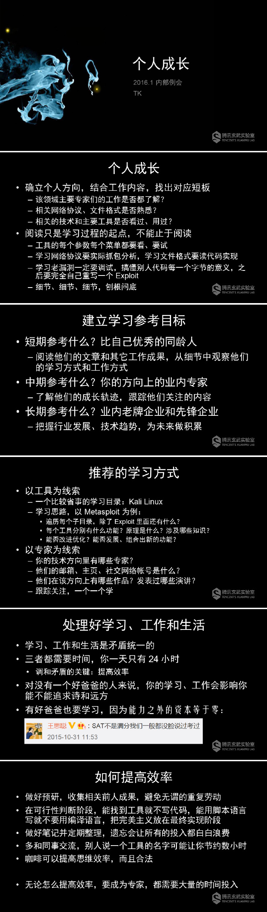

# TK教主谈个人成长

## 个人成长

1. 确立个人方向，结合工作内容，找出对应短板
    - 该领域主要专家们的工作是否都了解
    - 相关网络协议、文件格式是否熟悉
    - 相关的技术和主要工具是否看过、用过？

> 伍注：我的问题是个人方向仍未确定，同时在任何领域都远远没达到tk教主提的问题：不了解专家们的工作、不了解各种标准和协议等等。为什么大学四年以及工作两年多还不能确定个人方向？其实大方向已经确定：做程序员。但具体技术方向还没确定，原因是我对大部分方向都不了解。好了，知道这个原因后，你这么多年来总不肯调研一下吗？查下招聘信息、知乎和Google，起码可以知道程序员的发展方向的基本信息，再结合自己的能力和兴趣等加以筛选，其实并不难得到候选的方向。你的一个问题就是“用战术上的勤奋来掩饰战略上的懒惰”。得到候选方向后，可以像tk说的那样，关注和学习一下该领域主要专家们的工作，了解相关的技术栈等。

2. 阅读只是学习过程的起点，不能止于阅读
    - 工具的每个参数每个菜单都要看、要试
    - 学习网络协议要实际抓包分析，学习文件格式要读代码实现
    - 学习老漏洞一定要调试，搞懂别人代码每一个字节的意义，之后要完全自己重写一个Exploit
    - 细节、细节、细节，刨根问底

> 伍注：这里强调“实践得真知”，凡事多动手实践，包括阅读源码、编程和调试等，不能进满足于阅读得到的理论知识。以前我犯了一个误区：看到计算机经典书籍那么多，是否有必要认真啃下去。现在我明白了：不仅要读完经典技术书籍，还应该捣鼓下经典编程项目，听下经典公开课等等。技术提升之路可谓“道阻且长”，必须长期努力学习才能成为高手。tk数十年来每天工作12小时，轮子哥大学四年每天编程8小时以上，邹欣老师利用业余时间写书和讲课。自己起步慢，资质一般，倘若真想成为一名优秀的程序员，还是踏踏实实地学习和工作吧。

## 建立学习参考目标

1. 短期参考什么？比自己优秀的同龄人
    - 阅读他们的文章和其他工作成果，从细节中观察他们的学习方式和工作方式

2. 中期参考什么？你的方向上的业内专家
    - 了解他们的成长轨迹，跟踪他们关注的内容

3. 长期参考什么？业内老牌企业和先锋企业
    - 把握行业发展、技术趋势，为未来做积累

> 伍注：这3点建议十分宝贵，我应该写成文档定期跟踪。

## 推荐的学习方式

1. 以工具为线索
    - 一个比较省事的学习目录：Kali Linux
    - 学习思路，以Metasploit为例：
        - 遍历每个子目录，除了Exploit里面还有什么？
        - 每个工具分别有什么功能？原理是什么？涉及哪些知识？
        - 能否改进优化？能否发展、组合出新的功能？

2. 以专家为线索
    - 你的技术方向里有哪些专家？
    - 他们的邮箱、主页、社交网络账号是什么？
    - 他们在该方向上有哪些作品？发表过哪些演讲？
    - 跟踪关注，一个一个学

> 伍注：以工具为线索，这里的工具也可以是某门编程语言、某个框架、某个开源库等。以专家为线索，这个学习方式也是我基本没尝试过的，因为自己的基础还很薄弱，还达不到关注专家工作的水平。现在自己在基础方面有所提高，可以尝试关注一下自己方向的专家。

## 处理好学习、工作和生活

1. 学习、工作和生活是矛盾统一的

2. 三者都需要时间，你一天只有24小时
    - 调和矛盾的关键：提高效率

3. 对没有一个好爸爸的人来说，你的学习、工作会影响你能不能追求诗和远方

4. 有好爸爸也要学习，因为能力之外的资本等于零

5. 前几年接受图灵社区采访的时候我说过，我自己毕业后的十几年间，几乎每天都工作12个小时。突击一些项目的时候，连续一两个月每天18个小时也有过。

> 伍注：第一点是提高效率。提高效率是一切学习和工作的关键。然后是长期勤奋工作。想一想，tk教主毕业后的十几年间，几乎每天都工作12个小时，简单估算一下：360 * 12 * 10 = 43200 小时，按照一万小时天才理论，tk已经可以在多个领域成为专家了，何况tk本来就天资聪颖。这真的是，比你聪明的人还比你勤奋。知耻而后勇啊。

## 如何提高效率

1. 做好预研，收集相关前人成果，避免无谓的重复劳动

2. 在可行性判断阶段，能找到工具就不写代码，能用脚本语言写就不要用编译语言，把完美主义放在最终实现阶段

3. 做好笔记并定期整理，遗忘会让所有的投入都白白浪费

4. 多和同事交流，别人说一个工具的名字可能让你节约数小时

5. 咖啡可以提高思维效率，而且合法

## 原文

